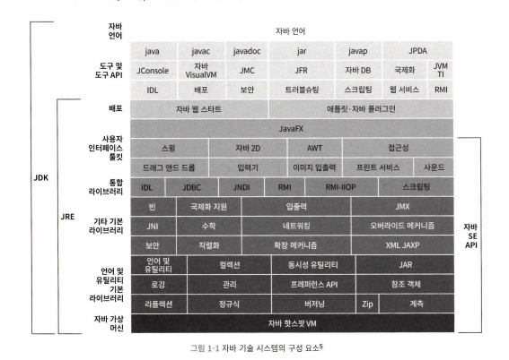

# ch 01. 자바 기술 시스템 소개

## 자바

- 언어 + 여러 가지 소프트웨어, 명세 + 기술 시스템
- 크로스 플랫폼 소프트웨어 개발(임베디드부터 메인 프레임까지)
- WORA(Write Once Run Anywhere)
- 안전한 메모리 관리 시스템 -> 메모리 누수 문제, 메모리 오참조 문제 해결
- 핫코드 감지, 컴파일, 최적화
- 풍부한 표준 API, 다양한 서드 파티 라이브러리 활용 가능

### 자바 기술 시스템

- 코틀린, 클로저, JRuby, 그루비 등 포함
- 자바 프로그래밍 언어
- 클래스 파일 포맷
- 자바 클래스 라이브러리 API
- 서드 파티 클래스 라이브러리를 포괄함

- 자바 네가지 제품군(SE, EE, ME, 카드)
    - SE 제외하고는 힘을 잃어 가고 있음

# 자바: 과거, 현재, 그리고 미래

## 과거

- 1991년: 제임스 고슬링의 그린 프로젝트에서 자바의 시초인 오크(Oak) 탄생
- 1995년: 인터넷 시대의 부상으로 자바(Java)로 이름 변경 및 공식 데뷔
    - JDK 1.0 출시, “한 번 작성하면 어디서든 실행된다”라는 구호 제시
- 1997년 ~ 2006년: 주요 JDK 출시와 기술 진화
    - JDK 1.1: JDBC, 내부 클래스 도입
    - JDK 1.2: J2SE, J2EE, J2ME로 시스템 분화
    - JDK 1.5: 제네릭스, 애너테이션, foreach 문법 추가

## 현재

- 2009년: 오라클의 썬 마이크로시스템즈 인수로 자바 관리 주체 변경
    - 상업적 전략 도입, 지원 정책 변화 (LTS 도입, 유료화)
- JDK 8: 람다식, 새로운 날짜 및 시간 API 도입
- JDK 9~20: 모듈화(직소 프로젝트), 텍스트 블록, 가상 스레드와 같은 최신 기능들 개발
    - 지속적 배포 체계로 전환(6개월 주기)

## 미래

- 지속적 발전 가능성: 모듈화, 동시성 개선, 가비지 컬렉터 등의 혁신을 통해 발전
- 도전 과제: 빠른 릴리스 주기에 따른 사용자 부담과 커뮤니티의 적응 필요
- 자바는 여전히 높은 가능성을 지닌 언어로 미래에도 혁신을 지속할 전망

## 자바 가상 머신(JVM) 제품군

- 썬 클래식 VM
    - 세계 최초의 상용 자바 가상 머신
    - 순전히 인터프리터 방식
    - JIT 컴파일러는 플러그인으로 추가 가능
- 이그잭트 VM
    - 정확한 메모리 관리(exact memory management)
    - 효율성 개선
- 핫스팟 VM
    - OpenJDK 기본 가상머신이자 가장 널리 사용됨
    - 핫 코드 감지: 컴파일 했을 때 효과를 가장 크게 볼 수 있는 코드 영역을 런타임에 알아내 JIT 컴파일러에 알려줌
    - 온스택 치환: 런타임에 스택을 치환하는 기술
- 모바일, 임베디드 VM(CVM, 몬티 VM)
    - 성공하지 못한 자바 ME에 포함된 VM이라 주목받지 못함
    - 현재는 스마트폰 시장을 안드로이드와 iOS가 양분하면서 사실상 죽음
- BEA JRockit & IBM J9 VM
    - 썬, 오라클 외의 조직이 만든 VM
- BEA 리퀴드 VM, 어줄 VM
    - 소프트웨어와 하드웨어와의 통합
    - 리퀴드 VM - 운영 체제 없이 독자적인 하이퍼바이저 시스템 위에 직접 실행
        - 커널 모드, 사용자 모드 전환 필요 없음
    - 어줄 VM - 인스턴스당 최소 수십 개의 CPU, 수백GB의 메모리 관리, 메모리 일시정지 시간 제어 가능 가비지 컬렉터
    - 징, 줄루 VM에 대체
- 아파치 하모니, 안드로이드 ART VM
    - 하모니: 아파치가 만든 VM
    - ART VM: 안드로이드 플랫폼 개발 핵심 요소였던 달빅 VM을 대체!
- 마이크로소프트 JVM
    - 인터넷 익스플로러에서만 동작하는 가상 머신
- 그외에도 수많은 VM들

## 자바 기술의 미래

- 언어 독립
    - 코틀린, 고, 자바스크립트, 파이썬 등 새로운 언어 등장과 인공 지능의 부상으로 3~4위로 밀림
    - 자바가 더 크게 발전하기 위해서는 자바 언어 자체를 잊고 기반 기술 영역으로 돌아가야 함
    - 오라클의 그랄VM: 어디서든 더 빠르게 실행한다
        - 크로스 언어 풀 스택 가상 머신(유니버설 VM, 폴리글랏 VM)
        - C, C++, 러스트, 자바스크립트, 루비, 파이썬, R, 웹어셈블리 지원
        - 네이티브 컴파일러보다 빠른 컴파일 성능
        - 자바 가상 머신으로 활용 가능
    - 그외에도 언어의 기능적 특성과 문법은 끊임없이 발전 중

- 차세대 JIT 컴파일러
    - 자주 사용되는 핫코드를 탐지하여 네이티브 코드로 컴파일 -> JIT 컴파일
    - 기존 핫스팟 컴파일러
        - C1 컴파일러 - 파일 속도가 빠른 대신 최적화를 적게 하는 클라인트 컴파일러
        - C2 컴파일러 - 컴파일 속도는 느리지만 더 많은 최적화를 적용하는 컴파일러
        - 인터프리터
        - JDK 10부터는 C2 컴파일러 대체 위한 그랄 컴파일러 도입 -> JDK 16부터 그랄VM으로 분리 -> 다시 복귀 예정

- 네이티브를 향한 발걸음
    - 자바의 문제점
        - 마이크로서비스와 맞지 않음
        - 자바는 구동 시간이 길고 최고 성능을 내기까지 예열이 필요(콜드 스타트 어려움 -> 서버리스와 맞지 않음)
        - 대책으로 애플리케이션 데이터 쉐어링(AppCDS), 노옵 가비지 컬렉터 엡실론, AOT(Ahead Of Time) 컴파일
        - AOT 컴파일은 JIT과 반대로, 미리 컴파일을 해둠 -> 느린 시작 해결 but, WORA 구호 깨짐
        - 서브트레이트 VM
            - 그랄 VM의 한 요소
            - 사전 컴파일된 네이티브 코드를 핫스팟 가상 머신 없이 실행하는 기술
            - 독자적인 예외 처리, 스레드 관리, 메모리 관리, 자바 네이티브 인터페이스(JNI) 접근 메커니즘 등을 갖춘 "극히 작은" 런타임 환경
            - 포인터 분석 기술을 활용하여 사용자 프로그램으로부터 도달 가능한 코드만 추려 네이티브 이미지에 담음
            - 또한 이 과정에서 초기화까지 수행하여 최종 실행 파일이 생성되면 초기화된 힙 스냅숏을 저장
            - 이런 식으로 자바 가상 머신이 수행하던 초기화 과정을 건너뛰고 프로그램을 곧바로 실행하여 초기 구동 시간을 획 기적으로 줄임
            - 이 방식이 가능하려면 프로그램이 완결된 형태여야 함
            - 컴파일러가 찾을 수 없는 코드나 클래스 라이브러리를 동적으로 읽어 들일 수 없음
            - 작은 메모리 사용량
            - 짧은 시작 시간
- 유연한 뚱뚱이
    - 핫스팟은 너무 거대해짐
    - 초기 버전은 모듈화 수준도 떨어졌지만 지속적인 리팩터링으로 나아졌음
- 언어 문법
    - 수많은 문법 개선 아이디어가 제기되고 있고 많은 JEP가 정식 문법으로 포함되었음
    - 발할라 프로젝트 - 제네릭 타입으로 값 타입/원시 타입 사용 가능. 명시적 불변 타입, 명시적 비참조 타입 선언.
    - 파나마 프로젝트 - JNI 이용해 네이티브 코드 호출 가능

## JDK 빌드

- JVM의 내부 구현 원리를 가장 잘 엿볼 수 있는 방법
    - JDK를 직접 컴파일하고 JDK 소스 코드를 읽고 분석하고 디버깅해가며, 자바 기술 시스템이 어떻게 동작하는지 이해해보는 것