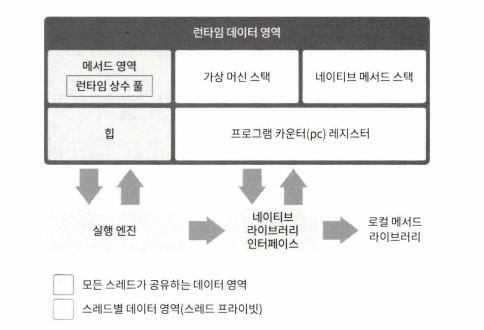

# ch 02. 자동 메모리 관리

- 자바가 자동 메모리 관리 메커니즘을 자동으로 제공해주므로 메모리 누수나 오버플로 문제를 거의 겪지 않게 됨
    - but, 문제 발생 시 메모리 관리 방식을 이해하지 못하면 해결하기 어려움

## 런타임 데이터 영역

- JVM이 프로그램 실행 시 나눠 관리하는 메모리의 영역
  

### 프로그램 카운터 레지스터

- 작은 메모리 영역, 실행 중인 스레드의 바이트코드 줄 번호 표시기
- 스레드 프라이빗: 스레드 마다 독립된 영역임

### 자바 가상 머신 스택

- 스레드 프라이빗
- 자바 메서드를 실행하는 스레드 메모리 모델을 설명
- 스택 프레임 만들어서 지역 변수 테이블(기본 데이터 타입, 객체 참조, 반환 주소 타입 포함), 피연산자 스택, 동적 링크, 메서드 반환 값 등 저장
- StackOverflowError, OutOfMemoryError 발생 가능

### 네이티브 메서드 스택

- 자바 가상 머신 스택은 자바 메서드를 실행할 때 사용하고, 네이티브 메서드 스택은 네이티브 메서드를 사용할 때 사용
- StackOverflowError, OutOfMemoryError 발생 가능

> 왜 네이티브 메서드 스택이 필요할까?
>
> 자바 프로그램은 기본적으로 자바 메서드를 사용하지만,
> 운영체제와의 상호작용, 성능 최적화, 기존 기술과의 통합 등 네이티브 메서드를 사용해야 하는 경우가 있음
> 따라서, 네이티브 메서드를 위한 스택 메모리인 네이티브 메서드 스택이 필요

### 자바 힙

- 자바 애플리케이션이 사용 가능한 가장 큰 메모리
- 모든 스레드가 공유
- 자바 힙은 물리적으로 떨어진 메모리에 위치해도 되지만 논리적으로는 연속돼야 함
    - but, 대다수 가상머신이 저장 효율을 높이고 구현 로직 단순화를 위해 물리적으로 연속 저장
- `-Xms`, `Xmx`, 로 확장 가능

### 메서드 영역

- 가상 머신이 읽어들인 타입 정보, 상수, 정적 변수 그리고 JIT 컴파일러가 컴파일한 코드 캐시 등을 저장
- 모든 스레드가 공유

#### 런타임 상수 풀

- 메서드 영역의 일부
- `클래스 파일에 포함된 설명 정보`(클래스 버전, 필드 메서드, 인터페이스 등), 컴파일타임에 생성된 다양한 `리터럴 심벌 참조`(정수, 실수 리터럴 등) 저장
- 클래스 파일의 상수 풀과 다르게 동적임(런타임에도 새로운 상수 추가 가능)
    - 자바에서는 상수가 꼭 컴파일 타임에 생성되어야 한다는 규칙이 없음
    - ex) `String.intern()`
- 메서드 영역을 넘어 확장 불가
    - OutOfMemory 발생 가능

### 다이렉트 메모리

- VM 런타임에 속하지 않음
- OOM의 원인이될 수 있어서 설명
- JDK 1.4에서 'NIO'가 도입되면서, `DirectByteBuffer` 객체 이용해 메모리 직접 할당 가능
    - `DirectByteBuffer`: 자바 힙이 아닌 컴퓨터 메모리를 직접 할당할 수 있게 해주는 객체
    - 자바 힙과 네이티브 힙 사이에서 데이터를 복사해 주고 받지 않아도 되어 성능 크게 개선
    - 물리 메모리를 직접 할당하기 때문에 자바 힙 크기 제약과 무관하지만
        - 프로세서가 다룰 수 있는 주소 공간을 넘어설 수 없고
        - 모든 메모리 영역의 합이 '물리 메모리' 한계를 넘어서면 OOM 발생

## 핫스팟 가상 머신 객체

### 객체 생성

- new 키워드 사용 시
    - 매개 변수가 상수 풀 안의 클래스를 가리키는 심벌 참조인지 확인
    - 이 심벌 참조가 뜻하는 클래스가 로딩, 해석(resolve), 초기화되었는지 확인
        - 준비되지 않은 클래스라면 로딩부터 해야 함
    - 로딩이 완료된 클래스라면 새 객체를 담을 메모리를 할당
        - 객체에 필요한 메모리 크기는 클래스 로딩 후 완벽히 알 수 있음
        - 객체용 메모리 공간 할당은 자바 힙에서 특정 크기의 메모리 블록을 잘라주는 일
        - 포인터 밀치기(bump the pointer): 자바 힙이 규칙적이라면, 사용 중인 메모리와 여유 메모리 사이를 가리키는 포인터를 객체 크기만큼 이동
          
    - 자바 힙이 규칙적이지 않기 때문에 포인터 밀치기가 간단하지 않음
        - 모으기(compact) 여부에 따라 자바 힙 규칙적인지 여부 달라짐
            - 시리얼, 파뉴(ParNew): 모으기 가능 -> 규칙적
            - CMS: 스윕 알고리즘 적용. 더 복잡한 여유 목록 방식 채택
    - 여러 스레드가 동시에 객체 생성 시 문제
        - 해결책
            1. 메모리 할당을 동기화
                - 실제로 비교 및 교환(CAS) 실패 시 재시도 방식의 갓아 머신은 갱신을 원자적으로 수행
            2. 스레드 마다 다른 메모리 공간 할당
                - 스레드 로컬 할당 버퍼(TLAB): 스레드 각각이 자바 힙 내 작은 전용 크기의 전용 메모리 할당
                - 버퍼 부족 시 동기화해 새로운 버퍼를 할당
                - TLAB 사용 여부는 `-xx:+/-UseTLAB` 매개 변수로 설정
    - 메모리 할당 후 VM은 할당 받은 공간을 0으로 초기화
        - TLAB 사용 시 초기화는 할당 시 미리 수행
        - 자바 코드에서 객체의 인스턴스 필드를 초기화 하지 않고도 사용할 수 있는 이유가 바로 이 단계 덕분(lazy init)
    - JVM은 각 객체에 필요한 설정(어느 클래스의 인스턴스인지, 메타 정보 찾는 법, 해시코드, GC 세대 나이 등)을 해줌
    - 자바 프로그램은 이 객체를 개발자의 의도대로 초기화해야 진짜 객체 완성
        - 자바 컴파일러는 new 키워드 발견하면 바이트 코드 명령어인 new(VM 관점 객체 생성), invokespecial(프로그램 관점 객체 생성)로 변환

### 객체 메모리 레이아웃

핫스판 가상 머신은 객체를 세 부분(객체 헤더, 인스턴스 데이터, 길이 맞추기용 정렬 패딩)으로 나눠 힙에 저장

- 객체 헤더
    - 포함하는 데이터
        - 객체 자체의 런타임 데이터(마크 워드)
            - 해시코드, GC 세대 나이, 락 상태 플래그, 스레드 점유 락, 편향돤 스레드의 아이디, 편향된 시각의 타임스탬프 등
            - 32비트 또는 64비트
        - 마크워드 다음 클래스 워드(klass word)
            - 클래스 워드에는 클래스 관련 메타데이터를 가리키는 클래스 포인터(어느 클래스의 인스턴스인지 런타임에 가리킴)가 저장됨
        - 자바 배열의 경우 배열 길이도 헤더에 저장
            - 객체 헤더에 저장되는 타입은 원소의 타입이므로 배열 길이까지 알아야 객체가 차지하는 메모리 크기 제대로 계산 가능
- 인스턴스 데이터
    - 객체가 실제로 담고 있는 정보
    - 저장 순서: 할당 전략 매개 변수 `-XX:FieldsAllocationStyle`과 자바 소스 코드에서 필드를 정의한 순서에 따름
        - 핫스팟: long • double, int, short • char, byte • boolean 순으로 할당
        - `+XX:CompactFields` 매개 변수 true 설정시 시 하위 클래스 필드 중 길이가 짧은 것들은 상위 클래스 변수 사이사이에 끼워 넣어짐(공간 절약)
- 정렬 패딩
    - 존재하지 않을 수 있으며, 특별한 의미 없이 자리 확보용
    - 객체 시작 주소는 반드시 8바이트의 정수 배여야 함 -> 모든 객체의 크기가 8바이트의 정수 배여야 함
    - 조건 불충족 시 패딩으로 채움

### 객체 접근

- 자바 프로그램은 스택에 있는 참조 데이터를 통해 힙에 들어 있는 객체들에 접근해 이를 조작
- 주로 핸들이나 다이렉트 포인터 사용해 구현
    - 핸들 방식
        - 자바 힙에 핸들 저장용 풀이 별도로 존재
        - 참조에는 객체의 `핸들 주소`가 저장되고, 핸들에는 다시 해당 객체의 `인스턴스 데이터, 타입 데이터 구조 등 정확한 주소` 정보가 담김
        - 객체의 위치가 바뀌는 상황에서도 참조 자체에 손댈 필요가 없이 인스턴스 데이터 포인터만 변경하면 됨 -> 안정적
    - 다이렉트 포인터 방식
        - 자바 힙에 위치한 객체에서 인스턴스 데이터뿐 아니라 타입 데이터에 접근하는 길도 제공해야 함
        - 스택의 참조에는 객체의 실제 주소가 바로 저장됨
        - 핸들을 경유하는 오버헤드 없음 -> 매우 빠르게 접근 가능
        - <u>핫스팟은 주로 다이렉트 포인터 방식 이용</u>

## OutOfMemoryError 예외 실전

실제로 해보기

- 자바 힙 오버플로
    - OOM을 발생시키고 Eclipse Memory Analyzer로 분석
    - 누수된 객체까지 어떤 참조 경로가 존재하고, 어느 GC 루트와 연결되어 있기에 가비지 컬렉터가 회수하지 못했는지 찾아보기
    - 메모리 누수가 아니라면
        - 자바 가상 머신의 힙 매개 변수 설정(`-Xmx`와 `-Xms`)과 컴퓨터의 가용 메모리를 비교하여 가상 머신에 메모리를 더 많이 할당할 수 있는지 알아보기
        - 코드에서 수명 주기가 너무 길거나 상태를 너무 오래 유지하는 객체는 없는지, 공간 낭비가 심한 데이터 구조를 쓰고 있지는 않은지 살펴보기
        - 그러고 나서 프로그램이 런타임에 소비하는 메모리를 최소로 낮춤
- 가상 머신 스택과 네이티브 메서드 스택 오버플로
    - 스택 크기는 오직 `-Xss` 매개 변수로만 변경 가능(`-Xoss` 매개변수는 효과 없음)
    - 네이티브 메서드 스택에서 예외 발생 경우
        - 스레드가 요구하는 스택 깊이가 가상머신 허용 최대 깊이보다 클 경우(StackOverflowError)
        - 가상 머신이 스택 메모리를 동적 확장하는 기능 지원하나, 가용 메모리가 부족하여 스택 확장 불가 시(OutOfMemory)
    - 스택 크기를 동적으로 확장할 수 없다면 StackOverflowError, 확장할 수 있다면 OutOfMemory
    - 운영체제가 각 프로세스에 할당하는 메모리가 제한적이기 때문에 핫스팟에서도 메모리 오버플로를 일으킬 수 있음
- 메서드 영역과 런타임 상수 풀 오버플로
    - JDK 6 이전에 `-XX：PermSize`와 `-XX:MaxPermSize`로 영구 세대 크기를 조절할 수 있었음 -> 상수 풀 용량에도 간접적으로 영향
        - OutOfMemoryError: PermGen space 오류 발생
    - JDK 7부터는 문자열 상수풀이 영구 세대에서 자바 힙으로 옮겨짐
    - JDK 8부터는 영구 세대가 사라지고 메타스페이스를 사용
        - 메타스페이스 보호용 매개변수들
            - `-XX:MaxMetaspaceSize`
            - `-XX:MetaspaceSize`
            - `XX:MinMetaspaceFreeRatio`
- 네이티브 다이렉트 메모리 오버플로
    - 다이렉트 메모리 용량 설정: `-XX:MaxDirectMemorySize`