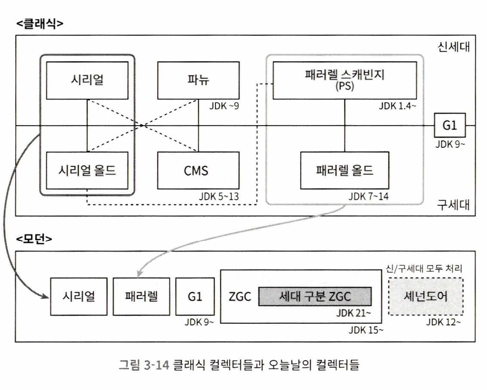

# ch 03. 가비지 컬렉터와 메모리 할당 전략

- 동적 메모리 할당과 가비지 컬렉션이 발전했음에도 GC와 메모리 할당 내부 이해 필요
    - 오버플로와 누수 문제를 해결하거나, 높은 동시성을 달성하기 위해 GC를 모니터링하고 조율할 수 있어야 하기 때문
- 스택 프레임 할당 메모리는 클래스가 만들어질 때 결정됨
- 반면, 자바 힙과 메서드 영역은 클래스마다 요구하는 메모리 크기가 다를 수 있음

### 대상이 죽었는가

- GC를 수행하려면 객체가 죽었는지(더 이상 사용되지 않는지) 판단 필요

#### 참조 카운팅 알고리즘

- 자바에서는 참조 카운팅을 쓰지 않음
    - 참조 카운팅은 순환 참조 문제를 풀기 어렵다는 점

#### 도달 가능성 분석 알고리즘

- 자바, C# 등 주류 프로그래밍 언어는 도달 가능성 분석 알고리즘 이용
    - GC 루트 객체들을 시작 노드 집합으로 쓰고 어떤 객체와 GC 루트 사이를 이어주는 참조 체인이 없다면 도달 불가
    - 해당 객체들은 회수 대상
- GC 루트 이용 가능 객체
    - 가상 머신 스택(스택 프레임의 지역 변수 테이블)에서 참조하는 객체
        - 현재 실행 중인 메서드에서 실행 중인 메서드에서 쓰이는 매개 변수, 지역 변수, 임시 변수
    - 메서드 영역에서 클래스가 정적 필드로 참조하는 객체
        - 자바 클래스의 참조 타입 정적 변수
    - 메서드 영역에서 상수로 참조되는 객체
        - 문자열 테이블 안의 참조
    - 네이티브 메서드 스택에서 JNI가 참조하는 객체
    - JVM 내부에서 쓰이는 참조
    - 동기화 락(synchronized 키워드)으로 잠겨있는 모든 객체
    - JVM 내부 상황을 반영하는 JMXBean
        - JVMTI에 등록된 콜백, 로컬 코드 캐시 등
    - 그 외 객체들도 임시로 추가될 수 있음
    - 메모리 영역에서, 객체는 다른 영역에 있는 객체도 참조할 수 있으므로 연관된 영역의 객체들도 GC 루트 집합에 포함시켜야 정확한 도달 가능성 분석 가능

#### 다시 참조 이야기로

- JDK 1.2의 참조 정의
    - 참조 타입 데이터에 저장된 값이 다른 메모리 조각의 시작 주소를 뜻하는 경우(≈가리키다)
- 1.2 이후의 확장된 구분
    - 강한 참조: 전통적 의미의 참조 ex) `Object obj = new Object;`
        - 강한 참조 관계 남아 있으면 GC 안 일어남
    - 부드러운 참조: 유용하지만 필수는 아닌 객체
        - 메모리 오버플로가 나기 직전에 가서야 두 번째 회수를 위한 회수 목록에 추가도미
        - `SoftReference` 클래스 형태
    - 약한 참조: 부드러운 참조보다 연결 강도가 더 약함
        - 다음 번 가비지 컬렉션 까지만 살아 있음
        - `WeakReference` 클래스 형태
    - 유령 참조: 참조중에 가장 약한 참조
        - 객체 수명에 아무런 영향 주지 않고, 인스턴스 가져오는 것마저 불가
        - 사용 목적은 대상 객체가 회수 될 때 알림을 받기 위해서
        - `PhantomReference` 클래스 형태

#### 살았나 죽었나?

- 두 번의 마킹 과정 후 사망
    - 도달가능성 분석: GC 루트와 연결된 참조 체인을 찾지 못하는 객체 찾기
    - 필터링: finalize() 메서드를 실행해야 하는 객체 찾기
        - finalize 대상 객체는 F-Queue에 추가되고, VM이 나중에 우선순위가 낮은 스레드 생성해, finalize() 메서드 실행
- finalize() 메서드는 사망 대상 객체의 마지막 부활 기회
    - 참조상의 아무 객체와 다시 연결
- '''finalize() 메서드는 가능한 사용하지 말자'''
    - C, C++의 종료자를 모방한 것일뿐 다름
    - 실행하는 비용도 높고 불확실성도 큼
    - 어느 객체로 부터 호출되는지도 보장하지 않음
      cf) JDK 21에서 deprecated됨

#### 메서드 영역 회수하기

- GC가 메서드 영역을 반드시 청소해야 하는 것은 아니지만, 비용 효율이 떨어져 클래스 언로딩을 지원하지 않는 경우도 있음(ZGC 컬렉터)
- 메서드 영역의 가비지 컬렉션은 크게 두 가지를 회수
    - 상수
    - 클래스
- 회수 방법은 자바 힙과 비슷
- 더 이상 쓰이지 않는 클래스 판단 조건
    - 클래스의 인스턴스가 모두 회수되었을 것
    - 클래스를 읽어 들인 클래스 로더가 회수 되었을 것
    - 클래스에 해당하는 java.lang.Class 객체를 아무 곳에서도 참조하지 않고 리플렉션으로 이용하는 곳도 없을 것
- 클래스 회수 여부는 `-Xnoclassgc` 매개변수에 달림

* 리플렉션, 동적 프록시, CGLib과 같은 바이트 코드 프레임 워크 많이 사용하는 경우나 JSP를 동적으로 생성하고 클래스 로더를 자주 커스텀 하는 OSGi 환경 등
  -> 일반적으로 JVM이 '타입 언로딩' 지원해야 함(메서드 영역에 과부하 막기 위해)

### 가비지 컬렉션 알고리즘

#### 세대 단위 컬렉션 이론

- 가비지 컬렉션 분류
    - 참조 카운팅 GC -> 비주류. 책에서 안 다룸.
    - 추적 GC
- GC 가정
    - 약한 세대 가설: 대다수 객체는 일찍 죽는다
    - 강한 세대 가설: 가비지 컬렉션 과정에서 살아 남은 횟수가 늘어 날수록 오래살 가능성이 커짐
    - 객체들을 한데 몰아 놓고 살아남는 소수의 객체를 유지하는 방법에 집중하기
- 영역에 따라: 마이너 GC, 메이저 GC, 전체 GC
- 생존 특성에 따라: 마크 스윕 GC, 마크-카피, 마크-컴팩트
- 자바 힙 구분
    - 신세대
    - 구세대
- 신세대와 구세대를 구분하는 건 단순하지 않음(신세대에 속하지만 구세대에서 참조 중인 객체 등) -> 경험 법칙 필요
- 세번째 가설
    - 세대 간 참조 가설: 세대 간 참조의 개수는 같은 세대 안에서의 참조보다 훨씬 적다
- 세대 간 참조를 일일이 기록할 필요 없이 '기억 집합'이라는 전역 데이터 구조를 둠
    - 구세대를 작은 조각으로 나누고 어느 조각에 세대 간 참조가 있는지 기록해 관리
- 용어 정리
    - 부분 GC
        - 마이너 GC: 신세대만 대상
        - 메이저 GC: 구세대만 대상
        - 혼합 GC: 신세대 전체와 구세대 일부를 대상
    - 전체 GC: 자바 힙 전체와 메서드 영역까지 모두를 대상

#### 마크-스윕 알고리즘

- 회수할 객체들을 모두 표시한 다음 표시된 객체들을 치우고, 반대로 살릴 객체에 표시하고 표시되지 않은 객체를 회수
- 단점
    - 실행 효율이 일정하지 않음(회수 대상이 많을수록 일이 많아짐)
    - 메모리 파편화가 심함(연속된 메모리 찾기 어려워짐)

#### 마크-카피 알고리즘

- 가용 메모리를 똑같은 크기의 두 블록으로 나눠 <u>한번에 한 블록만 사용</u>
- 대다수 객체가 살아남는다면 메모리 복사에 상당한 시간을 허비하는 반면, 대다수가 회수된다면 생존한 소수의 객체만 복사하면 됨
- 단점: 가용 메모리를 절반으로 줄여 낭비가 제법 심하다는 점
- 오늘날 상용 JVM 대부분이 마크-컴팩트 알고리즘 사용
- 아펠스타일 컬렉션
    - 신세대를 하나의 큰 에덴 공간과 두개의 생존자 공간으로 나눔
    - 메모리 할당 시에는 생존자 공간 중 하나와 에덴만을 사용
    - GC 시작되면 에덴과 생존자 공간에서 살아남은 객체들을 나머지 생존자 공간으로 하나씩 복사후에 에댄과 이전 생존자 공간을 곧바로 비움
    - 에덴 생존자 공간의 비율은 기본적으로 8:1(에덴 80%, S1 10%, S2 10%)
    - 메모리 할당 보증: 마이너 GC에서 살아남은 객체를 생존자 공간이 수용하지 못할 경우 다른 메모리 영역을 활용해 메모리 할당을 보증하는 것(핸들 승격)

#### 마크-컴팩트 알고리즘

- 마크-카피 알고리즘은 구세대에 적합하지 않음
- 마크-컴팩트 알고리즘
    - 표시 단계는 마크-스윕과 같고, 컴팩트 단계에서 생존한 모든 객체를 메모리 영역의 한쪽 끝으로 모은다음, 나머지 공간을 한꺼번에 비움
    - 메모리 이동 발생
    - 단점
        - 구세대에서 회수 때마다 살아남는 객체가 상당히 많을 것이고, 생존한 객체를 이동시키후 기존 참조들을 모두 갱신하는 것은 매우 부담
        - 객체 이동 시 애플리케이션을 모두 멈추는 '스톱 더 월드' 발생
    - 마크-스윕 알고리즘의 파편화 문제를 해결하기 위해서는 이런 객체 이동이나 복잡한 방식(파편화 없는 할당 연결 리스트 등)을 사용해야함

## 핫스팟 알고리즘 상세 구현

- 루트 노드 열거
    - 도달 가능성 분석 알고리즘에서 GC 루트 집합으로부터 참조 체인을 찾는 작업
    - 목표는 명백하지만 효율적 구현이 어려움
    - <u>지금까지 모든 컬렉터는 루트 노드 열거 시 스톱 더 월드 문제 피할 수 없음</u>
    - 루트 노드 열거는 반드시 일관성이 보장되는 스냅숏 상태에서 수행해야 함(다른 작업들은 사용자 스레드와 동시 실행 가능)
    - '정확한 가비지 컬렉션'을 사용하는 주류 JVM - 사용자 스레드 정지 후 실행 컨텍스트와 전역 참조 전부 확인 필요 없이, 객체 참조 저장 위치만 알아낼 수 있으면 됨
        - 핫스팟은 'OopMap' 이용
- 안전 지점
    - 핫스팟 OopMap은 참조 관계나 내용을 변경할 수 있는 명령어가 많고, 이를 모두 OopMap을 만들어 넣으면 메모리 사용량 증가
    - 그래서 모든 명령어에 각각 생성하지 않고 '안전 지점'에만 기록
    - 선택 기준: 프로그램이 장시간 실행될 가능성(명령어 흐름이 다중화될 때 등)이 있는가
    - GC 시작 시 JNI 호출을 실행 중인 스레드를 제외한 모든 스레드가 가장 가까운 안전 지점까지 실행하고 멈추게 할 방법이 필요
        - 선제적 멈춤
        - 자발적 멈춤
- 안전 지역
    - 일정 코드 영역에서는 참조 관계가 변하지 않음을 보장
    - 안전 지역 안이라면 어디서든 GC 시작해도 무방
- 기억 집합과 카드 테이블
    - 기억 집합: 비회수 영역에서 회수 영역을 가리키느 포인터들을 기록하는 추상 데이터 구조
    - 카드 테이블: 기록정밀도와 힙 메모리 매핑 관계 등을 정의하여 기억 집할을 구현한 방법 중 하나
- 쓰기 장벽
    - 핫스팟 VM은 쓰기 장벽 기술을 이용해 카드 테이블을 관리
    - 읽기 장벽은 동시 비순차 실행 문제 해결 위한 것
    - 쓰기 장벽은 AOP와 유사하게 참조 타입에 객체 대입 전후로 추가 동작 수행할 수 있게 함(어라운드 어드바이스)
- 동시 접근 가능성 분석
    - 증분 업데이트
    - 시작 단계 스냅숏

## 클래식 가비지 컬렉터

- 시리얼 컬렉터
    - 단일 스레드 동작
    - GC 시작 시 회수가 될 때까지 다른 모든 작업 스레드가 멈춰 있어야 한다는 점
- 파뉴 컬렉터
    - 시리얼 컬렉터를 병렬화
    - 단일 코어 프로세서에서는 시리얼 컬렉터보다 성능 떨어짐(하이퍼 스레딩 가상 듀얼 코어에서도 낫다고 보장 X)
- 패러렐 스캐빈지(PS) 컬렉터
    - 다른 컬렉터들과 달리 처리량(사용자 코드 실행 시간/(사용자 코드 실행시간 + GC 실행 시간)) 제어가 목표
- 시리얼 올드 컬렉터
    - 시리얼 컬렉터의 구세대용 버전
    - 단일 스레드 동작, 마크-컴팩트 알고리즘 사용
- 패러렐 올드 컬렉터
    - PS 컬렉터의 구세대용 버전
    - 멀티 스레드 이용 병렬 회수 지원, 마크-컴팩트 알고리즘 기반
- CMS 컬렉터
    - 표시와 쓸기 단계를 모두 사용자 스레드와 동시에 수행
    - GC에 따른 일시 정지 시간을 최소화하는 것이 목적
- G1 컬렉터(가비지 우선 컬렉터)
    - 부분 회수, 리전 단위 회수 메모리 레이아웃
    - 주로 서버용 애플리케이션에 집중한 컬렉터
- 오늘날의 가비지 컬렉터들
    - 시리얼 컬렉터: 시리얼 올드 컬렉터 흡수
    - 패러렐 컬렉터: PS + 패러렐 올드 컬렉터
    - CMS: G1에 자리를 완전히 내줌
    - ZGC, 섀넌도어: 지연 시간 최소화를 목표로 하는 최첨단 컬렉터
        - JDK 21부터 '세대 구분 ZGC'(신세대와 구세대를 구분)