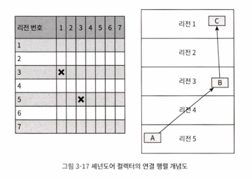
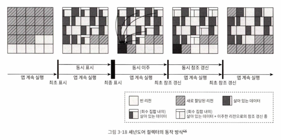
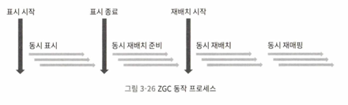

# 3.6 저지연 가비지 컬렉터

- 가장 중요한 지표: 처리량, 지연시간, 메모리 사용량
- 그중에서 `지연시간`이 가장 중요
    - 하드웨어 발전으로 처리량과 메모리 사용량은 덜 중요해졌지만, 메모리가 늘어나면 지연 시간에 악영향 줌
- CMS 등장 전(시리얼, 패러렐 GC)에는 동시 수행을 하지 않아 GC 동안 계속 일시 정지(STW)
- CMS는 마크-스윕 알고리즘 사용, 표시 단계 동시 수행, but 공간 파편화 심각
- G1은 리전 단위로 회수, but 동시 수행 불가
- 셰넌도어, ZGC는 거의 모든 과정이 동시에 수행됨
    - 일시 정지 시간이 짧음 -> `저지연 가비지 컬렉터`

## 셰넌도어(레드햇, 아마존 등)

- 힙 크기와 상관 없이 일시 정지를 10ms 이내 유지
- G1을 계승(힙 레이아웃 유사, 최초 표시와 동시 표시)
- 동시 모으기 지원(G1과 다르게 사용자 스레드도 병렬 수행)
- 세대 단위 컬렉션 미사용(JDK 21 이전) -> 신세대, 구세대 구별 안 함
- 기억 집합 대신 `연결 행렬`로 리전 간 참조 관계 기록
    - 관리 비용 감소, 거짓 공유 문제 가능성 감소
    - 
- 동작 방식
    - 최초 표시
    - 동시 표시
    - 최종 표시
    - 동시 청소
    - **동시 이주**
        - 셰넌도어와 다른 GC의 핵심 차이
        - 회수 집합 안에 살아 있는 객체들을 다른 빈 리전으로 복사
        - 사용자 스레드가 이동하는 객체를 계속 읽고 쓸 수 있게 하기 위해 `읽기 장벽`, `포워딩 포인터` 사용
    - 최초 참조 갱신
        - 동시 이주 단계의 객체 복사 이후 새로운 주소 수정하는 작업
        - 사용 스레드 아주 잠깐 일시 정지
    - 동시 참조 갱신
        - 참조 갱신을 '실제로' 시작하며 사용자 스레드와 동시에 수행
    - 최종 참조 갱신
        - GC 루트 집합의 참조 갱신
        - 마지막 일시 정지 단계
    - 동시 청소
    - 
- 포워딩 포인터(브룩스 포인터)
    - 원래의 객체 레이아웃 구조 상단에 참조 필드를 하나 추가
    - 이점: 포인터 하나의 값만 수정하면 끝
- 로드 참조 장벽 도입
    - 객체 참조 타입의 데이터를 읽거나 쓸 때만 끼어드는 메모리 장벽 모델 -> 원시 타입 작업, 객체 비교, 락 사용 시 오버헤드 감소
- 포워딩 포인터를 객체 헤더에 통합
    - 객체 헤더의 마크 워드를 포워딩 포인터로 사용
- 스택 워터마크 활용 스레드 스택 동시 처리
    - GC 시 발생하는 스택 스캔을 동시 수행하기 위해 도입
    - 스레드 스택 중 최상위 스택 프레임만 변하므로 나머지 부분만 잘 조율하면 되는 데 이 때 사용
    - 최상위 스택 프레임과 나머지 부분을 가르는 부분이 '스택 워터마크' -> 스택의 수위로 이해하면 됨

## ZGC(오라클)

- JDK 21 이전에는 신세대, 구세대 구분하지 않음
- 목표는 처리량 영향을 최소화하면서 일시 정지 시간을 10ms 이내로 줄이기(셰넌도어와 동일)
    - JDK 17부터 평균 1ms 이하로 줄이기 성공
- PGC, C4 계승
- 리전 기반 메모리 레이아웃
    - G1의 리전과 다르게 동적으로 생성/파괴
- 병렬 모으기와 컬러 포인터
    - 컬러 포인터: 객체의 생사 판단 외에 `포인터 자체에` 소량의 추가 정보를 직접 저장하는 기술
        - ZGC 이전에는 보통 주로 객체 헤더에 필드를 추가했음
- 동작 방식
    - 동작 표시
        - G1, 셰넌도어와 다르게 객체가 아니라 포인터에서 이뤄짐
    - 동시 재배치 준비
        - 청소해야 할 리전 선정하여 재배치 집합 만듦
        - ZGC는 G1의 회수집합과 다르게 모든 리전을 스캔
        - 리전 안의 생존 객체들을 다른 리전으로 복사한 후 리전 회수 여부만 결정
    - 동시 재배치
        - **핵심 단계**
        - 재배치 집합 안의 생존 객체를 새로운 리전으로 복사
        - 각 리전의 포워드 테이블에 신구 객체의 이주 관계 기록
        - 자가 치유
            - 사용자 스레드가 재배치 집합 내 객체에 동시 접근 시
            - 메모리 장벽이 개입하고,
            - 해당 리전 포워드 테이블 정보에 따라 새로운 객체로 포워드 시킴
            - 해당 참조 값도 새로운 객체를 직접 가리키도록 갱신
            - 이점: 옛 객체에 처음 접근 시에만 포워드 발생(셰넌 도어 포워딩 포인터 보다 낮은 오버헤드), 컬러포인터 사용으로 인해 복사 후 리전 재활용 가능
    - 동시 재매핑
        - 힙 전체에서 재배치 집합에 있는 옛 객체들을 향하는 참조 전부를 갱신하는 작업
        - 동시 재매핑 단계를 다음 가비지 컬렉션 주기가 시작되는 동시 표시 단계와 통합
- 다른 컬렉터들과의 비교
    - G1과 다르게 기억 집합, 쓰기 장벽 불사용 -> 부담 적음, but 할당 속도 제한
    - NUMA 메모리(멀티 프로세서, 멀티 코어 프로세서용 메모리 아키텍처)를 고려한 메모리 할당
    - 

## 세대 구분 ZGC

- 세대 구분으로 수명이 짧은 젊은 객체들을 더 자주 회수
- 약한 세대 가설에 따라, 젊은 객체들만 대상으로 하면 적은 노력으로 더 많은 메모리 확보 가능
- 컬러 포인터, 읽기 장벽 사용(ZGC) + 쓰기 장벽(G1)
- 읽기 장벽의 부하를 줄이기 위해 다중 매핑 메모리 기법 사용
    - 같은 힙 메모리를 세 개의 독립된 가상 주소로 매핑(ps 명령어로 메모리 사용량이 실제보다 3배 높게 측정됨)
- 기업 집합 장벽, 시작 단계 스냅숏 표시 장벽, 쓰기 장벽 버퍼, 장벽 패치 등 수많은 기법 적용
- 비트맵 이용해서 객체 필드의 위치를 정확하게 기록(이중 버퍼 이용)
- 밀집도 기반 리전 처리
    - 밀집도 분석해서 리전은 그대로 두고 노화시킴
- 거대 객체 처리
    - 구세대로 재배치 비용 걱정 없이 거대 객체도 신세대에 바로 할당(객체 재배치 없이 리전을 노화시킴 -> 구세대 승격)