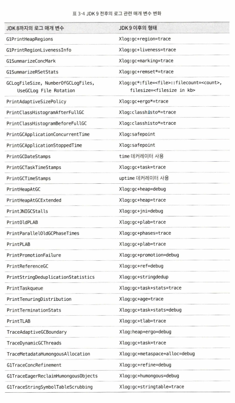
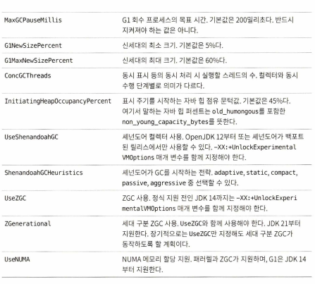

# 3.7 적합한 가비지 컬렉터 선택하기

## 엡실론 컬렉터

- 가비지 컬렉션을 전혀 하지 않는 컬렉터(실제로 그렇지는 않음)
- 자동 메모리 관리 서브 시스템
- 가비지 컬렉터는 힙 관리, 레이아웃, 객체 할당, 인터프리터, 컴파일러, 모니터링 서브 시스템 연동 등 수행
- 용도: 가비지 컬렉터를 서브시스템으로부터 떼어놓기, GC 배제 성능 테스트나 부하 테스트, 마이크로서비스나 서버리스용(저메모리, JIT 최적화 배제)
- 단기 동작 애플리케이션에서는 동작 부하가 아주 적고 메모리 회수 활동을 전혀 하지 않기 때문에 안성맞춤

## 컬렉터들 간 비교 및 취사선택

- 컬렉터 선택 시 고려 요소
    - 애플리케이션 주목적
        - 무엇이 중요한지(처리량, SLA, 지연시간, 메모리 사용량 등)
    - 애플리케이션 구동 서브시스템(아키텍처, 프로세서 개수, 가용 메모리 용량, 운영체제 등)
    - JDK 제공자
- Oracle JDK 또는 OpenJDK 이용 시 선택 방법
    - 최대 100MB 이하 작은 데이터만 다루는 경우 -> 시리얼
    - 단일 프로세서, 일시 정지시간 제약 없는 경우 -> 시리얼
    - 최대 성능 중요, 지연 시간 제약 없거나 1초 이상 지연 시간 허용되는 경우 -> 기본, 패러렐
    - 처리량보다 응답 시간 중요, 일시 정시 시간 짧아야 하는 경우 -> G1
    - 응답 시간 매우 중요 -> (세대 구분) ZGC

## 가상 머신과 가비지 컬렉터 로그

- 메모리 문제를 다루려면, 가상 머신과 가비지 컬렉터의 로그를 읽고 분석할 수 있어야 함
- JDK 9부터 -Xlog 매개 변수로 모든 핫스팟 기능의 로그를 설정할 수 있게 됨
- 로그 형식, 로그를 보고 싶은 기능 모듈, 로그 레벨, 데커레이터 등은 책 참조

## 가비지 컬렉터 매개 변수 정리

## 3.8 메모리 할당과 회수 전략

- 객체 메모리 할당은 힙에 할당한다는 의미
- 새로운 객체는 신세대에 할당(크기가 문턱값보다 크면 구세대 할당 되기도 함)

### 객체는 먼저 에덴에 할당

- 대부분, 신세대 에덴에 할당
- 에덴 공간 부족 시 마이너 GC 시작
- `-Xms20M`: 최소 힙크기 20MB
- `-Xmx20M`: 최대 힙크기 20MB
- `-Xmn10M`: 신세대에 10MB 할당(구세대에 10MB 할당됨)
- `-XX:SurvivorRatio:8`: 에덴과 생존자 공간 비율을 8:1로 설정
- 예제에서는 생존자 공간에 옮겨지지 못하는 객체를 바로 구세대로 옮기는 것을 보여줌

### 큰 객체는 곧바로 구세대에 할당

- 큰 객체: 크고 '연속된' 메모리 공간을 필요로 하는 자바 객체. ex) byte[]
- 큰 객체들을 담기 위한 연속된 공간을 확보학 위해 다른 수많은 객체를 옮겨야 함 -> 심각한 오버헤드
- `-XX:PretenureSizeThreshold` 매개 변수를 설정하면 설정값보다 큰 객체를 곧바로 구세대에 할당(에덴과 생존자 공간 간 대규모 복사 줄이기 위함)

### 나이가 차면 구세대로 옮겨짐

- 핫스팟 가상 머신 컬렉터 대부분은 세대 단위 컬렉션 활용 -> GC시 어떤 생존 객체를 남길지 아니면 구세대로 옮길지 정해야 함
- VM은 각 객체 헤더에 세대 나이 카운터를 두도록 함
- 구세대로 승격되는 나이는 `-XX:MaxTenuringThreshold`로 정함(0이 에덴에서 태어날 때 나이)
- `-XX:TargetSurvivorRatio` 매개변수 설정하면 생존자 공간이 지정한 비율 이상 차면 살아 남은 객체들을 구세대로 승격
- 즉, 객체 크기 나이 이외에도 구세대 이동 요인이 존재

### 공간이 비좁으면 강제로 승격

- 기본적으로, 생존 객체 전체의 크기 총합이 생존자 공간의 50%를 넘어서면 모든 객체를 구세대로 옮김
