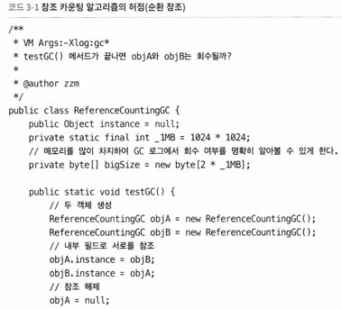
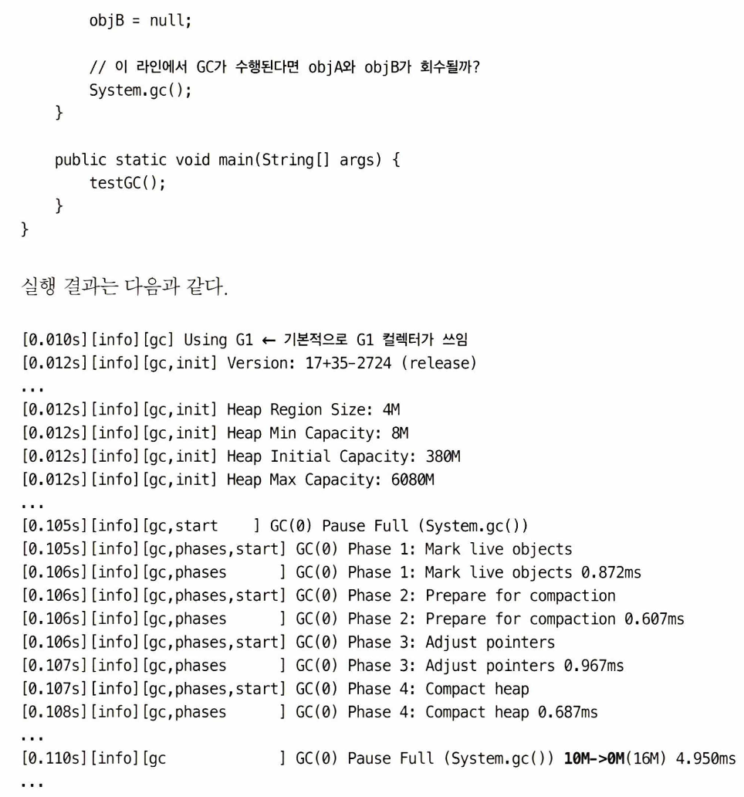
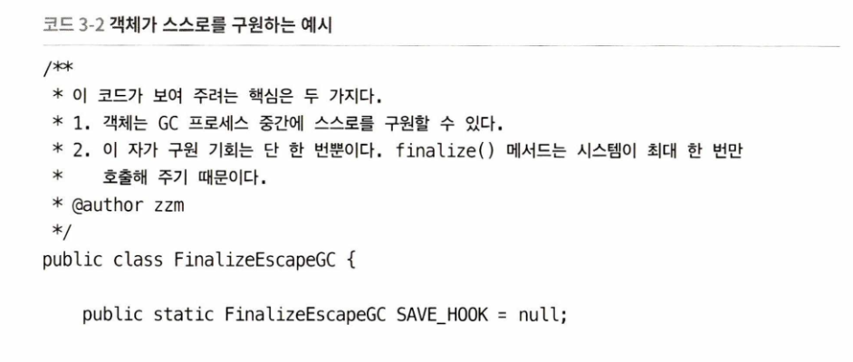
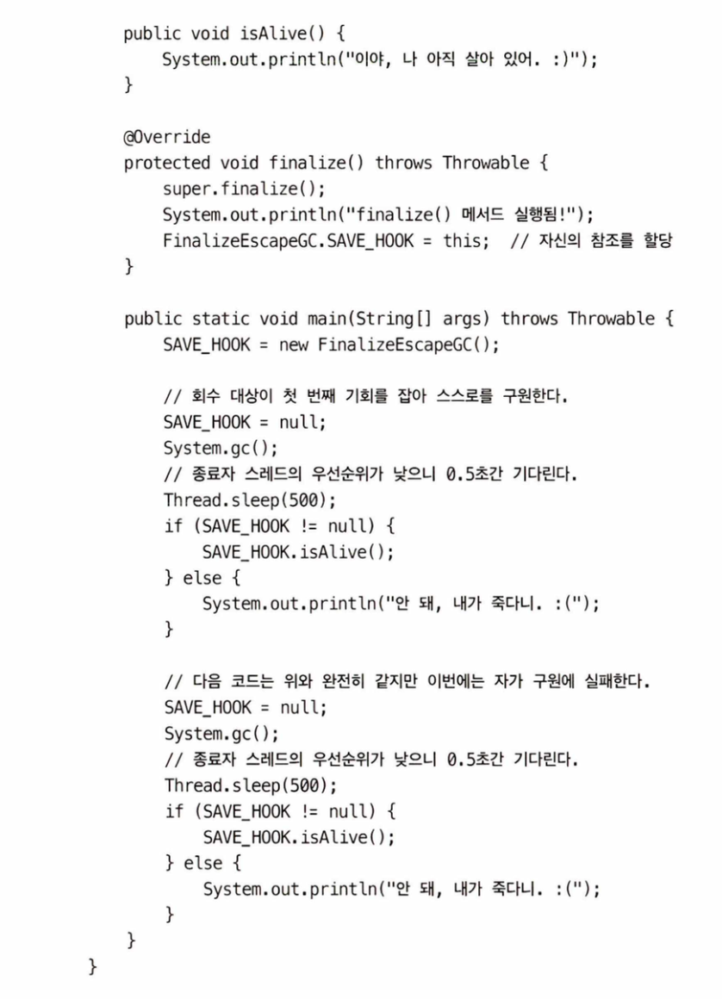
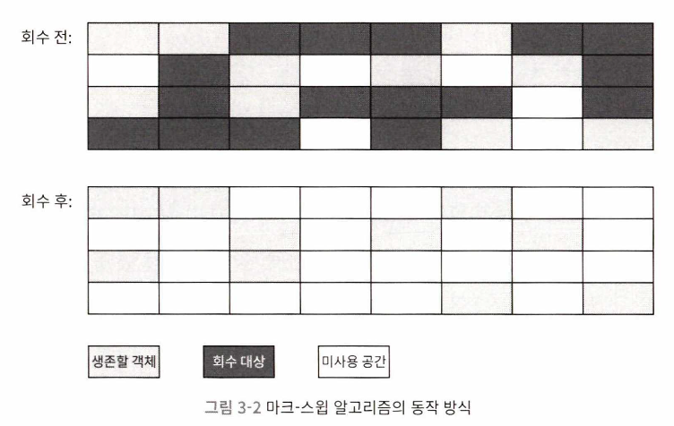
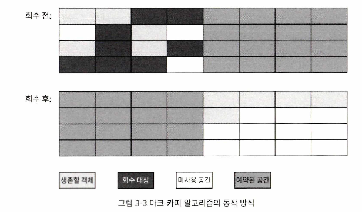
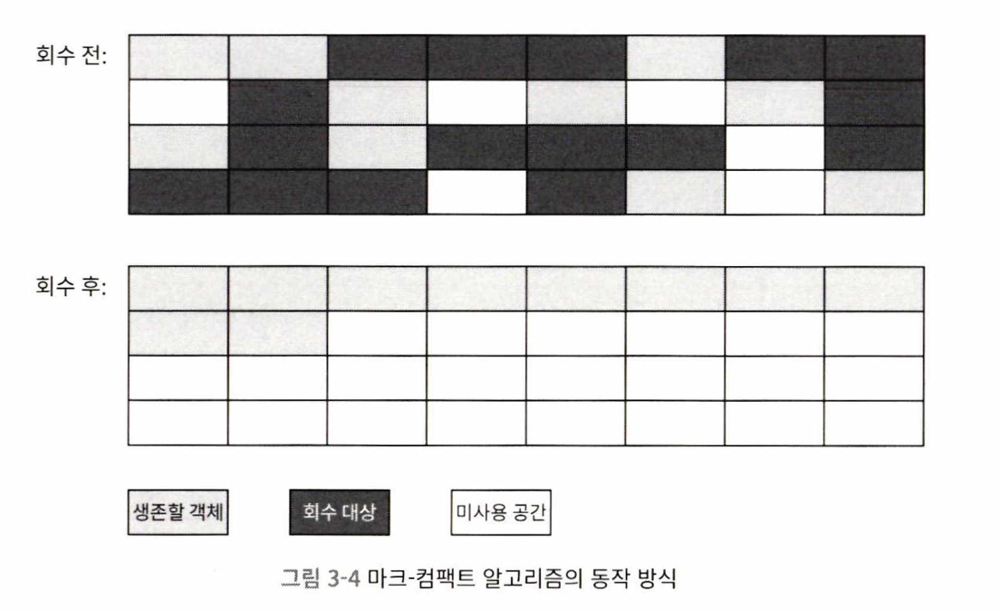

# 가비지 컬렉터와 메모리 할당 전략

## 들어가며

가비지 컬렉션은 자바 언어에서 처음 도입된 기술이라고 오해하는 사람들이 많지만, 실제로는 자바보다 훨씬 오래된 기술이다. 동적 메모리 할당과 가비지 컬렉션 기술은 1960년 MIT에서 개발된 리스프라는 언어에서 처음 사용되었다. 리스프의 창시자인 존 매카시는 가비지 컬렉션이 해결해야 할 세 가지 문제를 제시했는데, 그것은 어떤 메모리를 회수해야 하는지, 언제 회수해야 하는지, 그리고 어떻게 회수해야 하는지에 관한 문제이다.

이후 반세기가 넘는 시간 동안 동적 메모리 할당과 가비지 컬렉션 기술은 크게 발전하였고, 오늘날 자동화 시대의 필수 기술로 자리 잡았다. 특히 가비지 컬렉션과 메모리 할당의 내부를 이해하는 것은 높은 동시성을 요구하는 현대 시스템에서 매우 중요한 일이 되었다.

자바 언어를 기준으로 살펴보면, 스택 메모리와 힙 메모리 영역으로 나뉜다. 스택 메모리는 메소드 호출과 관련된 데이터를 저장하는 영역으로, 메소드가 종료되거나 스레드가 끝나면 자동으로 회수된다. 반면 힙 메모리는 클래스 구현과 조건 분기에 따라 동적으로 메모리가 할당되는 영역이다. 이 영역은 런타임 시점에서 객체가 얼마나 많이 생성되는지에 따라 메모리 요구량이 달라지며, 동적으로 메모리를 관리해야 한다.

따라서 가비지 컬렉터는 힙 메모리와 같은 동적 메모리 영역을 집중적으로 관리하며, 메모리 할당과 회수를 동적으로 수행한다. 이 책에서는 주로 이러한 동적 메모리 영역을 다루며, ‘메모리 할당과 회수’라는 주제를 중심으로 이야기를 전개한다.

## 대상이 죽었는가?

### 참조 카운팅 알고리즘

참조 카운팅 알고리즘은 객체가 살아 있는지 판단하기 위해 참조 횟수를 추적하는 방식으로 작동한다. 객체를 참조하는 곳이 생길 때마다 카운터 값을 증가시키고, 참조가 사라질 때마다 카운터 값을 감소시킨다. 카운터 값이 0이 되면 더는 사용되지 않는 객체로 간주하여 회수할 수 있다.

이 알고리즘은 원리가 단순하고 판단에 드는 에너지가 적기 때문에 많은 상황에서 효율적으로 사용된다. 실제로 마이크로소프트 COM, 파이썬, 리스프 등 다양한 환경에서 사용되고, 게임용 스크립트 언어인 스퀴럴(Squirrel)도 메모리 관리를 위해 참조 카운팅 알고리즘을 활용한다. 하지만 자바와 같은 가상 머신 환경에서는 참조 카운팅 알고리즘이 사용되지 않는다. 이는 이 알고리즘이 간결하다는 장점에도 불구하고, 동작을 위해 계산량이 상당히 늘어나기 때문이다.

특히 순환 참조 문제를 해결하기 어렵다는 점이 큰 단점이다. 순환 참조란 두 객체가 서로를 참조하는 경우를 의미하며, 이런 경우 참조 카운트가 0이 되지 않아 객체가 회수되지 않는다. 예를 들어, 한 객체의 필드가 다른 객체를 참조하고, 그 객체가 다시 첫 객체를 참조하면 외부에서 두 객체에 접근할 방법이 없어도 참조 카운트는 여전히 0이 아니다. 따라서 참조 카운팅 알고리즘만으로는 순환 참조 문제를 해결할 수 없으며, 이로 인해 자바에서는 사용되지 않는다는 한계가 있다.

코드의 실행 결과를 보면 System.gc()를 호출한 후 가비지 컬렉션이 정상적으로 작동하며 메모리에서 objA와 objB가 회수되었음을 확인할 수 있다. 이는 자바 가상 머신이 참조 카운팅이 아닌 다른 알고리즘을 사용하여 객체의 생존 여부를 판단한다는 증거이다.

### 도달 가능성 분석 알고리즘

도달 가능성 분석 알고리즘은 자바, C# 등 현대의 주요 프로그래밍 언어들이 객체의 생존 여부를 판단하기 위해 사용하는 방식이다. 이 알고리즘의 기본 원리는 특정 루트 객체(GC 루트)에서 시작해 참조 체인을 따라가며 다른 객체들을 탐색하는 것이다. 탐색 과정에서 참조 체인에 포함되지 않는 객체는 GC 루트에서 도달할 수 없다고 판단되며, 더 이상 사용되지 않는 객체로 간주하여 회수 대상이 된다.

GC 루트로 인정되는 객체는 메모리에서 특별히 관리되며, 대표적으로 가상 머신 스택에서 사용하는 매개 변수나 지역 변수, 클래스의 정적 필드가 참조하는 객체, 동기화 락(synchronized 키워드)을 통해 관리되는 객체, 네이티브 메서드에서 사용하는 객체 등이 포함된다. 또한, JVM 내부 상황을 반영하는 JMXBean, 로컬 코드 캐시 등도 GC 루트로 간주된다.

GC 루트 외에도 일부 메모리 영역에 따라 다른 객체들이 임시로 GC 루트 집합에 추가될 수 있다. 이 과정에서 도달 가능성 분석은 GC 루트에 포함된 객체뿐만 아니라, 다른 영역과 연결된 객체들까지 분석해 객체의 생존 여부를 판단한다.

도달 가능성 분석 알고리즘은 순환 참조 문제를 해결할 수 있는 장점이 있다. 예를 들어, 서로를 참조하는 객체라 하더라도 GC 루트에서 도달할 수 없는 경우 회수 대상이 된다. 이러한 접근 방식은 현대 가비지 컬렉터가 객체의 생존 여부를 효율적으로 판단할 수 있게 한다. 특히 최신 가비지 컬렉터는 부문 컬렉션과 같은 다양한 최적화 기법을 활용해 성능을 더욱 향상시키고 있다. 결과적으로, 도달 가능성 분석 알고리즘은 객체 생존 판단의 신뢰성을 높이며, 효율적인 메모리 관리를 가능하게 한다.

### 다시 참조 이야기로

객체의 생사 판단에서 참조는 중요한 개념으로, 참조 카운팅 알고리즘이든 도달 가능성 분석 알고리즘이든 객체를 참조하는지 여부를 기반으로 동작한다. JDK 1.2 이전 자바에서는 참조를 단순히 메모리 조각의 시작 주소를 가리키는 것으로 정의했지만, 이 정의는 현재 기준에서 한계가 있다. 객체의 상태를 ‘참조되었다’와 ‘참조되지 않았다’로만 나눌 경우, 메모리가 부족해도 회수 대상 객체를 표현하기 어렵기 때문이다.

JDK 1.2부터 참조의 개념은 네 가지로 확장되었다. 강한 참조(strong reference)는 전통적인 참조로, 객체를 가리키는 강한 관계가 있으면 가비지 컬렉션이 객체를 절대 회수하지 않는다. 반면 부드러운 참조(soft reference)는 메모리가 부족할 때만 회수 대상이 되는 객체를 표현한다. 약한 참조(weak reference)는 부드러운 참조보다 더 약하며, 가비지 컬렉터가 작동하기 시작하면 바로 회수된다. 유령 참조(phantom reference)는 가장 약한 형태로, 객체의 실제 회수 시점을 알리기 위한 목적으로만 사용된다.

이 확장된 참조 개념은 메모리 관리에 더 유연성을 제공하며, 캐시나 리소스 관리와 같은 다양한 상황에서 활용된다. 예를 들어, 부드러운 참조는 캐싱 시스템에서 유용하며, 유령 참조는 객체가 회수될 때 추가 작업을 수행하는 데 유용하다. 또한, JDK 내부적으로는 파이널 참조(final reference)라는 특별한 참조가 존재하여, finalize() 메서드를 구현한 객체의 회수 작업을 보조한다.

* 파이널 참조

파이널 참조(final reference)는 JDK 내부적으로 사용하는 참조 유형으로, 약한 참조와 유령 참조 사이의 강도를 가진다. finalize() 메서드를 구현한 객체는 모두 파이널 참조의 대상으로 간주되어, 가비지 컬렉션 과정에서 별도의 대기열(queue)에 등록된다. 이후 해당 객체에 도달할 수 있는 강한 참조, 부드러운 참조, 약한 참조가 모두 없어지면, finalize() 메서드가 호출된다.

파이널 참조는 객체가 회수되기 전에 마지막으로 특정 작업을 수행할 기회를 제공하기 위해 사용된다.

### 살았나, 죽었나 ?

도달 가능성 분석 알고리즘에서 도달 불가능하다고 판단된 객체가 반드시 즉시 회수되거나 사라지는 것은 아니다. 이 객체들은 ‘유예’ 단계에 들어가며, 명확한 사망 선고를 내리기 위해 두 번의 표시(marking) 과정을 거친다. 첫 번째 과정에서 GC 루트와 연결된 참조 체인을 찾지 못한 객체는 ‘finalize()’ 메서드 실행 여부를 확인하는 필터링 조건을 통과하게 된다. 이 과정에서 finalize() 메서드가 필요 없는 객체나 이미 실행된 객체는 바로 회수 대상으로 처리된다.

finalize() 메서드 실행이 필요한 객체는 F-큐(Finalization Queue)에 추가되고, 나중에 우선순위가 낮은 별도의 중료 스레드에서 finalize() 메서드가 실행된다. 하지만 가상 머신은 finalize() 메서드가 끝날 때까지 기다리지 않으며, 이를 수행하는 도중에 시스템의 다른 가비지 컬렉션 작업이 지연될 수 있다. 최악의 경우, 이러한 대기 중인 객체들로 인해 시스템 전체가 중단될 가능성도 존재한다.

finalize() 메서드는 객체가 죽기 전에 부활할 수 있는 마지막 기회를 제공한다. 객체가 finalize() 메서드 내에서 자신을 참조 체인에 다시 연결하거나 다른 객체의 변수에 저장되면, 해당 객체는 회수 대상에서 제외된다. 그러나 두 번째 GC 과정에서 다시 회수 대상으로 분류될 수 있으며, 만약 이 단계에서도 부활하지 못하면 진짜로 회수된다.

finalize() 메서드는 객체가 가비지 컬렉션 과정에서 한 번은 자신을 부활시킬 수 있지만, 그 기회는 단 한 번뿐이다. 두 번째 GC에서는 finalize()가 다시 호출되지 않기 때문에 객체는 결국 회수된다. 이는 finalize()가 비효율적이고 예측 불가능하다는 점을 보여준다.

이 메서드는 C++의 소멸자(destructor)와 유사하지만, 자바에서는 신뢰성이나 성능 문제가 크기 때문에 권장되지 않는다. 실행 비용이 높고, 호출 여부가 보장되지 않기 때문이다. 이런 이유로 finalize()는 JDK에서 폐기 대상으로 간주되었다.

따라서 finalize()를 사용하는 대신, 자원 관리는 try-with-resources나 명시적인 자원 해제 방식으로 처리하는 것이 더 바람직하다. 자바 언어에서 finalize() 메서드의 존재는 현대적인 메모리 관리 및 클린 코드 관점에서 완전히 배제하는 것이 권장된다.

### 메서드 영역 회수하기

메서드 영역은 가비지 컬렉터가 반드시 청소해야 하는 영역이 아니다. 실제로 가상 머신 중 일부는 메서드 영역의 언로딩을 구현하지 않아도 정상적으로 동작한다. 예를 들어, JDK 11에 도입된 ZGC 컬렉터는 메서드 영역의 언로딩을 지원하지 않는다. 이는 메서드 영역의 회수가 비효율적일 수 있기 때문이다. 하지만 자바 힙은 메모리 회수 효율이 높아 70~99%의 메모리를 회수할 수 있어 메서드 영역보다 효율적이다.

메서드 영역의 가비지 컬렉션은 주로 더 이상 사용되지 않는 두 가지 대상을 회수하는 데 초점을 맞춘다. 첫 번째는 ‘상수 풀’에 있는 데이터다. 예를 들어, 상수 풀에 있는 문자열 리터럴 “java”가 참조되지 않는다면, 가비지 컬렉터는 이를 회수 대상으로 간주한다. 상수 풀이 회수될 조건은 참조가 모두 사라진 경우뿐이며, 더 이상 사용되지 않는 데이터만 회수된다.

두 번째는 더 이상 사용되지 않는 클래스다. 클래스를 회수하기 위해서는 몇 가지 조건을 동시에 만족해야 한다. 해당 클래스의 모든 인스턴스가 회수되었고, 클래스 로더가 더 이상 필요하지 않으며, 해당 클래스가 어디에서도 참조되지 않아야 한다. 하지만 이러한 조건이 모두 만족되는 경우는 드물다. 특히 JSP와 같은 동적 프레임워크에서는 클래스 로더를 자주 사용하는 방식 때문에 클래스 언로딩이 어려울 수 있다.

가상 머신은 클래스 회수 여부를 제어할 수 있는 여러 옵션을 제공한다. 예를 들어, -Xnoclassgc 옵션은 클래스 회수를 비활성화할 수 있으며, -verbose:class와 같은 옵션은 로드된 클래스 정보를 출력한다. 동적 프레임워크나 OSGi 환경에서는 가상 머신의 타협적인 언로딩 지원을 통해 메서드 영역에 대한 과도한 압박을 줄일 수 있다.

## 가비지 컬렉션 알고리즘

비지 컬렉션 알고리즘은 가상 머신과 플랫폼에 따라 다양한 방식으로 구현된다. 이를 크게 두 가지로 나눌 수 있는데, 바로 ‘참조 카운팅 GC’와 ‘추적 GC’이다. 참조 카운팅 GC는 객체의 참조 횟수를 세어 이를 기준으로 객체의 생존 여부를 판단한다. 하지만 자바 가상 머신에서는 참조 카운팅 GC를 사용하지 않기 때문에, 이 책에서는 추적 GC에 속하는 알고리즘만 다룬다.

추적 GC는 객체의 생존 여부를 판단하기 위해 GC 루트에서 시작해 도달 가능성을 분석하는 방식을 사용한다. 이는 직접적으로 객체를 추적하여 가비지 여부를 판단하므로, 참조 카운팅 방식의 단점인 순환 참조 문제를 효과적으로 해결할 수 있다. 이러한 방식은 현대적인 자바 가상 머신에서 주로 사용되는 방식으로, 효율적인 메모리 관리를 가능하게 한다.

### 세대 단위 컬렉션 이론

세대 단위 컬렉션 이론은 대다수의 현대 가상 머신에서 채택된 가비지 컬렉션 설계의 기본 원칙으로, 실제 프로그래밍 경험에서 얻은 법칙을 기반으로 한다. 이 이론의 핵심은 객체를 나이에 따라 서로 다른 영역으로 구분하고, 각 영역에 맞는 가비지 컬렉션을 수행하는 것이다.

이 이론은 두 가지 주요 가설에 기반한다. 첫 번째는 약한 세대 가설로, 대부분의 객체는 짧은 수명을 가지고 금방 소멸된다는 것이다. 두 번째는 강한 세대 가설로, 오래 생존한 객체일수록 더욱 오래 살아남을 가능성이 크다는 것이다. 이 두 가설은 객체를 생성 후 빠르게 소멸되는 신세대와 오래 생존하는 구세대로 나누고, 신세대는 자주 회수하며 구세대는 덜 자주 회수하는 방식으로 효율을 높이는 데 기여한다.

세대 단위 컬렉션은 신세대와 구세대라는 두 영역으로 자바 힙을 구분한다. 신세대는 객체가 빠르게 생성되고 소멸되는 영역으로, 대부분의 객체가 이곳에서 죽는다. 구세대는 오래 살아남은 객체가 이동하여 유지되는 영역이다. 신세대 객체가 살아남으면 구세대로 승격되며, 구세대는 더 적은 빈도로 가비지 컬렉션을 수행한다. 이러한 접근 방식은 가비지 컬렉션에 드는 전체 시간을 줄이고, 메모리 공간을 더 효율적으로 활용할 수 있게 한다.

세대 간 참조를 관리하기 위해 추가적인 메커니즘도 도입된다. 세대 간 참조가 있는 객체를 추적하기 위한 특별한 데이터 구조가 사용되며, 이를 통해 신세대에서 구세대로, 혹은 그 반대로의 참조 관계를 효율적으로 관리할 수 있다.

이 이론은 마크-스윕, 마크-카피, 마크-컴팩트와 같은 다양한 알고리즘과 결합하여 사용되며, 이러한 방식의 통합은 가비지 컬렉션 효율을 극대화한다. 또한, 핫스팟 JVM에서는 DefNewGeneration, ParNewGeneration과 같은 구현 코드를 통해 세대별 가비지 컬렉터를 지원하며, 세대 단위 컬렉션 이론의 기본 설계 철학을 따른다.

* 세대 단위 컬렉션에서의 다양한 GC 방식

#### 1. 부분 GC
자바 힙의 일부만 회수하는 가비지 컬렉션 방식.
- **마이너 GC**: 신세대만 대상.
- **메이저 GC**: 구세대만 대상.
    - 집필 시점 기준으로, 오직 CMS 컬렉터만 구세대를 따로 회수.
- **혼합 GC**: 신세대 전체와 구세대 일부를 대상으로 회수.
    - G1 컬렉터에서 사용.

#### 2. 전체 GC
자바 힙 전체와 메서드 영역까지 모두를 대상으로 회수하는 가비지 컬렉션 방식.

각 방식은 대상 영역과 회수 범위에 따라 구분되며, 효율적인 메모리 관리를 위해 적합한 GC 방식이 선택된다.

### 마크-스윕 알고리즘

마크-스윕(Mark-Sweep) 알고리즘은 1960년 존 매카시가 제안한 최초의 가비지 컬렉션 알고리즘으로, 가장 기본적인 형태의 알고리즘이다. 이 알고리즘은 두 단계로 이루어진다. 먼저 회수 대상 객체를 모두 표시(mark)하고, 이후 표시된 객체를 쓸어(sweep)내는 방식으로 동작한다. 회수 단계에서는 표시되지 않은 객체를 회수하여 메모리에서 제거한다.

이 알고리즘이 기본적인 이유는 이후에 나온 대부분의 가비지 컬렉션 알고리즘이 마크-스윕의 단계를 기반으로 발전해왔기 때문이다. 하지만 단순한 구조만큼 몇 가지 단점도 존재한다.

첫 번째 단점은 실행 효율이 일정하지 않다는 점이다. 자바 힙에 객체가 많을수록 표시 단계와 회수 단계에 시간이 오래 걸린다. 이는 객체가 많을수록 작업 효율이 급격히 떨어지는 문제를 야기한다.

두 번째 단점은 메모리 단편화 문제다. 가비지 컬렉터가 사용하지 않는 객체를 회수한 후, 메모리 내에 불연속적인 빈 공간이 남아 메모리 파편화가 발생한다. 메모리 파편화가 심해질 경우, 큰 객체를 저장할 연속된 메모리 공간을 찾기 어려워지고, 이는 프로그램 성능에 부정적인 영향을 끼친다.

###  마크-카피 알고리즘

마크-카피 알고리즘은 마크-스윕 알고리즘의 단점을 해결하기 위해 1969년 로버트 페나첼에 의해 제안된 방식으로, 가용 메모리를 두 개의 동일한 크기 블록으로 나누어 한 블록만 사용하는 방식을 채택한다. 회수 대상이 되는 객체를 제외하고 살아남은 객체를 다른 블록으로 복사한 뒤, 기존 블록을 한 번에 청소하는 방식이다.

이 알고리즘의 주요 장점은 메모리 파편화를 방지할 수 있다는 것이다. 복사 과정에서 객체가 메모리의 한쪽 끝에서부터 차곡차곡 쌓이기 때문에 불연속적인 공간이 생기지 않는다. 또한 구현이 간단하고 실행 효율이 높은 편이다. 하지만 단점도 명확한데, 바로 메모리 사용의 절반만 활용할 수 있다는 점이다. 전체 메모리의 절반은 항상 비어 있어야 하므로, 메모리 효율이 떨어질 수 있다.

마크-카피 알고리즘은 주로 신세대 가비지 컬렉션에 활용된다. 연구에 따르면 신세대 객체의 약 98%는 첫 번째 가비지 컬렉션에서 회수되기 때문에, 살아남는 객체의 비율이 낮은 신세대 영역에서 이 알고리즘은 매우 효과적이다. IBM은 이러한 신세대의 특징을 활용하여 메모리를 생존자 공간과 에덴 공간으로 나누는 전략을 고안했고, 이를 기반으로 앤드류 아펠이 ‘아펠 스타일 컬렉션’이라는 최적화된 전략을 제시했다.

이 방식에서 에덴과 생존자 공간의 기본 비율은 8:1로, 신세대 전체 메모리의 90%를 에덴 공간으로 할당하고, 나머지 10%를 생존자 공간으로 사용한다. 대부분의 객체가 에덴 공간에서 회수되고, 살아남은 객체만 생존자 공간으로 복사된다. 이후 살아남은 객체가 구세대로 승격된다.

한편, 생존자 공간을 초과하는 객체가 발생할 경우 메모리 할당 보증 메커니즘이 적용된다. 즉, 초과된 객체를 구세대로 직접 이동시키거나 다른 영역을 활용하여 메모리 할당을 보장한다. 이는 은행의 보증 시스템과 유사하게, 예외적인 상황을 대비한 메커니즘으로 안정성을 제공한다.

### 마크-컴팩트 알고리즘

마크-컴팩트(Mark-Compact) 알고리즘은 1974년 에드워드 루더스가 제안한 방식으로, 구세대 객체의 생존 특성을 고려한 알고리즘이다. 이 알고리즘은 마크-스윕 알고리즘과 유사하게 먼저 회수 대상 객체를 표시(mark)하는 단계를 거친다. 이후 컴팩트(compact) 단계에서 살아남은 객체를 메모리 영역의 한쪽 끝으로 이동시키고, 나머지 공간을 연속된 빈 공간으로 정리한다.

마크-컴팩트 알고리즘의 주요 차이점은 메모리 이동이 발생한다는 점이다. 이는 메모리 단편화 문제를 해결하여 연속된 메모리 공간을 확보할 수 있는 장점을 제공한다. 하지만 객체를 이동시키는 과정에서 기존 참조들을 갱신해야 하는 추가 작업이 필요하며, 이로 인해 실행 비용이 증가할 수 있다. 특히 구세대 객체가 많을 경우, 이동 비용이 상당히 높아져 성능에 영향을 줄 수 있다.

이 알고리즘의 단점은 두 가지 관점에서 나타난다. 첫 번째로, 객체를 이동시킬 경우, 이동 비용과 참조 갱신 작업이 부담으로 작용한다. 두 번째로, 객체를 이동시키지 않을 경우, 단편화 문제가 해결되지 않아 메모리 접근 효율이 떨어질 수 있다. 따라서 객체를 이동시킬지 여부는 상황에 따라 결정되며, 단기적으로 정지 시간이 중요할 경우 객체 이동을 최소화하고, 전체 처리량을 중시할 경우 객체를 이동시키는 방식이 더 효율적일 수 있다.

마크-컴팩트 알고리즘은 CMS(Concurrent Mark-Sweep)와 같은 가비지 컬렉션 방식에서 마크-스윕을 기본으로 하되, 메모리 단편화가 심각할 경우 연속된 공간을 확보하기 위해 사용된다. 이는 처리량과 정지 시간 간의 균형을 맞추기 위한 방안으로, 메모리 파편화를 최소화하며 효율적인 메모리 사용을 가능하게 한다.

## 핫스팟 알고리즘 상세 구현

핫스팟 알고리즘의 상세 구현에서는 일반적인 객체 생존 판단 알고리즘과 가비지 컬렉션 알고리즘 이론을 다룬다. 

### 루트 노드 열거

루트 노드 열거는 도달 가능성 분석 알고리즘의 첫 단계로, GC 루트 집합으로부터 참조 체인을 찾아내는 작업을 말한다. GC 루트는 주로 전역 참조(상수와 클래스 정적 속성)와 실행 컨텍스트(스택 프레임의 지역 변수 테이블) 등에 존재한다. 이 과정의 목표는 참조 체인 스캔을 효율적으로 구현하는 데 있다.

현대 자바 애플리케이션은 점점 거대해지고, 메서드 영역 크기가 수백 GB에 이르는 경우도 드물지 않다. 클래스와 상수의 수가 많아질수록 참조를 하나하나 확인하는 작업은 엄청난 시간이 소요될 수 있다. 따라서 루트 노드 열거 작업은 필연적으로 ‘스톱 더 월드(Stop the World)’ 문제를 발생시킨다. GC가 루트 노드를 열거하는 동안 모든 사용자 스레드를 정지해야 하기 때문이다. 이는 실행 중인 애플리케이션의 성능에 직접적인 영향을 줄 수 있다.

도달 가능성 분석 과정에서 가장 오래 걸리는 작업은 루트 노드 열거로, 현재 대부분의 GC는 이 작업을 사용자 스레드와 동시에 수행할 수 없다. 루트 노드 열거는 반드시 스냅샷 상태에서 수행되어야 하며, 스냅샷 상태란 실행 도중에 루트 노드의 참조 관계가 변하지 않아야 한다는 것을 의미한다. 이를 달성하지 못하면 분석 결과가 신뢰성을 잃게 된다.

핫스팟 가상 머신은 OopMap이라는 데이터 구조를 사용해 이 문제를 해결한다. OopMap은 스택과 레지스터에서 특정 지점에 어떤 데이터가 참조인지 정확히 기록한다. 이를 통해 GC는 메서드 영역과 다른 GC 루트로부터 정보를 직접 얻어 루트 노드 열거 과정을 간소화한다.

### 안전 지점

안전 지점(Safe Point)은 가비지 컬렉션(GC)에서 OopMap을 활용하여 GC 루트를 빠르게 열거할 수 있도록 설정된 특정 위치를 말한다. OopMap은 각 명령어에 모두 생성되지 않고, 메모리 사용량 증가를 방지하기 위해 특정 명령어에서만 안전 지점을 기록한다. 안전 지점에 도달하기 전에는 프로그램을 멈추지 않아 GC 작업이 안전하게 이루어진다.

안전 지점을 설정할 때, 너무 적게 설정하면 GC가 시작될 때 프로그램이 오랫동안 기다릴 수 있고, 반대로 너무 많이 설정하면 런타임 메모리 부하가 커질 수 있다. 따라서 안전 지점은 기본적으로 프로그램의 장시간 실행 가능성을 기준으로 선택된다. 명령어 하나의 실행 시간이 짧아 안전 지점으로 적합하지 않으면, 멀티플렉싱(multiflexing)이 이루어지는 지점에서 안전 지점을 생성한다.

안전 지점을 구현하는 방법은 선제적 멈춤(preemptive suspension)과 자발적 멈춤(voluntary suspension) 두 가지로 나뉜다. 선제적 멈춤 방식은 GC 실행 시 모든 사용자 스레드를 즉시 중단시키는 방식으로, GC가 실행되면 즉시 안전 지점으로 이동하지 않은 스레드를 반복적으로 인터럽트한다. 반면 자발적 멈춤 방식은 GC 실행 동안 각 스레드가 스스로 안전 지점에 도달하도록 설계되며, 플래그 비트를 설정하고 주기적으로 확인(polling)한다. 플래그가 활성화되면 안전 지점에서 스레드가 멈추도록 동작한다.

핫스팟은 메모리 보호 트랩(memory protection trap) 기술을 사용해 안전 지점에서의 플래그 확인 과정을 단순화하며, GC 실행 중 스레드 인터럽트를 효율적으로 처리한다. 이를 통해 가비지 컬렉션은 보다 신속하고 안정적으로 진행될 수 있다.

### 안전 지역

안전 지역(Safe Region)은 안전 지점(Safe Point) 개념을 확장하여, 사용자가 프로그램 실행 중에 특정 코드 영역에 진입했음을 명시적으로 알리는 방식이다. 안전 지점이 프로그램의 임무를 중단하고 특정 지점에서 가비지 컬렉션(GC)을 수행한다면, 안전 지역은 실행 중인 스레드가 명시적으로 GC에 방해받지 않음을 보장하는 영역이다.

안전 지역에 있는 스레드는 가비지 컬렉션 중 인터럽트를 받을 필요가 없다. 대신 안전 지역에서 벗어나는 순간, 가상 머신은 해당 스레드가 GC와의 인터랙션이 필요한 상태인지 확인한다. 예를 들어, 루트 노드 열거가 필요한 경우라면 안전 지역을 벗어난 스레드는 가비지 컬렉션 작업에 참여한다. 반면, 안전 지역 내부에 있거나 GC 작업과 무관한 상태라면 스레드는 자신이 수행하던 작업을 계속 실행한다.

이 개념은 일반적으로 사용자 스레드가 장시간 차단되는 문제를 줄이기 위해 도입된다. 예를 들어, 사용자가 블록된 상태에서 입력 대기를 하는 동안 가상 머신이 다른 스레드의 GC 작업을 기다릴 필요가 없도록 한다. 안전 지역은 GC의 효율성을 높이고 사용자 경험을 개선하는 데 기여하며, 프로그램의 유연성과 안정성을 증대시킨다.

### 기억 집합과 카드 테이블

기억 집합과 카드 테이블은 세대 단위 가비지 컬렉션에서 세대 간 참조 문제를 해결하기 위한 데이터 구조로 설계되었다. 이를 통해 특정 영역에서 회수 가능한 메모리 블록만 스캔하여 효율성을 높인다.

기억 집합은 비휘발성 영역(회수 대상이 아닌 영역)에서 회수 대상 영역을 가리키는 포인터를 기록하는 구조이다. 이는 특정 메모리 블록의 데이터를 효율적으로 추적하는 데 도움을 준다. 그러나 이러한 기록을 유지하기 위해서는 공간과 관리 비용이 필요하며, 이는 설계 단위를 최적화하는 중요한 요소로 작용한다.

카드 테이블은 메모리 블록을 작은 카드 페이지 단위로 나누고, 각각의 카드 페이지에 대해 해당 메모리가 수정되었는지 여부를 나타내는 정보를 관리한다. 예를 들어, 특정 카드 페이지가 수정되었다면 카드 테이블에 ‘더러워짐(dirty)’ 상태로 표시되며, 해당 블록을 스캔 대상으로 추가한다. 이를 통해 세대 간 참조 관계를 효과적으로 추적하고 관리할 수 있다.

카드 테이블의 구현은 기본적으로 바이트 배열 형태로 이루어지며, 배열의 각 원소는 메모리 블록의 상태를 나타낸다. 메모리 페이지 하나가 특정 크기(예: 512바이트)로 정해지면, 이를 기반으로 페이지가 포함된 메모리 블록을 카드 페이지로 정리한다. 카드 테이블은 일반적으로 HashMap이나 Map과 비슷한 구조로 이해할 수 있으며, 간단하고 효율적인 관리 방법을 제공한다.

### 쓰기 장벽

기 장벽은 GC 루트의 스캔 범위를 줄이고 세대 간 참조를 효율적으로 관리하기 위한 메커니즘이다. 카드 테이블의 상태를 유지하고 갱신하는 과정에서 사용되며, 참조 타입 필드에 값이 대입되는 순간 이를 감지하여 카드 테이블의 상태를 업데이트한다. 이러한 과정은 주로 대입 연산 후 실행되는 “포스트 쓰기 장벽”을 통해 이루어진다.

카드 테이블의 원소가 더러워지는 조건은 명확하다. 다른 세대의 객체가 현재 블록의 객체를 참조하면 해당 카드 테이블 원소가 더러워지고, 이는 GC가 스캔할 범위를 효율적으로 줄이는 데 기여한다. 그러나 쓰기 장벽을 적용하는 과정에서 발생하는 오버헤드 문제와 멀티스레드 환경에서의 거짓 공유 문제는 해결해야 할 중요한 과제이다.

쓰기 장벽은 멀티스레드 환경에서 캐시 라인 공유로 인해 발생할 수 있는 성능 저하를 방지하기 위해 설계되었다. 거짓 공유는 여러 스레드가 동일한 캐시 라인을 수정할 때 발생하며, 성능에 부정적인 영향을 미친다. 이를 해결하기 위해 현대 JVM은 카드 테이블 갱신 작업을 최소화하는 방안을 채택하고 있다.

JDK 7부터는 -XX:+UseCondCardMark 옵션을 제공하여 조건부 쓰기 장벽을 구현할 수 있다. 이를 통해 쓰기 장벽의 오버헤드를 줄이면서도 카드 테이블 상태를 효율적으로 관리할 수 있다. 조건부 쓰기 장벽은 카드 테이블 갱신이 필요하지 않은 경우 작업을 생략함으로써 성능 저하를 최소화한다.

### 동시 접근 가능성 분석

동시 접근 가능성 분석은 현재 가비지 컬렉터가 객체의 생존 여부를 판단하기 위해 도달 가능성 분석 알고리즘을 활용하는 방식을 설명한다. 도달 가능성 분석 알고리즘은 스냅샷 상태에서 분석을 수행해야 하므로 사용자 스레드는 분석 과정에서 멈춰 있어야 한다. 이론적으로 스냅샷 상태를 보장하려면 모든 객체를 탐색하는 작업을 한 번에 수행해야 하지만, OopMap과 같은 최적화 기법 덕분에 스레드가 멈춰 있는 시간은 짧아지고 효율성이 높아진다.

루트 노드 열거 단계에서 GC 루트로부터 객체 그래프를 탐색하며, 이 단계에서의 일시 정지 시간은 자바 힙의 크기에 비례한다. 힙의 크기가 클수록 탐색해야 할 객체와 구조의 복잡성이 증가하므로 일시 정지 시간이 길어진다. 따라서 대부분의 가비지 컬렉션 알고리즘은 일시 정지 시간을 줄이는 것을 목표로 한다. 이를 위해 일반적으로 “표시” 단계를 활용한다. 표시 단계에서는 힙 크기에 비례하는 일시 정지 시간이 발생하지만, 이후의 단계에서 힙의 대부분이 이미 표시되었으므로 추가적인 탐색 비용이 크게 줄어든다.

사용자 스레드의 일시 정지 문제를 해결하기 위해 가비지 컬렉션 알고리즘은 객체 그래프 탐색 과정을 최적화한다. 이 과정에서 삼색 표시(tri-color marking) 기법이 사용되며, 객체를 흰색, 검은색, 회색으로 구분한다. 흰색 객체는 방문된 적이 없고, 검은색 객체는 스캔이 완료된 생존 객체이며, 회색 객체는 방문은 되었으나 참조를 통해 다른 객체를 추가적으로 탐색해야 하는 상태를 나타낸다.

스냅샷을 활용한 동시 스캔 도중에는 두 가지 문제가 발생할 수 있다. 첫째, 사용자 스레드가 흰색 객체로 새로운 참조를 생성하면 검은색 객체로 표시되어야 할 객체가 잘못 표시될 수 있다. 둘째, 사용자 스레드가 회색 객체의 참조를 제거하면 흰색 객체로 남아 있어야 할 객체가 검은색으로 잘못 표시될 수 있다. 이를 해결하기 위해 두 가지 조건이 필요하다. 첫 번째 조건은 검은색 객체에 새로운 참조가 추가될 경우 이를 기록하는 것이다. 두 번째 조건은 흰색 객체의 참조가 삭제될 경우 이를 기록하는 것이다. 이러한 조건을 만족하면 동시 스캔 시에도 정확한 삼색 분류를 유지할 수 있다.

## 클래식 가비지 컬렉터

클래식 가비지 컬렉터는 가비지 컬렉션 알고리즘을 실제로 구현한 결과물이다. 자바 가상 머신 명세에는 가비지 컬렉터를 어떻게 구현해야 하는지 규정하지 않았으므로, 가상 머신마다 다른 방식의 가비지 컬렉터를 제공하며, 사용자의 애플리케이션 특성과 요구 사항에 따라 메모리 세대별로 적합한 컬렉터를 선택해 사용할 수 있다.

각 컬렉터들은 사용 목적, 원리, 특징, 사용 시나리오에 따라 다르게 동작한다. 특히 CMS와 G1 같은 복잡하고 널리 쓰이는 컬렉터는 동작 특성을 더 깊이 분석할 필요가 있다. 그러나 이 절에서는 특정 컬렉터를 최고라 주장하거나 비교하는 데 초점을 두지 않는다. 가비지 컬렉터는 각 사용 시나리오에 맞게 적합한 것을 선택하는 것이 중요하며, 핫스팟 가상 머신은 이를 위해 다양한 선택지를 제공한다.

### 시리얼 컬렉터

시리얼 컬렉터는 가장 기초적이고 오래된 가비지 컬렉터로, JDK 1.3.1 전까지의 핫스팟 가상 머신에서 유일한 구세대용 컬렉터였다. 이 컬렉터는 단일 스레드로 동작하며, 가비지 컬렉션이 실행되면 모든 사용자 스레드를 정지시키는 특성을 가진다. 이 과정은 흔히 ‘스톱 더 월드’라고 불리며, 가비지 컬렉션 동안 애플리케이션의 실행이 완전히 멈추는 단점을 수반한다.

초기 설계 단계에서 핫스팟 가상 머신 개발자들은 이러한 ‘스톱 더 월드’ 문제가 사용자 경험에 미칠 영향을 심각히 고민했으며, 이에 따라 시리얼 컬렉터의 한계를 극복하기 위해 다양한 노력을 기울였다. 특히 JDK 1.3 이후로 패러렐 컬렉터, CMS, G1 컬렉터와 같은 최신 컬렉터들이 개발되면서 사용자 스레드의 일시 정지 시간을 줄이기 위한 연구가 지속되었다. 그러나 여전히 시리얼 컬렉터는 효율성과 단순함으로 인해 메모리가 적게 사용되는 환경이나 단일 코어 환경에서 적합한 선택지로 간주된다.

시리얼 컬렉터는 신세대와 구세대 메모리 모두에서 작동하며, 단일 스레드 알고리즘의 간단함과 효율성을 가진다. 특히 가용 메모리가 적고 코드가 단순한 환경에서는 메모리 관리의 오버헤드가 낮아 자연스럽게 회수 효율을 극대화할 수 있다. 이 컬렉터를 사용하려면 -XX:+UseSerialGC 옵션을 추가하면 된다.

### 파뉴 컬렉터

파뉴(ParNew) 컬렉터는 여러 스레드를 활용하여 시리얼 컬렉터를 병렬화한 버전이다. 스레드 회수에 멀티스레드를 사용하는 점을 제외하면, 컬렉터 제어용 매개 변수와 알고리즘, 객체 할당 규칙, 회수 전략 등 모든 것이 시리얼 컬렉터와 동일하다. 이러한 구현 방식은 스톱 더 월드(STW) 상태에서 모든 사용자 스레드를 일시 정지시킨다. 따라서 시리얼 컬렉터와의 차이는 멀티스레드를 활용한다는 점 외에는 거의 없다.

파뉴 컬렉터는 JDK 7까지의 핫스팟 서버 버전에서 매우 중요한 역할을 했는데, 이는 신세대용 컬렉터로서 특히 서버 환경에서 인기가 높았다. 이는 기능과 성능의 차이가 아니라, 시리얼 컬렉터를 제외하고 CMS와 조합할 수 있는 유일한 컬렉터였기 때문이다. JDK 5 시절부터 CMS가 구세대용 컬렉터로 도입되었을 때, 신세대용 컬렉터로 파뉴나 시리얼 중 하나를 선택할 수밖에 없었다. CMS를 활성화하려면 -XX:+UseParNewGC 매개 변수를 설정해야 했으며, 이는 CMS와 파뉴의 조합을 가능하게 했다.

그러나 CMS의 도입과 함께 파뉴의 입지는 점점 약화되었고, G1 컬렉터의 등장으로 인해 더 이상 파뉴와 CMS의 조합이 필요하지 않게 되었다. JDK 7 이후부터는 G1 컬렉터가 모든 세대를 대상으로 하는 컬렉터로 대체되었으며, 파뉴는 공식 지원 목록에서 제외되었다. 결국 파뉴는 역사적으로 매우 중요한 위치를 차지했지만, 점차적으로 다른 컬렉터들에 의해 대체되며 역할을 다했다.

### 페러렐 스캐빈지 컬렉터

패러렐 스캐빈지(PS) 컬렉터는 신세대용 컬렉터로, 마크-카피 알고리즘을 기반으로 하며 병렬로 동작하는 특성을 가진다. 여러 스레드를 사용하여 작업을 병렬 처리하는 파뉴 컬렉터와 비슷하지만, 주로 “처리량” 제어에 초점을 맞춘다. 처리량은 사용자가 작성한 코드 실행 시간 대비 가비지 컬렉션에 소요된 총 시간을 기준으로 정의된다. PS 컬렉터는 시스템 자원을 효율적으로 활용하여 사용자 코드 실행 시간을 극대화하고 가비지 컬렉션 시간은 최소화하도록 설계되었다.

PS 컬렉터는 다양한 설정 변수로 정밀한 제어가 가능하다. 예를 들어, -XX:MaxGCPauseMillis는 정지 시간의 최대값을 설정하며, -XX:GCTimeRatio는 전체 실행 시간 대비 가비지 컬렉션에 소요되는 시간 비율을 정의한다. 정지 시간이 짧을수록 사용자 경험은 개선되지만, 빈번한 컬렉션으로 인해 처리량이 낮아질 수 있다. 반대로 처리량을 극대화하려면 정지 시간을 늘리는 방식으로 시스템 메모리를 보다 느슨하게 관리할 수 있다.

PS 컬렉터는 적응형 조율 전략(adaptive adjustment strategy)을 지원하며, 이를 통해 시스템의 메모리 사용량 및 작업 부하에 따라 설정값을 자동으로 조정한다. 이 전략은 시스템이 최적의 상태로 동작하도록 돕는 동시에, 운영자가 세부적으로 설정하지 않아도 효율적인 컬렉션을 보장한다. 

### 시리얼 올드 컬렉터

시리얼 올드 컬렉터는 시리얼 컬렉터의 구세대용 버전으로, 마크-컴팩트 알고리즘을 사용한다. 이 컬렉터는 주로 클라이언트용 핫스팟 가상 머신에서 활용되며, 단일 스레드로 동작하는 것이 특징이다. 시리얼 올드 컬렉터는 서버용으로도 사용되는데, 그 목적은 두 가지 중 하나일 가능성이 크다.

첫 번째는 JDK 5와 그 이전의 환경에서 PS 컬렉터와 함께 사용되기 위함이다. PS 컬렉터는 신세대 메모리를 관리하는 데 주로 사용되며, 시리얼 올드 컬렉터는 구세대 메모리 관리를 보완하는 역할을 한다. 두 번째 목적은 CMS 컬렉터가 실패할 경우 대비책으로 활용되는 것이다. 예를 들어, 동시 회수 중 모든 실패(concurrent mode failure)가 발생했을 때 시리얼 올드 컬렉터가 대신 작동하여 안정성을 확보한다.

시리얼 올드 컬렉터는 기본적으로 GC 스레드가 모든 사용자 스레드를 일시 정지시키고 작업을 수행하는 방식으로 작동한다.

### 페러렐 올드 컬렉터

패러렐 올드 컬렉터는 PS 컬렉터의 구세대용 버전으로, 멀티스레드를 활용하여 병렬 회수를 지원하며 마크-컴팩트 알고리즘을 기반으로 구현되었다. 이 컬렉터는 JDK 6까지는 사용할 수 없었으며, 당시 신세대에 사용된 PS 컬렉터는 다소 제한적인 상황에서만 적용이 가능했다. 따라서 신세대용으로 PS 컬렉터를 선택하면 구세대에서는 자연스럽게 시리얼 올드(엄밀히는 마크-스윕)를 선택해야 했다. 이는 CMS처럼 더 나은 구세대용 컬렉터를 PS와 함께 사용할 수 없기 때문이었다.

패러렐 올드 컬렉터는 병렬 처리를 통해 구세대 메모리 영역의 처리량을 크게 향상시켰다. 그러나 서버용 애플리케이션에서 구세대에 시리얼 올드를 적용하는 경우 성능이 좋지 않기 때문에 PS 컬렉터로 신세대만 병렬화했을 때의 전체 처리량은 크게 향상되지 않는다는 한계가 있었다. 단일 스레드로 동작하는 구세대 컬렉터들은 서버와 프로세서의 병렬 처리 역량을 온전히 활용하지 못하며, 구세대 메모리 용량이 크고 하드웨어 자원이 상대적으로 우수한 상황에서 이 조합은 병렬화된 패러렐 올드와 CMS 조합보다 좋지 않은 선택이 될 수 있다.

패러렐 올드 컬렉터는 처리량을 중시하는 PS 컬렉터와의 조합에 최적화되어 있다. 이는 처리량이 중요하거나 프로세서 자원이 부족한 상황에서 이상적인 선택이 될 수 있으며, 이를 사용하기 위해 -XX:+UseParallelGC 옵션을 지정할 수 있다

###  CMS 컬렉터

CMS 컬렉터는 가비지 컬렉션의 일시 정지 시간을 최소화하기 위해 설계된 컬렉터로, 표시와 쓰기 단계를 사용자 스레드와 동시에 수행한다. 이 컬렉터의 주요 목표는 인터넷 서비스의 백엔드나 브라우저 기반 시스템에서 발생하는 사용자 응답 시간의 중요성을 해결하여 더 나은 사용자 경험을 제공하는 데 있다. CMS 컬렉터는 일반적으로 짧은 정지 시간을 요구하는 애플리케이션에 적합하다.

CMS는 마크-스윕 알고리즘을 기반으로 구현되며, 전체 프로세스는 네 단계로 이루어진다. 첫 번째는 최소 표시 단계로, GC 루트와 직접 연결된 객체만 표시하기 때문에 매우 빠르게 완료된다. 두 번째는 동시 표시 단계로, GC 루트에서 시작해 객체 그래프 전체를 탐색하며, 이 단계는 사용자 스레드를 멈추지 않고 수행된다. 세 번째는 재표시 단계로, 동시 표시 동안 사용자 스레드가 변경한 객체를 다시 탐색하여 죽었거나 살아 있는 객체를 식별한다. 마지막으로 동시 쓰기 단계에서는 앞서 표시된 객체를 기준으로 실제로 삭제하거나 살아 있는 객체를 올바른 영역에 배치한다. CMS의 중요한 특징은 동시 표시와 동시 쓰기 단계가 사용자 스레드를 멈추지 않고 진행된다는 점이다.

그러나 CMS에는 몇 가지 한계가 있다. 첫째, 프로세서 자원을 많이 소모하여, 동시 수행 과정에서 사용자 스레드의 속도를 느리게 하고 전체 처리량을 저하시킬 수 있다. 둘째, 동시 모드 실패가 발생할 가능성이 있는데, 이는 부유 쓰레기(floating garbage)를 처리하지 못하는 상황에서 발생한다. 이런 경우, 전통적인 ‘스톱 더 월드’ 방식의 전체 GC로 대체된다. 셋째, 공간 단편화 문제로 인해 큰 객체를 위한 연속된 메모리 할당이 어려울 수 있다.

CMS는 이러한 단점을 보완하기 위해 다양한 매개 변수를 제공하며, 운영자가 시스템에 맞는 최적의 설정을 통해 문제를 해결하도록 지원한다. 그러나 점점 더 발전된 컬렉터인 G1, 세넌도어, ZGC로 대체됨에 따라, CMS는 JDK 9에서 공식적으로 폐기 대상으로 지정되고 JDK 14에서 완전히 제거되었다. 

### G1 컬렉터

G1 컬렉터는 “Garbage First”라는 이름에서 알 수 있듯이, 가비지 컬렉션을 효율적으로 수행하기 위해 설계된 컬렉터이다. G1은 JDK 7 업데이트부터 등장하여 초기에는 실험적이었으나, JDK 9부터 CMS를 대체하기 위한 기본 컬렉터로 자리 잡았다. G1의 주요 설계 목적은 서버 애플리케이션에서 사용되는 가비지 컬렉터로서의 성능을 최적화하는 것이었다. 특히 CMS가 가진 단점을 보완하며, 정지 시간을 예측하고 최소화하는 것을 목표로 한다.

G1 컬렉터의 가장 큰 특징은 메모리 레이아웃을 여러 개의 독립적인 리전(region)으로 나누어 관리한다는 점이다. 각 리전은 힙 메모리의 한 부분으로, 새로 생성된 객체를 담거나 오래된 객체를 담을 수 있다. G1은 리전 단위로 가비지 컬렉션을 수행하며, 이를 통해 특정 리전만을 대상으로 효율적으로 메모리를 회수할 수 있다. 이러한 방식은 기존의 세대 구분 방식을 따르지 않으며, 전통적인 CMS보다 메모리 사용 효율과 처리량을 향상시키는 데 기여한다.

G1의 또 다른 핵심 요소는 정지 시간 예측 모델을 기반으로 한다는 것이다. 사용자가 원하는 최대 정지 시간을 설정하면, G1은 이를 초과하지 않도록 가비지 컬렉션 작업을 조정한다. 이를 위해 G1은 각 리전의 통계 데이터를 수집하고, 이를 바탕으로 효율적인 회수 전략을 세운다. 예를 들어, 특정 리전이 상대적으로 많은 쓰레기를 포함하고 있다면 우선적으로 해당 리전을 대상으로 컬렉션을 수행한다. 이 과정을 통해 전체 메모리의 가비지 컬렉션을 최적화하고, 애플리케이션의 성능 저하를 최소화한다.

G1의 동작 과정은 크게 네 단계로 나뉜다. 첫 번째 단계는 “최초 표시” 단계로, GC 루트에서 직접 참조하는 객체를 표시하는 작업이 수행된다. 두 번째 단계는 “동시 표시” 단계로, 전체 객체 그래프를 탐색하여 참조 관계를 분석하고, 회수할 객체를 결정한다. 세 번째 단계는 “재표시” 단계로, 변경된 객체 참조 관계를 기반으로 한 최종 검사가 이루어진다. 마지막으로 “복사 및 청소” 단계에서는 통계 데이터를 바탕으로 회수 우선순위를 정하고, 불필요한 객체를 정리하여 메모리를 효율적으로 관리한다.

## 저지연 가비지 컬렉터

저지연 가비지 컬렉터는 시리얼에서 CMS로, 다시 G1으로 진화해왔다. 20년이 넘는 세월 동안 서버 환경에서 적용되며 새로운 방식으로 정제되고 성숙해졌지만, 여전히 완벽과는 거리가 멀다. 완벽한 가비지 컬렉터란 존재할 수 없으며, 현실적으로 완벽한 성능을 갖춘 컬렉터를 설계하는 것은 불가능하다.

가비지 컬렉터를 평가하는 주요 지표는 처리량(throughput), 지연 시간(latency), 메모리 사용량(footprint)이다. 이 세 가지 지표는 불가능한 삼각 정리(impossible trinity) 관계를 형성하며, 셋을 모두 극대화하는 것은 불가능하다. 일반적으로 가비지 컬렉터는 이 중 두 가지를 최적화하면서 나머지 하나를 희생한다. 기술이 발전하며 전반적인 성능이 향상되었지만, 이 세 요소를 모두 만족하는 ‘완벽한’ 컬렉터는 존재하지 않는다.

처리량은 컬렉터의 수행 능력을 의미하며, 하드웨어 성능과 밀접한 관련이 있다. 빠르고 강력한 하드웨어를 사용하면 애플리케이션의 실행 속도를 유지하면서도 가비지 컬렉션의 영향을 줄일 수 있다. 하지만 지연 시간은 다르다. 지연 시간을 줄이려면 힙 메모리 크기를 증가시켜야 하지만, 이는 또 다른 문제를 초래한다. 예를 들어, 힙 메모리 1TB를 관리할 때 1GB를 처리하는 것보다 시간이 더 오래 걸리는 것은 당연하다. 따라서 최근 가비지 컬렉션 기술의 발전은 점점 더 지연 시간을 줄이는 방향으로 나아가고 있다.

지금까지의 가비지 컬렉터들은 일정한 단계에서 사용자 스레드를 일시 정지해야 했다. 그림 3-16에서 보듯이, 전통적인 CMS는 마크-스윕 알고리즘을 사용하며 일시 정지 단계를 거쳤고, G1 컬렉터는 초기 표시와 최종 표시 단계에서 여전히 일부 정지가 필요했다. 하지만 ZGC와 세넌도어(Shenandoah)는 거의 모든 단계를 동시 수행하여 지연 시간을 최소화하는 데 성공했다.

세넌도어와 ZGC는 거의 모든 가비지 컬렉션 과정을 동시 실행하는 것이 특징이다. 초기에 객체를 표시하는 과정과 최종적으로 객체를 모으는 단계에서만 아주 짧은 정지가 발생하지만, 이 시간이 거의 일정하게 유지된다. 즉, 힙 크기가 커지고 객체 수가 많아져도 일시 정지 시간이 길어지지 않는다. 특히 ZGC는 최대 16TB 힙을 지원하며, 컬렉션으로 인한 일시 정지 시간을 10밀리초 이하로 유지할 수 있다. 이는 과거의 가비지 컬렉터들과 비교하면 믿기 어려운 수준이며, 이로 인해 저지연 가비지 컬렉터라 불린다.

### 셰넌도어

셰넌도어(Shenandoah) 가비지 컬렉터는 저지연을 목표로 하는 OpenJDK 기반의 가비지 컬렉터이다. 기존의 CMS나 G1과 달리, 일시 정지 시간을 10밀리초 이내로 유지하는 것을 목표로 한다. 이를 위해 객체 회수 및 마무리 작업을 포함한 모든 GC 단계를 사용자 스레드와 동시 실행하도록 설계되었다.

셰넌도어는 원래 레드햇에서 독립적으로 개발되었으며, 이후 OpenJDK에 기여되어 JDK 12에서 공식 기능으로 포함되었다. 하지만 오라클은 자체 JDK에서 셰넌도어 지원을 거부하였고, JDK 21에서도 지원 목록에서 제외되었다. 따라서 셰넌도어는 오라클 JDK에는 존재하지 않으며, 레드햇, 아마존 등에서 제공하는 OpenJDK에서만 사용할 수 있다.

셰넌도어는 G1과 유사한 힙 레이아웃을 사용하며, 여러 GC 단계에서 처리 방식도 공유한다. 그러나 G1보다 동시 실행을 강화하여, 전체 GC 과정에서 사용자 스레드가 거의 중단되지 않도록 설계되었다. 특히 G1에서는 동시 실패 발생 시 전체 GC를 단일 스레드로 처리해야 하지만, 셰넌도어는 이를 멀티스레드로 처리할 수 있도록 개선되었다.

* 개선사항

셰넌도어는 G1 컬렉터와 유사한 방식으로 힙을 리전 단위로 나누어 처리하지만, 몇 가지 중요한 개선 사항이 있다. 먼저, 가장 큰 차이점은 동시 모으기 지원이다. G1도 여러 스레드를 활용하여 병렬로 모으기 단계를 수행하지만, 사용자 스레드와 완전히 동시에 실행할 수는 없다. 반면, 셰넌도어는 이 단계를 사용자 스레드와 함께 수행하여 애플리케이션의 일시 정지를 더욱 최소화한다.

또한, 세대 단위 컬렉션을 사용하지 않는다는 점도 중요한 차별점이다. 기존 GC에서는 신세대와 구세대를 구분하여 관리했지만, 셰넌도어는 이를 구분하지 않고 모든 리전을 동일한 방식으로 관리한다. 이는 세대 구분 자체가 컬렉션의 효율성에 큰 영향을 미치지 않는다고 판단했기 때문이다. 다만, 개발 및 일정상의 우선순위를 고려하여 세대 구분 기능의 도입이 보류된 것일 뿐, 완전히 배제된 개념은 아니다.

마지막으로, 기억 집합 대신 연결 행렬을 사용하여 리전 간 참조 관계를 관리한다. 기존에는 기억 집합을 활용하여 객체 간 참조를 추적했지만, 이는 관리 비용이 높고 간혹 불필요한 참조까지 유지되는 문제가 있었다. 셰넌도어는 연결 행렬을 사용하여 리전 간 참조 관계를 효율적으로 기록하며, 이를 통해 관리 비용을 줄이고 가비지 컬렉션 시 불필요한 참조 확인 작업을 최소화한다. 

* 동작방식

셰넌도어 가비지 컬렉터는 전체적인 수집 과정을 아홉 단계로 나누어 수행한다. 이 과정에서 중요한 특징은 대부분의 작업을 사용자 스레드와 동시에 수행하며, 일시적인 정지를 최소화한다는 점이다.

먼저, 최초 표식 단계에서는 GC 루트에서 직접 참조하는 객체를 표시한다. 이 단계는 여전히 “스톱 더 월드” 방식이지만, 정지 시간이 매우 짧으며 힙 크기가 아니라 GC 루트 수에 따라 영향을 받는다. 이후 동시 표식 단계에서는 객체 그래프를 따라 탐색하며 살아 있는 객체를 표시하고, 이 과정은 사용자 스레드와 동시에 진행된다. 이때 객체 그래프의 복잡도와 살아 있는 객체 수에 따라 시간이 달라진다.

다음으로, 최종 표식 단계에서는 GC 루트 집합을 스캔하고 회수 대상이 될 가능성이 높은 리전을 추려낸다. 이 단계에서는 짧은 정지 시간이 발생한다. 이후 동시 청소 단계에서는 살아 있는 객체가 하나도 없는 리전을 제거하여 메모리를 확보한다.

동시 이주 단계에서는 살아 있는 객체를 새로운 빈 리전으로 복사하는데, 이를 사용자 스레드와 동시에 수행한다. 기존 객체의 참조를 동적으로 수정해야 하므로 복잡성이 높은 작업이며, 이를 해결하기 위해 읽기 장벽과 포워딩 포인터를 활용한다. 최초 참조 갱신 단계에서는 이주된 객체들의 참조를 복사하고 새 주소로 수정하며, 이는 스레드 간 충돌을 방지하기 위해 일시적으로 스레드를 정지할 수도 있다.

이후, 동시 참조 갱신 단계에서 본격적인 참조 수정이 시작된다. 사용자 스레드와 동시에 수행되며, GC 루트 및 힙 전체를 탐색하면서 참조를 새로운 값으로 갱신한다. 최종 참조 갱신 단계에서는 힙 내 참조뿐만 아니라 GC 루트 집합의 참조도 수정하며, 이 단계에서 마지막으로 짧은 정지가 발생한다.

마지막으로, 동시 청소 단계에서는 살아 있는 객체가 없는 리전을 제거하고, 새로운 객체를 할당할 공간을 확보한다. 이로써 가비지 컬렉션이 종료되며, 남아 있는 객체들은 정리된 메모리에서 효율적으로 관리될 수 있다.

셰넌도어의 핵심은 대부분의 단계를 사용자 스레드와 동시에 수행하며, 일시적인 정지를 최소화하는 점이다. 특히 동시 이주와 동시 참조 갱신이 중요한 역할을 하며, 이를 통해 전체적인 응답성을 유지하면서 가비지 컬렉션을 수행한다.

* 동시 이주의 핵심, 포워딩 포인터

셰넌도어의 동시 이주가 가능한 핵심 개념은 포워딩 포인터이다. 기존의 객체 이동 방식에서는 원래 객체의 메모리 보호 트랩을 설정하여 이전과 새로운 메모리 간의 전환을 감지하고, 예외 처리를 통해 새 객체를 사용하도록 했다. 하지만 이 방식은 운영 체제의 지원이 필요하거나, 커널 모드를 수동으로 전환해야 하므로 비용이 높았다.

브룩스가 제안한 해결책은 포워딩 포인터를 이용하는 것이다. 포워딩 포인터는 객체의 헤더에 추가된 참조 필드로, 동시 이주 중에는 새로운 객체의 주소를 가리키고, 동시 이주가 발생하지 않는 경우에는 원래 객체 자체를 가리킨다. 즉, 기존의 보호 트랩 방식과 달리 단순한 값 변경만으로 객체 이동을 처리할 수 있어 효율적이다.

포워딩 포인터 방식의 장점은 명확하다. 첫째, 객체 이동을 위해 보호 트랩을 설정할 필요가 없으므로 운영 체제의 지원 없이도 작동할 수 있다. 둘째, 기존 객체를 가리키던 참조가 자동으로 새로운 객체를 참조하도록 처리되므로, 참조 업데이트 과정이 간소화된다. 하지만 단점도 존재한다. 포워딩 포인터를 사용하면 기존 객체에 추가적인 필드가 필요하여 메모리 사용량이 증가한다. 또한, 우회 접근 방식이므로 객체에 접근할 때마다 추가적인 연산이 필요하여 성능 저하를 유발할 수 있다.

포워딩 포인터를 사용할 때 중요한 점은 동기화이다. 만약 GC 스레드와 사용자 스레드가 동시에 포워딩 포인터를 수정하려 한다면 충돌이 발생할 수 있다. 이를 방지하기 위해 셰넌도어는 CAS(Compare-And-Swap) 기법을 사용하여 포워딩 포인터 업데이트를 동기화한다. 즉, 한 스레드가 포워딩 포인터를 변경하는 동안 다른 스레드는 변경이 완료될 때까지 대기하도록 설계되었다.

결과적으로, 포워딩 포인터는 셰넌도어의 동시 이주를 가능하게 하는 핵심 기술이며, 운영 체제의 개입 없이도 효율적으로 객체를 이동할 수 있도록 한다. 하지만 메모리 사용량 증가와 우회 접근에 따른 성능 저하 문제를 고려해야 하므로, 이를 최소화하기 위한 최적화가 필요하다.

* 계속되는 개선 

셰넌도어는 읽기 장벽을 사용하는 최초의 가비지 컬렉터이며, 이를 통해 메모리 접근 방식에서의 성능 오버헤드를 줄였다. JDK 13에서는 로드 참조 장벽(load reference barrier) 개념을 도입하여, 기존 데이터 접근 시 불필요한 메모리 장벽 설정을 최소화하였다. 즉, 임시 데이터 타입처럼 참조가 아닌 필드를 읽고 쓸 때는 별도의 장벽을 거치지 않아 오버헤드를 감소시킨다.

JDK 14에서는 자가 수리 장벽(self-fixing barrier) 을 도입하여 최종 표시 단계에서 GC 루트 처리와 클래스 언로딩을 동시에 수행하도록 최적화하였다. 이를 통해 GC 과정에서의 정지 시간을 더욱 줄이는 효과를 거두었다.

또한, 포워딩 포인터를 객체 헤더에 통합하는 방식이 JDK 13부터 적용되었다. 기존에는 객체마다 별도로 포워딩 포인터를 저장했지만, 이를 객체 헤더에 포함하면서 메모리 사용량을 줄이고, 캐시 적중률을 높이는 효과를 얻었다. 이를 통해 기존 대비 5~10%의 메모리 사용량을 절감하고, 가비지 컬렉션의 수행 횟수를 줄이며, 다른 컬렉터와 객체 할당 코드의 공유도 용이해졌다.

JDK 17에서는 스택 워터마크(stack watermark) 기법을 활용한 스레드 스택 동시 처리가 도입되었다. 이는 스택 스캔 시 모든 스레드를 정지시키지 않고, 최상위 프레임에만 워터마크를 설정하여 처리하는 방식이다. 이를 통해 GC가 진행되는 동안에도 사용자 스레드가 계속 실행될 수 있도록 하였다. 특히, 서버 환경에서는 스레드가 많아질수록 기존 방식보다 월등한 성능을 보인다.

이러한 개선을 통해 셰넌도어는 지속적으로 저지연 가비지 컬렉터로 발전하고 있으며, 최신 JDK 환경에서 더욱 안정적이고 효율적인 가비지 컬렉션을 제공하도록 설계되었다.

* 실전 성능

셰넌도어의 실전 성능을 평가하면, 초기 버전에서는 목표를 완벽히 달성했다고 보기 어렵다. 다른 가비지 컬렉터들에 비해 일시 정지 시간은 크게 줄었지만, ‘최장 정지 시간을 10밀리초 이내로 제한’하는 목표에는 미치지 못했다. 또한 처리량이 낮아 실행 시간이 상대적으로 길었다. 그러나 시간이 지나면서 지속적인 개선이 이루어졌다.

2015년 테스트에서는 실행 시간이 길었지만, 이후 자바 17에서 평균 일시 정지 시간을 1밀리초 미만으로 줄이는 데 성공했다. 특히, 최신 버전에서는 스택 워터마크 기술을 적용하여 초반 표시 단계에서 일시 정지 시간을 최소화했다. 이를 통해 가비지 컬렉션이 애플리케이션 성능에 미치는 영향을 최소화하는 방향으로 발전했다.

셰넌도어는 오라클 외부에서 개발된 첫 번째 가비지 컬렉터로, 연구 인력과 경험이 부족한 상황에서도 ‘짧은 보폭으로 빠르게 개선’하는 전략을 선택했다. 목표를 점진적으로 나누어 개선하는 방식으로 저지연 성능을 지속적으로 강화하고 있다. 현재는 JDK 17을 포함한 최신 버전에서 더욱 안정적으로 동작하며, 장기적으로는 더욱 넓은 범위에서 활용될 가능성이 크다.

레드햇은 셰넌도어의 활용 범위를 넓히기 위해 JDK 8에도 백포팅을 지원하여, 최신 JDK로 업그레이드가 어려운 환경에서도 저지연 가비지 컬렉션 기술을 활용할 수 있도록 하고 있다. 이를 통해 셰넌도어는 성능 민감한 애플리케이션에서 점차 경쟁력을 갖춰가고 있다.

### ZGC

ZGC는 오라클이 개발한 저지연 가비지 컬렉터로, JDK 11에서 실험 버전으로 처음 도입된 후 JDK 15에서 정식 버전이 되었다. JDK 21부터는 신세대와 구세대를 구분하여 처리하는 새로운 방식의 ZGC가 추가되었지만, 여기서는 세대 구분 없는 기본 ZGC에 집중한다.

ZGC와 셰넌도어의 목표는 비슷하다. 둘 다 처리량에 미치는 영향을 최소화하면서 힙 크기와 관계없이 가비지 컬렉션으로 인한 일시 정지 시간을 10밀리초 이하로 줄이는 것을 목표로 한다. 특히 JDK 17 이후 ZGC는 평균 일시 정지 시간을 1밀리초 이하로 낮추는 데 성공했다.

하지만 구현 방식에서는 차이가 있다. 셰넌도어는 레드햇이 개발한 것으로, 오라클의 G1 컬렉터를 개선한 형태에 가깝다. 반면, ZGC는 어플리케이션 서버 시스템에서 널리 사용되는 PGC(Parallel Garbage Collector) 및 C4 컬렉터의 원리를 계승하여 설계되었다. 특히 ZGC는 어플리케이션과 가비지 컬렉션이 충돌하지 않도록 하기 위해, 가비지 컬렉션을 실행하는 동안에도 사용자 스레드가 방해받지 않도록 설계된 것이 특징이다.

ZGC는 리전 기반 메모리 레이아웃을 사용하며, 가장 낮은 지연 시간을 목표로 한다. 이를 위해 동시 마크-컴팩트 알고리즘, 읽기 장벽(read barrier), 컬러 포인터, 메모리 다중 매핑 기술을 활용한다.

* 리전 기반 메모리 레이아웃

ZGC는 리전 기반 메모리 레이아웃을 사용하여 힙을 관리한다. G1과 마찬가지로 메모리를 리전 단위로 나누지만, ZGC는 리전을 동적으로 생성하고 파괴하는 특징이 있다. 공식 문서에서는 이를 페이지(Page) 또는 ZPage라고도 부르지만, 일반적인 개념과의 일관성을 위해 계속 리전이라는 용어를 사용한다. 또한 ZGC의 리전은 크기가 고정된 것이 아니라 동적으로 변하며, x86-64 환경에서는 소형, 중형, 대형 리전으로 나뉜다.

소형 리전은 2MB 크기로 고정되며, 256KB 미만의 작은 객체를 저장하는 용도로 사용된다. 중형 리전은 32MB 크기로 고정되며, 256KB 이상 4MB 미만의 객체를 저장한다. 대형 리전은 크기가 동적으로 변할 수 있으며, 2MB의 배수로 조정된다. 4MB 이상의 큰 객체를 저장하는 용도로 사용되며, 하나의 대형 리전에는 하나의 객체만 저장된다. 따라서 ‘대형 리전’이라는 명칭이 붙었지만, 경우에 따라서는 중형 리전보다 더 작은 크기를 가질 수도 있다.

ZGC는 대형 리전을 재할당하지 않는다. 이는 대형 객체를 복사하는 비용이 매우 크기 때문이다. 리전 기반 메모리 관리 방식을 통해 ZGC는 동적인 힙 관리와 함께 가비지 컬렉션의 지연 시간을 최소화하는 전략을 취하고 있다.

* 병렬 모으기와 컬러 포인터

기존의 셰넌도어(Shenandoah) 컬렉터는 동시 이주(Concurrent Relocation)를 구현하기 위해 포워딩 포인터(Forwarding Pointer)와 읽기 장벽(Read Barrier)을 사용했다. ZGC도 읽기 장벽을 활용하지만, 셰넌도어보다 훨씬 더 정교하고 복잡한 방식으로 구현되어 있다.

ZGC의 가장 큰 특징 중 하나는 컬러 포인터(Color Pointer) 기술이다. 컬러 포인터는 태그 포인터(Tag Pointer) 또는 버전 포인터(Version Pointer)라고도 불린다. 기존의 가비지 컬렉터들은 객체에 대한 추가적인 정보를 객체 헤더에 저장하는 방식을 사용했다. 예를 들어, 객체의 해시 코드, 세대 정보, 락 레코드 등의 메타데이터는 객체 헤더에 포함되어 있었다. 그러나 ZGC는 객체가 이동하는 환경에서도 참조가 정확하게 유지될 수 있도록 객체 헤더가 아닌 포인터 자체에 정보를 저장하는 방식을 채택했다.

컬러 포인터의 가장 큰 장점은 객체의 상태를 직접 추적하면서도 참조 관계를 효율적으로 유지할 수 있다는 점이다. 기존 방식에서는 객체가 이동하면 객체 헤더의 정보를 갱신해야 했으나, ZGC는 컬러 포인터를 활용하여 객체의 참조 그래프를 순회하며 참조 자체를 수정하는 방식을 사용한다. 즉, 기존의 컬렉터가 객체 그래프를 순회하며 객체를 수정하는 방식이었다면, ZGC는 참조 그래프를 순회하며 참조 자체를 변경하는 방식을 사용한다. 이를 통해 객체의 이동과 가비지 컬렉션을 더욱 효율적으로 수행할 수 있다.

컬러 포인터 기술을 적용하기 위해서는 64비트 시스템의 메모리 주소 공간을 활용하는 방식이 필요하다. 64비트 시스템은 이론적으로 최대 16EB(엑사바이트, 2의 64제곱)까지의 메모리 주소 공간을 제공할 수 있지만, 현실적으로 운영 체제와 하드웨어의 제약으로 인해 주소 공간이 52비트 이하로 제한된다.

#### ZGC가 사용하는 주요 메모리 주소 공간 제한 사항
- x86-64 아키텍처에서 최대 52비트(4PB)의 주소 버스를 지원한다.
- 현재 가상 주소 공간은 48비트(256TB)까지 지원된다.
- 리눅스의 프로세스 가상 주소 공간은 47비트(128TB)이며, 물리 주소 공간은 46비트(64TB)이다.
- 윈도우의 물리 주소 공간은 44비트(16TB)로 더 적다.

ZGC는 이러한 제한을 고려하여 포인터의 상위 4비트를 추가적인 플래그 정보 저장에 활용한다. 즉, ZGC는 주소 공간을 44비트로 제한하고, 상위 4비트를 컬러 포인터의 플래그 정보를 저장하는 용도로 사용한다. 이를 통해 포인터만 보고도 객체의 상태를 즉각적으로 파악할 수 있다. 예를 들어, 객체가 이동했는지, 특정 GC 처리 대상인지, finalize() 메서드를 통해서만 접근할 수 있는지 등의 정보를 저장할 수 있다.

컬러 포인터의 주요 장점으로, 첫째, 객체가 이동하면 즉시 해당 리전을 재활용할 수 있다. 기존 셰넌도어는 참조 갱신이 완료될 때까지 리전을 재활용할 수 없었지만, ZGC는 컬러 포인터 덕분에 객체 이동 후 즉시 해당 리전을 회수할 수 있다. 이는 가비지 컬렉션의 효율성을 대폭 향상시키는 요소이다.

둘째, 메모리 장벽의 사용을 줄일 수 있다. 기존의 가비지 컬렉터는 객체 참조 변경을 감지하기 위해 쓰기 장벽(Write Barrier)을 활용했다. 그러나 ZGC는 컬러 포인터를 통해 객체의 참조 상태를 유지하기 때문에 쓰기 장벽을 전혀 사용하지 않고 오직 읽기 장벽만 사용한다. 이 덕분에 ZGC는 프로그램 실행 중 성능 저하를 최소화할 수 있다.

셋째, 컬러 포인터는 향후 확장성을 고려한 설계를 가능하게 한다. 현재 리눅스에서는 64비트 포인터의 상위 16비트를 사용하지 않는다. 따라서 ZGC는 상위 4비트를 활용하여 플래그 정보를 저장하고 있으며, 향후 필요에 따라 추가적인 메타데이터를 저장할 수 있도록 확장 가능성을 염두에 두고 있다.

컬러 포인터를 적용하기 위해서는 몇 가지 기술적 문제가 해결되어야 한다. 기존의 CPU와 운영 체제는 포인터를 단순한 메모리 주소로 해석하기 때문에, 컬러 포인터의 플래그 비트를 별도로 인식할 수 있도록 설계해야 한다. 일부 아키텍처, 예를 들어 SPARC(Sun Microsystems의 RISC 아키텍처) 기반 시스템은 가상 주소 마스크(Virtual Address Mask)를 하드웨어적으로 지원하여 컬러 포인터의 플래그 비트를 무시할 수 있도록 되어 있다. 그러나 x86-64 아키텍처에서는 이러한 기능이 지원되지 않기 때문에 ZGC는 가상 메모리 매핑(Virtual Memory Mapping) 기법을 활용하여 문제를 해결하였다.

ZGC는 다중 매핑(Multi-Mapping) 기법을 사용하여 여러 개의 가상 메모리 주소를 동일한 물리 메모리 주소로 매핑하는 방식을 적용하였다. 다중 매핑은 다대일(N:1) 방식의 메모리 매핑을 의미하며, ZGC가 가상 메모리로 관리하는 주소 공간이 실제 물리 메모리보다 더 넓게 동작할 수 있도록 만든 기법이다. 컬러 포인터의 플래그 비트를 주소의 일부로 활용하여 서로 다른 가상 주소 세그먼트를 동일한 물리 메모리 공간에 매핑할 수 있도록 한다.

다중 매핑 기법의 효과는 컬러 포인터를 활용하는 과정에서 객체의 이동이 발생할 때 참조를 더 빠르게 갱신할 수 있으며, 대형 객체 복사가 필요한 경우에도 효율적인 메모리 활용이 가능하다. 그러나 다중 매핑 자체는 컬러 포인터 기술의 부가적인 결과일 뿐, 독립적인 기술로서 설계된 것은 아니다.

* ZGC 동작방식

첫 번째 단계인 동시 표시는 G1과 셰넌도어처럼 객체 그래프를 탐색하며 도달 가능성을 분석하는 과정이다. 또한 G1과 셰넌도어의 최초 및 최종 표시 단계와 비슷하게 짧은 일시 정지가 발생하며, 이 정지 동안 수행하는 일의 목표도 동일하다. 그러나 G1이나 셰넌도어와 다른 점은 ZGC의 표시는 객체가 아니라 포인터에서 이루어진다는 것이다. 컬러 포인터의 Marked0과 Marked1 플래그가 이 단계에서 갱신된다.

두 번째 단계인 동시 재배치 준비는 청소해야 할 리전들을 선정하여 재배치 집합(relocation set)을 만드는 과정이다. G1이 리전을 나누는 이유는 회수 효율을 극대화하기 위해 점진적으로 회수하는 방식이었지만, ZGC는 리전을 나누는 목적이 다르다. G1과 달리 ZGC는 가비지 컬렉션이 발생할 때마다 모든 리전을 스캔한다. G1은 기어 집합을 관리하는 비용 대신 스캔을 감행하지만, ZGC는 리전 내 생존 객체들을 다른 리전으로 복사한 후 리전 자체를 회수할지 결정한다. 또한, 이 단계에서는 JDK 12 이후 지원된 클래스 언로딩과 약한 참조 처리도 수행된다.

세 번째 단계인 동시 재배치는 ZGC의 핵심 과정이다. 재배치 집합 안의 생존 객체들은 새로운 리전으로 복사된다. 또한, 재배치 집합에 속한 각 리전의 포워드 테이블에 옛 객체와 새 객체의 이주 관계가 기록된다. 컬러 포인터 덕분에 ZGC는 객체가 재배치 집합에 속하는지 참조만 보고 바로 알 수 있다. 사용자가 재배치 집합에 포함된 객체에 동시에 접근하면 미리 설정해둔 메모리 장벽이 동작하여, 해당 리전의 포워드 테이블을 조회한 후 새로운 객체로 포워딩한다. 또한, 해당 참조의 값도 새로운 객체를 직접 가리키도록 갱신된다. ZGC는 이 동작을 포인터의 자가 치유(self-healing)라고 한다. 자가 치유의 장점은 옛 객체에 처음 접근할 때만 포워딩이 발생하는 것이며, 한 번 포워딩되면 이후에는 새로운 객체를 직접 가리키게 된다. 한편, 컬러 포인터 덕분에 재배치 집합에 속한 생존 객체들의 복사가 끝나는 즉시 해당 리전을 재활용할 수 있다. 반면, 셰넌도어는 포워딩 포인터를 이용하며, 객체에 접근할 때마다 오버헤드가 발생하므로 ZGC보다 런타임 부담이 크다.

네 번째 단계인 동시 재매핑은 힙 전체에서 재배치 집합에 있는 옛 객체들을 가리키는 모든 참조를 갱신하는 작업이다. 셰넌도어의 동시 참조 갱신 단계와 동일한 역할을 수행하지만, ZGC의 방식은 다소 차이가 있다. ZGC의 재매핑은 즉시 이루어지는 것이 아니라, 낡은 참조가 필요할 때만 업데이트된다. 이는 속도 저하를 방지하기 위한 설계이며, 포워드 테이블을 삭제할 수 있는 부수적인 장점도 있다. 따라서 ZGC는 “동시 재매핑 단계를 다음 가비지 컬렉션 주기가 시작되는 동시 표시 단계와 통합하는” 전략을 구현하였다. 두 단계 모두 객체를 전체 탐색해야 하므로, 이를 하나로 합쳐서 수행하는 것이다. 결국, 마지막 포인터까지 갱신이 완료되면, 옛 객체와 새 객체의 매핑 정보를 담은 포워드 테이블을 삭제할 수 있다.

ZGC의 설계는 어줄 시스템의 PGC나 C4 컬렉터와 유사하다. 현재까지 존재하는 가비지 컬렉션 연구 중 최고의 결실이라고 평가할 수 있다. 셰넌도어처럼 모든 회수 단계가 사용자 스레드와 동시에 수행되며, 짧은 일시 정지 단계도 GC 루트 크기에만 영향을 받는다. 힙 메모리 크기와는 무관하게 정지 시간을 10밀리초 이내로 줄이겠다는 목표를 달성하였다.

* 다른 컬렉터들과의 비교

ZGC는 최신 가비지 컬렉터인 G1이나 셰넌도어와 비교하여 상체 구현 면에서 차별화된 접근 방식을 선택하였다. G1은 세대 간 참조와 리전들의 점진적 회수를 관리하기 위해 기억 집합을 활용하며, 이 과정에서 쓰기 장벽을 사용한다. 하지만 이 기억 집합은 메모리 공간을 상당히 차지하고, 쓰기 장벽은 사용자 애플리케이션의 성능에도 영향을 미친다. 반면 ZGC는 기억 집합을 전혀 사용하지 않으며, 세대 구분도 존재하지 않는다. 따라서 CMS와 같이 세대를 구분하기 위한 카드 테이블이 필요하지 않다. 이로 인해 쓰기 장벽을 전혀 사용하지 않으며, 사용자 애플리케이션에 주는 부담이 훨씬 적다. 이러한 특징은 단순한 '절충'이 아니라, 객체 할당 속도를 제한하는 설계적 결과이다.

ZGC는 대규모 힙에서도 동시 회수를 수행하는데, 이 과정이 만약 10분 이상 지속된다면, 동시 수행 시간과 일시 정지 시간을 명확히 구분해야 한다. ZGC가 플래그를 설정하는 이유는 일시 정지 시간을 10밀리초 이하로 유지하기 위해서이다. 애플리케이션이 빠르게 객체를 할당할 경우, 객체의 수가 급격히 증가하고 현 회수 단계에서 표시는 어렵지만 대부분 살아남게 된다. 그러나 실제로 살아있는 객체가 아니라 다량의 부유 쓰레기가 남게 되어 성능 저하를 유발할 수 있다. 따라서 객체를 지속적으로 생성하는 애플리케이션에서는 동시 회수 주기가 길어지면서 메모리 공간이 부족해지고, 성능 저하가 발생할 가능성이 커진다.

이 문제를 해결하는 방법 중 하나는 힙 크기를 증가시키는 것이다. 하지만 ZGC가 객체 할당 속도를 근본적으로 따라잡으려면 세대 단위 컬렉션이 필요하다. 예를 들어, Azul의 C4 컬렉터는 세대 단위 컬렉션을 도입하여 객체 할당 속도를 극적으로 증가시킨다. 세대 단위 컬렉션이 없는 PGC 컬렉터 대비 10배 이상 빠른 객체 할당 속도를 보인다. 하지만 ZGC는 이러한 방식 대신 NUMA 메모리를 고려한 메모리 할당 방식을 적용하였다. NUMA는 멀티프로세서 및 멀티코어 프로세서를 사용하는 컴퓨터 시스템을 위해 설계된 메모리 아키텍처이다. 현대의 서버 프로세서들은 점점 더 많은 코어를 추가하는 방식으로 발전하고 있으며, 과거에는 노스브리지 칩에서 메모리 컨트롤러가 프로세서 코어에 통합되지 않았다. 그러나 현재는 각 코어가 메모리를 직접 관리하여, 내부 채널을 통해 다른 프로세서의 메모리에 접근하는 경우보다 훨씬 빠르게 데이터를 처리할 수 있다.

NUMA 환경에서 ZGC는 객체 생성을 요청한 스레드가 실행 중인 프로세서의 지역 메모리에 우선적으로 객체를 할당하는 방식을 사용하여 메모리 접근 효율을 극대화하였다. 이는 기존의 단순한 처리량 극대화 목표에서 벗어나, 메모리 접근 효율성을 고려한 설계로 전환된 것이다. 물론 JDK 14부터는 G1도 NUMA를 지원하지만, ZGC는 NUMA 최적화를 보다 적극적으로 활용하고 있다.

ZGC의 성능을 SPECjbb 2015 벤치마크에서 측정한 결과, G1 및 패럴렐 컬렉터보다 뛰어난 처리량을 보였다. JDK 17 이전에는 다른 컬렉터들보다 처리량이 다소 낮았으나, JDK 17부터 역전에 성공하였다. 또한, 지연 시간 테스트에서도 JDK 11에서는 가장 낮은 성능을 보였지만, JDK 17에서는 가장 큰 폭으로 개선되어 2위까지 상승하였다. 마지막으로 ZGC의 지상 목표인 일시 정지 시간 테스트에서는 패럴렐 및 G1 컬렉터와 비교하여 압도적인 차이를 보였다. JDK 17 기준으로 ZGC의 일시 정지 시간은 0.1밀리초 수준이었으며, 다른 컬렉터들은 100밀리초 이상을 기록하여 ZGC가 1000배 이상의 성능을 보였다.

JDK 11에서는 라이선스 정책이 변경되면서, OpenJDK에 모든 기능이 기증되어 누구나 사용할 수 있게 되었다. ZGC는 이로 인해 대규모 애플리케이션에서 유용한 선택지가 되었다.

###  세대 구분 ZGC

기존에 ZGC와 셰넌도어는 세대를 구분하지 않았는데, 이는 구현의 복잡성을 줄이기 위한 선택이었다. 그러나 ZGC가 발전하면서 세대 개념을 적용한 형태인 “세대 구분 ZGC”가 등장하였고, JDK 21부터 정식으로 포함되었다. 세대 구분을 도입하면 수명이 짧은 객체를 더 자주 회수할 수 있는 이점이 있다.

세대 구분 ZGC는 힙 크기와 관계없이 대부분의 경우 가비지 컬렉션 과정에서의 지연 시간을 해결할 수 있다. 이는 애플리케이션의 스레드들이 메모리를 소비하는 속도보다 ZGC가 회수하는 속도가 빠르게 유지되는 한 문제가 되지 않는다. 그러나 기존 ZGC에서는 모든 객체를 한꺼번에 보관하며 매번 전체 객체를 대상으로 회수 작업을 수행해야 했다. 세대 구분을 통해 젊은 객체와 오래된 객체를 분리하면, 짧은 수명의 객체를 더욱 효율적으로 관리할 수 있다.

일반적으로 젊은 객체는 일정 시간이 지나면 자연스럽게 소멸하는 경향이 있다. 따라서 젊은 객체들만 대상으로 하면 적은 연산 비용으로 더 많은 메모리를 확보할 수 있다. 이를 통해 세대 구분 ZGC는 애플리케이션의 성능을 더욱 개선할 수 있다. JDK 21을 기준으로 세대 구분 ZGC는 기존의 ZGC를 대체하는 것은 아니다. 사용자는 -XX:+UseZGC 옵션을 설정하면 기존의 ZGC를 사용할 수 있으며, 세대 구분을 활성화하려면 -XX:+ZGenerational 옵션을 추가하면 된다.

향후에는 세대 구분 ZGC가 기본 ZGC로 자리 잡을 예정이며, 그 시점이 되면 -XX:+UseZGC 옵션을 사용하면 기본적으로 세대 구분이 적용된 ZGC가 선택될 것이다. 반대로 세대 구분 없이 기존 방식의 ZGC를 사용하려면 -XX:-ZGenerational 옵션을 덧붙여야 한다. 현재는 두 방식이 공존하지만, 장기적으로는 세대 구분 ZGC가 표준이 될 가능성이 높다.

세대 구분 ZGC는 기존 ZGC에서 사용하던 컬러 포인터와 읽기 장벽을 그대로 유지하면서, 세대 간 참조를 효율적으로 추적하기 위해 쓰기 장벽을 활용한다. 또한 컬러 포인터에 새로운 메타데이터를 추가하여, 쓰기 장벽이 이 데이터를 확인하면서 현재 값이 저장되는 필드가 세대 간 참조를 포함하는지 여부를 알 수 있도록 설계되었다. 기존의 컬러 포인터와 연계하여 세대 구분 ZGC의 쓰기 장벽은 기존의 대부분의 컬렉터에서 사용했던 쓰기 장벽보다 더욱 효율적이다.

또한 도달 가능 객체 표시 작업을 쓰기 장벽에서 수행하도록 변경하였다. 기존에는 쓰기 장벽이 없는 상태에서 이를 수행했으나, 읽기 장벽보다 쓰기 장벽이 훨씬 덜 수행되기 때문에 이 방식이 전체적인 성능을 향상시키는 데 효과적이다. 이를 통해 작업량을 상당히 줄일 수 있다.

* 다중 매핑 메모리 제거

ZGC는 읽기 장벽의 부하를 줄이기 위해 다중 매핑 메모리 기법을 사용한다. 동일한 힙 메모리를 세 개의 독립된 가상 주소로 매핑하는 방식이다. 이에 따라 유닉스의 ps 같은 도구로 메모리 사용량을 확인하면 실제보다 3배가량 높게 측정된다. 하지만 세대 구분 ZGC에서는 읽기 장벽과 쓰기 장벽의 코드가 명확히 구분되었으며, 이로 인해 메모리 사용량을 더욱 정확하게 측정할 수 있다. 기존 가비지 컬렉터 관점에서도 이러한 변화는 유리하다. 컬러 포인터에서 다중 매핑과 관련된 메타데이터 비트가 제거되었으며, 확보된 비트는 다른 용도로 활용할 수 있다. 추가적으로 새로운 메타데이터를 삽입하거나, 최대 힙 크기를 16TB 이상으로 확장할 수 있는 가능성도 존재한다.

쓰기 장벽이 도입되고 읽기 장벽의 역할도 변화하면서 가비지 컬렉터 코드가 컴파일된 애플리케이션 코드에 섞여 실행되었다. 이에 따라 장벽의 처리량을 최적화하는 것이 중요해졌으며, 이를 위해 기억 집합 장벽, 시작 단계 스냅숏 표시 장벽, 쓰기 장벽 버퍼, 장벽 패치 등의 기법을 적용하였다.

기존의 가비지 컬렉터들은 세대 간 포인터 관리에서 기억 집합을 이용하였다. 애플리케이션 스레드가 객체 필드에 값을 쓸 때, 카드 테이블이라는 거대한 바이트 배열이 추가되어 표시하는 방식이었다. 일반적으로 카드 테이블의 한 바이트는 힙의 512바이트에 대응하는데, 구세대에서 신세대를 가리키는 포인터를 찾으려면 가비지 컬렉터는 더 확장된 바이트를 확인해야 한다. 그러나 세대 구분 ZGC는 비트맵을 활용하여 객체 필드의 위치를 정확하게 기록한다. 비트맵의 각 비트는 하나의 객체 필드 주소를 나타내며, 구세대 리전은 개별적인 기억 집합 비트맵을 보유한다. 애플리케이션 스레드가 쓰기 장벽을 통해 비트맵을 수정하면, 읽기 전용 복사본인 다른 비트맵을 GC 스레드가 참조하는 방식이다. 또한 마이너 GC가 시작될 때마다 두 개의 비트맵을 원자적으로 교환하여, 애플리케이션 스레드와 GC 스레드 간 충돌을 방지한다.

신세대에 객체를 재배치할 때, 살아 있는 객체의 수와 이들이 차지하는 메모리량은 리전에 따라 달라진다. 최근 할당된 리전이라면 많은 객체가 살아 있을 가능성이 크다. 세대 구분 ZGC는 어느 리전부터 회수해야 하는지를 결정하기 위해 신세대 리전의 밀집도를 분석한다. 회수 대상이 되지 않은 리전은 그대로 유지되며, 시간이 지나면서 구세대 리전으로 승격된다. 이렇게 리전을 그대로 두면서 노화시키는 방식은 신세대 리전을 회수하는 비용을 절감하는 효과를 제공한다.

거대한 객체에 대한 처리 방식도 세대 구분 ZGC에서 변화되었다. 거대한 객체는 신세대에서 바로 할당되며, 만약 일정 시간 동안 생존하면 구세대로 승격된다. 하지만 해당 객체가 짧은 시간 내에 제거된다면, 빠르게 회수되어 메모리를 확보할 수 있다.

