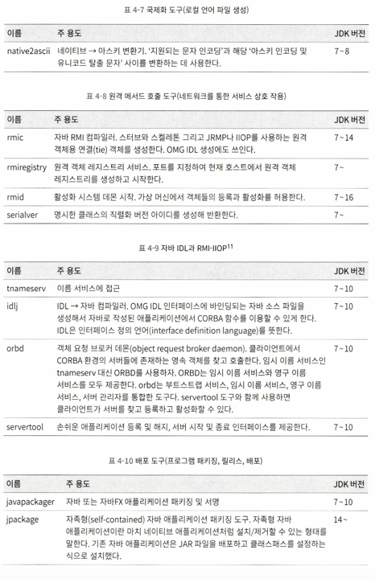

# ch04. 가상 머신 성능 모니터링과 문제 해결 도구

가상 머신 장애 처리 및 분석 도구를 적절히 이용하면, 데이터를 분석하여 문제를 해결하기 쉬워짐

`\[자바 홈 디렉터리]/bin`에는 다양한 모니터링 및 문제 해결 도구들이 존재

라이선스, 셩숙 수준에 따라 상용 인증 도구(유료), 공식 인증 도구(무료), 실험적 도구로 나눌 수 있음

## jps: 가상 머신 프로세스 상태 도구

- `동작 중인 가상 머신 프로세스 목록` 보여줌
- 가상 머신이 실행한 메인 클래스의 이름 과 로컬 가상 머신 식별자(LVMID => os pid) 알려줌

```shell
jps [options] [host id]

# 예시(l 옵션은 생략해도 됨)
# jps -l
```


## jstat: 가상 머신 통계 정보 모니터링 도구

- 가상 머신의 다양한 작동 상태 정보를 모니터링하는 데 사용

```shell
jstat [option vmid [interval[s|ms] [count]]]

# vmid는 lvmid와 동일
# 예시
# jstat -gc 2764 250 20
```


## jinfo: 자바 설정 정보 도구

- 가상 머신의 다양한 매개 변수를 실시간으로 확인하고 변경하는 도구
- JVM 시작 시 명시한 매개 변수 목록 보기: `-flag` 매개 변수 사용
- 명시하지 않은 매개변수: `-flag` 옵션 다음 원하는 매개변수 이름
- `-sysprops` 매개변수: 자바 시스템의 속성(System.getProperties())의 내용 출력

```shell
jinfo [options] vmid
# 예시
# jinfo -flag ConGCThreads 1444
```

## jmap: 자바 메모리 매핑 도구

- 힙 스냅숏을 파일로 덤프해 주는 자바용 메모리 맵 명령어

```shell
jmap [optons] vmid

# 예시
# jmap -dump:format=b,file=jconsole.bin 15396
```


## jhat: 가상 머신 힙 덤프 스냅숏 분석 도구

- jmap으로 덤프한 힙 스냅숏을 분석
- JDK 8가지 제공, JDK 9부터는 jhsdb로 대체
- 실무에서는 직접 사용 안 함
    - 그 이유는 제공하는 기능이 단순하고, 힙 스냅숏 분석은 보통 서버에서 직접하는 게 아니라 다른 기기에서 수행

```shell
jhat jconsole.bin

```

## jstack: 자바 스택 추적 도구

- 현재 가상 머신의 스레드 스냅숏(현재 가상머신에서 실행 중인 각 스레드의 메서드 스택들의 집합)을 생성하는데 쓰임
- 우선순위, CPU 사용 시간, 생성 후 경과 시간, 스레드 상테, 메서드 호출 스택 등 다양한 정보 제공

```shell
jstack [options] vmid

# 예시
# jstack -l 3500
```


## 기본 도구 정리





## GUI 도구

### JHSDB: 서비스 에이전트 기반 디버깅 도구

- 기본 도구들의 기능을 거의 다 제공하고 더 강력


- SA(핫스팟 가상 머신이 제공하는 API 집합)를 통해 프로세스 외부에서 디버깅 할 수 있는 도구
- JVM의 런타임 정보 제공
- SA API를 이용하면 다른 핫스팟의 내부 데이터를 독립된 JVM 프로세스에서 분석 가능
- 핫스팟이 런타임에 메모리를 어떻게 활용하는지 스냅숏의 덤프 파일로부터 상세하게 복원 가능
-

### Jconsole: 자바 모니터링 및 관리 콘솔

- JMX에 기반한 GUI 모니터링 및 관리 도구
- 주로 정보를 수집하고 JMX MBean(Managed Bean)을 통해 시스템의 매개 변숫값을 동적으로 조정하는데 쓰임
- 모니터링 대상 프로그램에 특별한 에이전트 소프트웨어를 심지 않아도 돼서 활용이 쉽고 애플리케이션 성능 영향 적음

### VisualVM: 다용도 문제 대응 도구

- 일반적인 운영 및 문제 대응 기능`에 더해 `성능 분석`까지 제공하는 올인원 자바 문제 해결 도구
- 현재는 JDK에서 분리되어 독립적으로 개발되는 오픈 소스 프로젝트

### JMC: 지속 가능한 온라인 모니터링 도구

- cf) JMC는 자바 미션 컨트롤, JFR은 자바 플라이트 리코더의 약자
- 오라클의 유료 지원 서비스 중 개인 용도로는 JMC, JFR은 무료로 이용 가능
- JFR: 핫스팟 가사 머신에 내장된 모니터링 및 이벤트 기반 정보 수집 프레임워크
- JMC는 이클립스 RCP를 기본 프레임워크로 활용
    - 그래서 이클립스 플러그인 형태로 많이 쓰임
    - 홈페이지에서 다운 가능
- VM과의 통신에는 JMX 프로토콜 쓰임
- VM MBean이 제공하느 데이터를 보여주는 JMX 콘솔 역할을 하며, 다른 한편으로는 JFR이 제공하는 데이터를 보여주는 JFR 분석도구로 쓰임

### 핫스팟 가상 머신 플러그인과 도구

- 핫스팟 VM은 IGV, CCV, 프로젝트 크리에이터, LogCompilation, HSDIS등 다양한 도구 제공

### HSDIS

- 오라클이 권장하는 핫스팟 가상머신 JIT 컴파일 코드용 디스어셈블리 플러그인
- 실행은 핫스팟에 `-XX:+PrintAssembly` 매개 변수를 추가하면 됨
- Product 모드의 핫스팟은 `-XX:+UnlockDiagnosticVMOptions` 매개 변수도 추가해야 한다

```shell
java -XX:+UnlockDiagnosticVMOptions -XX:+PrintAssembly -Xcomp -XX:CompileCommand=dotinline,*Bar.sum -XX:CompileCommand=compileonly,*Bar.sum test.Bar
```

- `-XX:+PrintAssembly`: 디스어셈블된 코드 출력
- `-Xcomp`: 가상 머신이 코드를 컴파일 모드로 실행한다. 핫 코드가 될 때까지 오래
  기다리지 않아도 JIT 컴파일이 바로 이루어짐
- `-XX:CompileCommand=dontin'line/*Bar.sum`: sum() 메서드 인라인 방지
- `-XX:CompileCommand=compileonly/*Bar.sum`: sum() 메서드만 컴파일

### JITWatch

- 핫스팟 JIT 컴파일용 로그 분석 및 시각화 도구
- HSDIS와 자주 함께 쓰임

 
