# ch 06. 클래스 파일 구조

## 플랫폼 독립을 향한 초석

- 자바의 플랫폼 독립성
- 자바의 언어 독립성 - 코틀린, 클로저, 그루비, JRuby, JPython, 스칼라 등
- JVM은 어떤 언어에 종속되지 않고 클래스 파일이라는 특정 바이너리 파일 형식에만 의존
- 클래스 파일
    - JVM 명령어 집합, 심벌테이블, 몇 가지 추가 정보 등으로 구성
    - 여러가지 필수 구문 갖추고 특정 구조 따르도록 제약
    - 튜링 완전(JVM에서 어떤 언어도 표현 가능)
    - 다른 언어에서도 JVM을 하드웨어 독립적인 범용 실행 플랫폼으로 활용 가능(코틀린 등 다른 언어에서 바이트 코드로 컴파일 가능)
    - 바이트 코드 명령어 표현 능력이 자바 언어보다 뛰어남(자바 언어에서 효과적으로 표현하지 못하는 개념도 바이트 코드에서 가능)

## 클래스 파일의 구조

- 모든 클래스 파일은 하나의 클래스 또는 인터페이스를 정의
- 클래스나 인터페이스를 꼭 파일에 담아야 하는 것은 아님(동적 생성하여 클래스 로더 제공도 OK)
- 클래스 파일: 바이트를 하나의 단위로하는 이진 스트림 집합체
    - 큰 단위의 바이트가 먼저 저장되는 빅엔디언 방식으로 표현
    - C언어 구조체외 비슷한 구조(숫자, 테이블 데이터 타입만 존재)
        - 부호 없는 숫자(u1, u2, u4, u8)
        - 테이블: 여러 개의 부호 없는 숫자나 또 다른 테이블로 구성된 복합 데이터 표현(_info로 끝남)
    - 같은 타입 데이터 여러 개 표현 시 개수를 알려주는 타입 *_count이 바로 앞에 등장
    - 데이터 항목은 바이트 순서, 바이트의 의미, 길이, 순서가 엄격하게 제한, 변경 불가

### 매직 넘버와 클래스 파일의 버전

- 모든 클래스 파일의 처음 4바이트는 매직 넘버로 시작(0xCAFEBABE)
- 매직 넘버 다음의 4바이트는 클래스 파일의 버전 번호(5 ~ 6번째는 메이저, 7~8번째는 마이너 버전)
  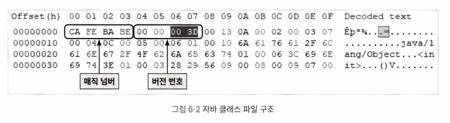

### 상수 풀

- 버전 번호 다음
- 대체로 가장 큰 공간 차지
- "항목 개수"를 알려주는 u2 타입 데이터 필요(1부터 시작)
- 두 가지 상수 유형
    - 리터럴
    - 심벌 참조
- 컴파일 시 링크 단계가 없이 가상 머신이 클래스 파일 로드할 때 동적으로 이뤄짐
- 필드와 메서드가 어떤 메모리에서 어떤 구조로 표현되는가에 관한 정보는 클래스 파일에 저장되지 않음
    - VM은 필드와 메서드의 심벌 참조를 런타임에 변환하지 않으면 각 항목의 실제 메모리 주소를 알 수 없음
    - 클래스 파일 로드 시 상수 풀에서 해당 심벌 참조들을 가져옴
    - 그리고 클래스 생성, 구동 시 실제 메모리 주소 변환
- 상수 풀 안의 상수 각각이 모두 테이블
- 초기 11개 + 4개(동적 언어 호출 지원) + 2개(모듈 시스템 지원) = 17개 상수 타입 존재
  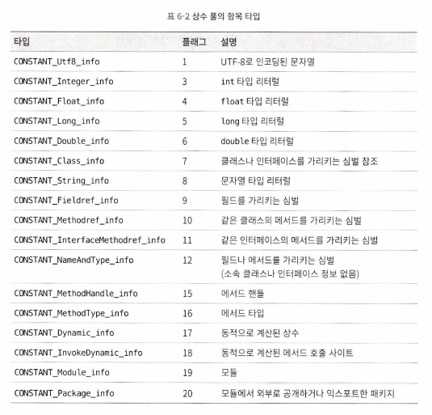
- CONSTANT_Methodref_info(같은 클래스의 메서드를 가리키는 심벌) 타입의 상수 구조
  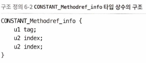
    - tag: 상수 타입 구분 플래그 비트, index: 상수 풀에서의 인덱스(2 ~ 3)
- CONSTANT_Class_info 타입 상수 구조
  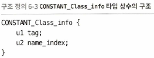
    - tag: 상수 타입 구분 플래그 비트, name_index: 클래스 이름 인덱스
- C0NSTANT_Utf8_info 타입 상수 구조
  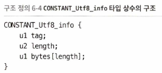
    - tag: 상수 타입 구분 플래그 비트, length: UTF-8 축약 인코딩된 문자열 크기(바이트), bytes\[length\]: 문자열

### 접근 플래그

- 상수 풀 다음의 2바이트는 현재 클래스의 접근 정보를 식별하는 접근 플래그
- 클래스/인터페이스, final, 접근 제어자, 추상 클래스/메서드 여부 등 정보
- 플래그 비트는 16(2 * 8)개 사용할 수 있으나, 현재는 9개만 정의됨

### 클래스 인덱스, 부모 클래스 인덱스, 인터페이스 인덱스

- 접근 플래그 뒤에 나옴
- 클래스 파일의 상속 관계 규정
- 클래스 인덱스, 부모 클래스 인덱스: 각각 현재 클래스, 부모클래스의 FQN 결정하는데 쓰임
    - 부모 클래스 인덱스는 java.lang.Object가 아니면 0이 아님
- 인터페이스 인덱스 컬렉션: 현재 클래스가 구현한 인터페이스 기술 (implements, extends 이후 순서대로)
- 클래스, 부모 클래스 인덱스는 u2타입
- 인터페이스 인덱스 컬렉션 첫 항목은 u2타입, 값은 인덱스 테이블 크기(현재 클래스의 구현 인터페이스 수)
  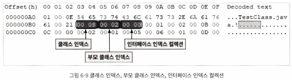

### 필드 테이블

- 인터페이스나 클래스 안에 선언된 변수 설명
- 필드: 클래스 변수와 인스턴스 변수 (지역변수는 X)
- 필드 테이블 구조
  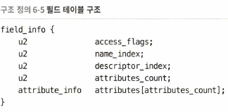
    - access_flags: 접근 플래그랑 유사. u2 타입. name_index: 상수 풀 인덱스. 필드 단순 이름. descriptor_index: 상수 풀 인덱스. 필드 및 메서드 서술자.
    - attributes_count: 속성 테이블 개수. attributes\[attributes_count\]: 속성 테이블. -> 이 둘은 속성 테이블 참조
    - 클래스의 완전한 이름: 예) org/fenixsoft/clazz/TestClass11
    - 메서드나 필드의 단순한 이름: 예) inc() -> inc, m 필드 -> m
    - 메서드와 필드의 서술자
      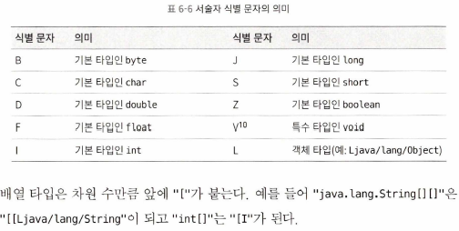
    - 메서드 기술 시 매개 변수 목록 적고 반환값 적음
      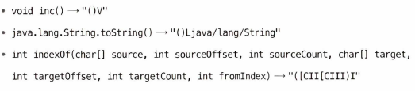
- 소스 코드에 존재하지 않는 필드: 예) 내부 클래스는 외부 클래스를 가리키기 위해 외부 클래스의 인스턴스를 가리키는 필드 자동 추가
- 자바 언어에서는 같은 이름 필드 오버로딩이 불가능하지만, 클래스 파일에서는 서술자만 다르면 가능

### 메서드 테이블

- 메서드 테이블 구조
  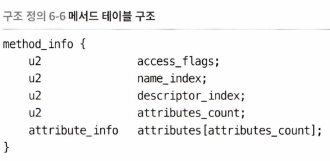
- 필드 테이블 구조가 완전히 같음
- 접근 플래그와 속성 테이블 컬렉션에서 선택할 수 있는 값만 살짝 다름
  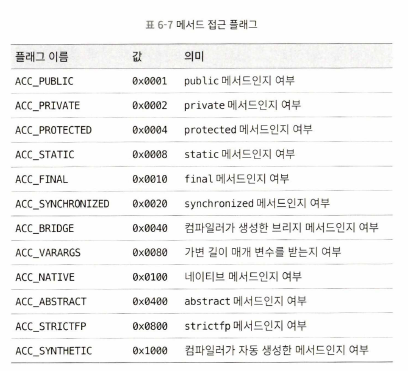
- 메서드 본문 코드는 컴파일 후에 메서드 속성 테이블 컬렉션의 Code 속성에 따로 저장됨(다음 절 참조)
- 부모 클래스의 메서드를 오버라이딩하지 않았다면, 부모 클래스의 메서드 정보는 자식 클래스의 메서드 테이블 컬렉션에 나타나지 않음
- 자바 언어에서는 반환 값만 다르게 해서 오버로딩이 불가능하지만, 클래스 파일에서는 서술자만 다르면 가능

### 속성 테이블

- 클래스 파일, 필드 테이블, 메서드 테이블, Code 속성, 레코드 구성요소가 포함 가능
- 제약이 약간 느슨하고 순서에도 엄격하지 않음
- 기존 속성 이름과 중복되지 않으면 새로운 속성 정보를 테이블에 추가할 수 있음
- JDK 21에서는 30가지 속성 존재(책 참조)
- 속성 테이블 구조
  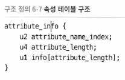

#### Code 속성

- 메서드 본문 코드는 컴파일 후 Code 속성에 저장됨
- 인터페이스나 추상 클래스의 추상 메서드에는 Code 속성이 없음
- Code 속성 부터 구조들은 너무 지엽적이고 양이 많아 생략. 책 참조 할 것.

#### Exceptions 속성

- 메서드에 throw 될 수있는 체크드 익셉션들을 나열 하는 기능

#### LineNumberTable 속성

- 자바 소스 코드의 줄 번호와 바이트 코드의 줄 번호 사이의 대응 관계를 설명하는 속성(-g:lines 옵션을 지정해야 함)
- 이 속성 생성하지 않으면 오류를 일으킨 줄 번호가 스택 트레이스에 안 나타남

#### LocalVariableTable과 LocalVariableTypeTable 속성

- 스택 프레임에 있는 지역 변수 테이블 안의 변수와 자바 소스 코드에 정의된 변수 사이의 관계를 설명하는 속성(-g:vars 옵션을 지정해야 함)
- 이 속성 생성하지 않으면 매개변수 이름을 알 수 없게 됨

#### SourceFile과 SourceDebugExtension 속성

- SourceFile: 클래스 파일을 생성한 자바 소스 파일이름이 기록됨(-g:source 옵션을 지정해야 함)
- SourceDebugExtension: 컴파일러에 의해 또는 동적으로 생성된 클래스에 개발자를 위한 사용자 정의 정보를 쉽게 추가할 수 있도록 설계된 속성

#### ConstantValue 속성

- 정적(static) 변수에 값을 자동으로 할당하도록 VM에 알림
- 인스턴스 변수는 인스턴스 생성자인<init>이 수행
- 클래스 변수는 클래스 생성자인<cinit> 또는 ConstantValue 속성 사용 방법 중 선택 가능

#### InnerClasses 속성

- 내부 클래스와 호스트 클래스 사이의 연결 관계 기록

#### Deprecated와 Synthetic 속성

- 플래그 타입의 Bool 속성
- Deprecated 속성: 클래스, 필드, 메서드를 프로그램작성자가 폐기 대상으로 지정했음
- Synthetic 속성: 컴파일러가 추가한 필드, 메서드임

#### StackMapTable 속성

- Code 속성의 attribute 테이블에 자리하는 상당히 복잡한 가변 길이 속성(JDK 6 이후 등장)
- 클래스 로드 시 타입 검증기가 활용
    - 타입 검사 기번의 새로운 검증기가 클래스 파일의 적법성까지 보장할 수 있어서 논리적 적법성 확인 생략 가능

#### Signature 속성

- 클래스의 속성 테이블, 필드 테이블, 메서드 테이블에 선택적 등장(JDK 5 이후 추가)
- 길이는 일정
- 클래스, 인터페이스, 초기화 메서드, 기타 클래스 멤버가 타입 변수 나 매개변수화 타입을 포함할 경우 제네릭 시그니처 정보를 담기 위해 사용

#### BootstrapMethods 속성

- 가변 길이 속성 (JDK 7 이후 추가)
- 클래스 파일 속성 테이블에 위치
- invokedynamic 명령어가 참조하는 부트스트랩 한정자가 담김
- 이 기능에 대한 자세한 이야기는 8.4절에서 함

#### MethodParameters 속성

- 메서드 테이블에서 사용되는 가변 길이 속성(JDK 8 이후 추가)
- 자바 초기에는 매개변수 이름은 클래스 파일에 기록하지 않음
- JDK 8 이후 MethodParameters 속성 도입하여 매개 변수 이름 클래스 파일에 기록할 수 있게 됨(컴파일시 -parameters 옵션 사용)

#### 모듈화 관련 속성

- JDK 9 이후 모듈 도입
- module-info.java 파일이 독립된 클래스 파일로 컴파일됨
- 모듈 관련 기능 위해 Module, ModulePackages, ModuleMain Class 속성이 추가됨

#### 런타임 애너테이션 관련 속성

- 애너테이션(JDK 5 도입) 정보 담기 위한 속성
    - RuntimeVisibleAnnotations
    - RuntimeInvisibleAnnotations
    - RuntimeVisibleParameterAnnotations
    - RuntimeInvisibleParameterAnnotations
    - VisibleTypeAnnotations(JDK 8 이후)
    - RuntimeInvisibleTypeAnnotations(JDK 8 이후)

#### Record 속성

- 레코드(JDK 16 도입) 클래스의 구성요소 관련된 정보 담겨 있음

#### PermittedSubclasses 속성

- 봉인된 클래스(JDK 17 도입) 위한 클래스

## 바이트 코드 명령어

- 연산 코드(opcode), 피연산자(operand)로 구성
- 대부분 피연산자 없이 연산 코드로 구성
- 피연산자는 피연산자 스택에 저장됨

### 바이트 코드와 데이터 타입들

- iload, fload 등 명령어 자체에 타입 정보 포함됨
- 세부 명령어는 책 참조

### 로드와 스토어 명령어

- 스택 프레임의 지역 변수 테이블과 피연산자 스택 사이의 데이터 주고 받는데 쓰임
- 예) iload, istore, bipush

### 산술 명령어

- 피연산자 스택의 값 두개를 이용해 특정한 산술 연산을 수행하고, 결괏값을 다시 피연산자 스택의 맨 위에 저장
- 예) iadd, isub 등

### 형변환 명령어

- 숫자 타입 데이터를 다른 숫자 타입으로 변환

### 객체 생성과 접근 명령어

- 예) new, newarray, getfieldd, baload, bastore, arraylength, instanceof 등

### 피연산자 스택 관리 명령어

- 예) pop, dup, swap

### 제어 전이 명령어

- 예) ifeq, tableswitch, goto 등

### 메서드 호출과 반환 명령어

- 예) invokevirtual, invokeinterface, invokespecial 등

### 예외 처리 명령어

- 예) athrow

### 동기화 명령어

- 예) monitorenter, monitorexit 등

## 설계는 공개, 구현은 비공개

- 《자바 가상 머신 명세》는 모든 JVM이 지켜야 하는 약속
- 세부 구현은 공개되지 않을 수 있음
- 명세는 지키되 구현은 수정하거나 최적화 할 수 있음

## 클래스 파일 구조의 진화

- 《자바 가상 머신 명세》 이후 엄청난 변화 겪음
- JDK 1.4 이후 클래스 파일 형식에 총 5개의 접근 플래그 추가(열거형, 가변길이 변수 등)
- 플랫폼 독립성, 클래스 파일 형식의 간결성, 안정성, 확장성은 플랫폼 독립과 언어 독립을 위한 중요한 두 기둥 