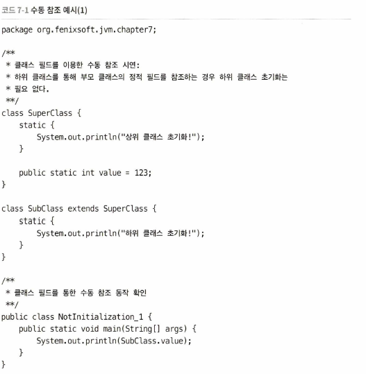
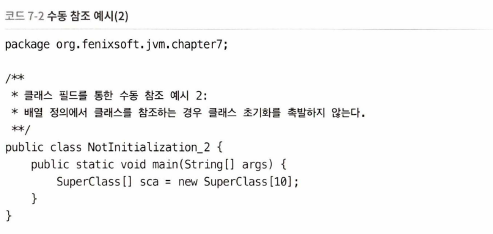
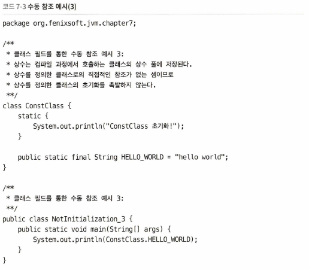
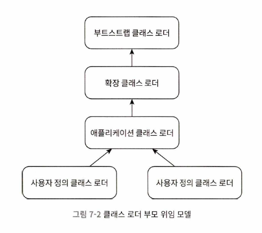

# ch 07. 클래스 로딩 메커니즘

- 클래스 로딩 메커니즘
    - JVM은 데이트를 클래스 파일로부터 읽어들임 -> 검증, 변환, 초기화 -> 자바 타입 생성
- 자바 언어에서는 클래스 로딩, 링킹, 초기화가 모두 런타임에 이뤄짐 -> 실행 성능이 살짝 떨어짐, but 높은 확장성, 유연성 가능케 함
- 동적 확장 언어 기능
    - 런타임에 이뤄지는 동적 로딩, 동적 링킹 덕분
    - **애플리케이션을 인터페이스 중심 으로작성 시 실제 구현 클래스 결정은 실행 시 까지 미룰 수 있음**

## 클래스 로딩 시점

- 로딩 -> (검증 -> 준비 -> 해석)(=링킹) -> 초기화 -> 사용 -> 언로딩
- 모두 반드시 순서대로 진행돼야 하지만, 런타임 바인딩(동적 바인딩) 위해 해석은 초기화 후에도 가능
- 명세에는 로딩은 구체적으로 명시되지 않았지만, 초기화 단계는 각 경우에 초기화를 촉발해야 하는 6가지 상황을 규정(타입에 대한 능동 참조)

1. new, getstatic, putstatic, invokestatic 만났을 때 타입이 초기화 안 됐을 경우
2. 리플렉션 메서드를 사용할 때 타입이 초기화 안 됐을 경우
3. 클래스 초기화 시 상위 클래스가 초기화 안 됐을 때
4. JVM 구동 직후, 메인 타입(메인 메서드가 있는 클래스나 인터페이스)
5. java.lang.invoke.MethodHandle 인스턴스 호출 시 클래스가 초기화 안 됐을 경우
6. 디폴트 메서드 포함 인터페이스의 구현 클래스 초기화 시

- 수동 참조
    - 
    - 위 코드에서 "하위 클래스 초기화"는 출력 안 됨
    - 정적 필드를 참조할 때는 필드를 직접 정의한 클래스만 초기화됨 -> value 필드가 있는 SuperClass만 초기화됨
    - 
    - 위 코드는 java.lang.Object를 상속해 자동 생성한 [Lorg.fenixsoft.jvm.chapter7.Superclass라는 다른 클래스의 초기화 단계를 촉발
        - "상위 클래스 초기화" 출력 안 됨
    - 위 클래스는 일차원 배열
    - 자바 배열이 안전한 이유는 배열 원소로 직접 접근 하지 못하도록 이 클래스가 감싸주기 때문
    - 
    - 위 코드에서 "ConstClas 초기화"는 출력 안 됨
    - 컴파일 과정에서 상수 전파 최적화되기 때문
        - 컴파일 시 HELLO_WORLD의 값이 NotInitialization_3 클래스 상수 풀에 저장되고 NotInitialization_3 클래스 자체의 상수 풀을 참조하도록 변경됨
- 인터페이스 로딩 과정
    - 멤버 변수 초기화 용도로 클래스 생성자인 `<clinit>()` 메서드를 생성
    - 인터페이스 초기화에는 상위 인터페이스 초기화 불필요(상위 인터페이스가 사용될 때 이뤄짐)

## 클래스 로딩 처리 과정

- 로딩 -> 검증 -> 준비 -> 해석 -> 초기화

### 로딩

- 클래스 로딩 과정 중 한 단계(클래스 로딩과 다름)

1. FQN을 보고 해당 클래스 정의하는 바이너리 바이트 스트림 가져오기
2. 바이트 스트림(정적인 저장 구조)를 런타임 데이터 구조로 변환
3. 로딩 대상 클래스를 표현하는 java.lang.Class 객체를 힙메모리에 생성 -> 이 클래스 객체로 메서드 영역에 저장된 타입 데이터 활용 가능하게 됨

- 이 요구사항이 세세하게 정의 되지 않아 다음이 가능해짐
    - ZIP 압축 파일로부터 로딩 -> JAR, WAR,EAR 형식의 기초가 됨
    - 네트워크로부터 로딩
    - 런타임에 동적으로 생성 ex) 동적 프락시 기술
    - 다른 파일로부터 생성 ex) JSP 파일로 부터 생성하는 JSP 애플리케이션
    - 데이터 베이스로부터 로딩 ex) SAP 넷위버
    - 암호화된 파일로 부터 로딩
- JVM에 내장된 `부트스트랩 클래스 로더`를 사용하거나 `사용자 정의 클래스 로더` 사용하여 수행
- ClassLoader의 findClass() 또는 loadClass() 메서드를 오버라이딩하면 바이트 스트림을 얻는 방법 통제 가능
- but, 배열 클래스는 클래스로더가 생성하지 않고 JVM이 직접 메모리에 동적 생성 -> 제어 어려움
    - 원소 타입은 클래스 로더를 통해 로드
    - 배열 컴포넌트 타입(배열에서 첫 번째 차원이 제거된 타입)이 참조 타입이면, 로딩 과정 재귀적 실행
    - 아니면, C를 부트스트랩 클래스 로더에 맡김
    - 배열 클래스 접근성은 해당 컴포넌트 타입과 같음(참조 타입 안 배열 클래슨느 기본적으로 public)
- 로딩 끝나면 바이너리 바이트 스트림은 메서드 영역에 저장됨
- 타입 정보를 메서드 영역에 올바르게 저장한 다음, java.lang.Class 객체를 자바 힙에 초기화
- 로딩 단계와 링킹 단계 일부 동작은 서로 중첩되어 진행됨

### 검증

- 링킹 단계의 첫번째 단계
- 목적
    - 바이트 스트림에 담긴 정보가 규정한 명세의 모든 제약을 만족하는지 확인
    - 이를 코드 변환 후 실행 시 보안 위협 없는지 확인
- 순수한 자바 언어는 배열 경계 넘어선 데이터 접근, 상속하지 않은 타입변환, 존재하지 않는 코드 라인으로 점프 불가
    - 순수한 자바 코드 아닌 바이너리 편집기 사용 등 바이트 코드수준에서는 가능
    - 바이트 코드 검증은 JVM이 스스로 보호하기 위한 필수 조치

1. 파일 형식 검증
    - 매직넘버 시작 여부, 버전 허용 범위 여부, 미지원 타입 상수가 상수 풀 속하는지 여부,
    - 상수 인덱스 값 중 유효하지 않는 상수 가리키는지 여부, UTF-8 인코딩 위반 데이터 클래스 파일 형식 요소 중 누락/추가 여부 등

2. 메타 데이터 검증
    - 상위 클래스 존재 여부, 상위 클래스 상속 허용 여부, 상위 클래스 또는 인터페이스 정의한 필수 메서드 구현 여부,
    - 필드와 메서드와 상위 클래스 충돌여부 등

3. 바이트 코드 검증
    - 프로그램의 의미가 적법하고 논리적인지 확인
    - 피연산자(operand) 스택의 데이터 타입과 명령어 코드(opcode) 시퀀스가 항시 어울려 동작하는지 확인
    - 점프 명령어가 메서드 본문 바깥의 바이트 코드 명령어로 점프하지 않기
    - 메서드 본문에서 형변환 항상 유효한지 보장
        - 메서드 본문이 검증 통과했다고 해서 100% 안전 보장 못함

4. 심벌 참조 검증
    - VM이 심벌 참조를 직접 참조로 변환할 때 수행
    - 이 변환은 해석 단계에서 일어남
    - 해당 클래스 자체(상수 풀의 다양한 심벌 참조)를 제외한 모든 정보를 확인하는 것
    - 심벌 참조에서 문자열로 기술된 FQN에 해당하는 클래스를 찾을 수 있는지,
    - 단순 이름과 필드 서술자와 일치하는 메서드나 필드가 클래스에 존재 하는지,
    - 심벌 참조가 가리키는 클래스, 필드, 메서드의 접근 지정자가 현재 클래스의 접근을 허용하는지
    - 주된 목적은 해설을 제대로 수행할 수 있는지 확인하는 것(실패시 예외)

- 검증 단계는 매우 중요하지만 필수는 아님(코드 신뢰하면 로드 시간 단축 위해 뛰어 넘을 수 있음)

### 준비

- 클래스 변수를 메모리에 할당하고 초깃값을 설정하는 단계
- JDK 8부터는 클래스 변수가 자바 힙에 저장됨
- 인스턴스 변수가 아닌 클래스 변수만 할당됨
- 클래스 변수에 할당하는 초깃값은 해당 데이터 타입의 제로값(기본값)
- 클래스 변수 정의 시 준비 단계에는 제로값(기본값)이 할당되고 클래스 초기화 단계에서야 값이 비로소 할당됨

### 해석

- 자바 가상 머신이 상수 풀의 심벌 참조를 직접 참조로 대체하는 과정
- 심벌 참조: 클래스 파일에서 CONSTANT_Class_info, CONSTANT_Fieldref_info, CONSTANT_Methodref_info 등
- 직접 참조: 포인터, 상대적 위치 (오프셋) 또는 대상의 위치를 간접적으로 가리키는 핸들
    - 똑같은 심벌 참조로부터 변환했더라도 직접 참조는 VM에 따라 달라지는게 보통
- 동일 심벌 참조에 대해서 여러 번 해석 요청 이뤄지는게 보통 -> 해석 결과를 캐시해두곤 함
    - 반복 수행 시에도 항상 같은 결과 내야함(invokedynamic 명령어 제외)

#### 클래스 또는 인터페이스 해석

- D(현재 코드 위치한 클래스)에서 N(해석 전 심벌 참조)를 클래스 또는 인터페이스 C(직접 참조)로 해석
- C가 배열이 아니면, N이 가리키는 FQN을 D의 클래스로더에 전달하여 C 로드
- C가 배열이고 원소 타입 객체라면, 배열의 원소 타입을 위 규칙에 따라 로드
- 해석 완료하려면 D가 C에 접근할 수 있는지 확인하는 심벌 참조 검증 필요(실패 시 IllegalAccessError)

#### 필드 해석

- 아직 해석되지 않은 필드 심벌 참조를 해석하려면 필드 테이블의 class_index 항목이 가리키는 CONSTANT_Class_info 심벌 참조가 먼저 해석되어야 함
- 단순 이름 및 필드 서술자가 일치하는 필드가 C 자체에 포함되어있다면, 이 필드를 가리키는 직접 참조를 반환하고 검색 종료
- 그렇지 않고 C가 인터페이스 구현 시,각 인터페이스와 그 상위 인터페이스들을 계층 구조 아래서부터 재귀적 검색 후 직접 참조를 반환하고 발견 시 검색 종료
- 그렇지 않고 C가 java.lang.Object도 아니라면 계층 구조 아래에서 부터 상위 클래스를 재귀적으로 검색후 발 견시 직접 참조 반환하고 검색 종료
- 그렇지 않으면 검색 실패, NosuchFieldError 던짐
- 검색 성공 후, 필드 접근 권한 없으면 IllegalAccessError 던짐

#### 메서드 해석

- 메서드 테이블의 class_index 항목이 가리키는 메서드가 속한 클래스 또는 심벌 참조를 해석
- 인터페이스 메서드 테이블의 class_index가 가리키는 C가 현재 클래스의 메서드 테이블 안의 인터페이스라고 확인되면 java.lang.IncompatibleClassChangeError를 던짐
- 위 단계 통과 시 단순 이름과 서술자 일치 메서드 검색 후 발견 시 메서드의 직접 참조 반환 후 검색 종료
- 그렇지 않으면 인터페이스 C에 단순 이름및 서술자가 일치하는 메서드가 있는지 확인 후 발견 시 직접 참조 반환하고 검색 종료
- 그렇지 않으면 C의 상위 클래스를 재귀적으로 검색 후 발견 시 직접 참조 반환하고 검색 종료
- 그렇지 않으면 C가 구현한 인터페이스 목록과 그 상위 인터페이스를 재귀적으로 검색 후 발견 시 직접 참조 반환하고 검색 종료(실패 시 AbstractMethodError)
- 위에서 일치하는 메서드 여러 개 발견 시 하나만 반환(어떤 메서드 반환은 미정)
- 그렇지 않으면 NoSuchMethodError 반환

#### 인터페이스 메서드 해석

- 그렇지 않으면 인터페이스 C에 단순 이름및 서술자가 일치하는 메서드가 있는지 확인 후 발견 시 직접 참조 반환하고 검색 종료
- 그렇지 않으면 java.lang.Object 클래스 만날 때까지 상위 인터페이스를 재귀적으로 검사 후 발견 시 직접 참조 반환하고 검색 종료
- 위에서 일치하는 메서드 여러 개 발견 시 하나만 반환(어떤 메서드 반환은 미정)
- 그렇지 않으면 NoSuchMethodError 반환

### 초기화

- 클래스 로딩 마지막 단계
- JVM이 사용자 클래스에 작성된 자바 코드를 실행하기 시작
- 준비 단계에서 초깃값 할당했던 변수들을 코드에 기술한대로 초기화
- 클래스 생성자인 <clinit>() 메서드 실행 단계(<clinit>() 메서드 자체는 개발자가 작성 불가)
    - <clinit>() 메서드는 static 블록 내용 취합하여 컴파일러가 자동생성
    - <clinit>() 메서드는 생성자와는 다름(인스턴스를 만드는 생성자는 <init>())
    - 부모 클래스의 생성자를 명시적으로 호출하지 않아도 부모 클래스의 <clinit>()을 하위 클래스 것보다 먼저 실행
        - 자연스럽게 부모 클래스에 정의된 static 블록이 자식 클래스의 변수 할당자보다 먼저 실행됨
    - <clinit>() 메서드는 클래스나 인터페이스에 반드시 필요하진 않음(static 블록이나 static 변수 할당 않으면)
    - 인터페이스도 <clinit>() 메서드가 있을 수 있음
        - 인터페이스는 부모 인터페이스의 <clinit>() 메서드를 먼저 실행할 필요 없음
        - 부모 인터페이스는 부모 인터페이스가 실제로 사용되는 시점에 비로소 초기화됨
        - 클래스를 초기화할 때도 클래스가 구현한 인터페이스의 <clinit>() 실행 안 함
    - <clinit>()가 멀티 스레드 환경에서 적절히 동기화되도록 해야 함(여러 스레드 초기화 시도 시 한 스레드만 실행하도록)

## 클래스 로더

- 자바는 바이너리 바이트스트림 가져오기를 가상 머신 외부에서 수행하도록 함 -> 이 역할을 맡은 코드가 클래스 로더

### 클래스와 클래스 로더
- 

- 클래스의 동치 여부는 같은 클래스 로더로 로드 했을 때만 성립
    - equals(), isAssignableFrom(), isInstance 메서드의 반환값, instanceof와 관련

### 부모 위임 모델

- JVM 관점에서 클래스 로더 종류
    - 부트스트랩 클래스 로더(JVM 일부, C++ 구현)
    - java.lang.ClassLoader 상속 구현한 클래스로더 (JVM 외부에 독립 존재)
- JDK 1.2 이후, 3계층 클래스 로더인 부모위임 클래스 로딩 아키텍처 유지
    - 부트스트랩 클래스 로더
        - JAVA_HOME/lib 디렉터리나 -Xbootclasspath 지정 경로 파일들을 로드하는 역할
        - 자바 프로그램에서 직접 참조할 수 없음
        - 커스텀 로더 작성 시 로딩을 부트스트랩 클래스 로더에 위임하고자 할때는 참조 대신 null 사용
    - 확장 클래스 로더
        - sun.misc.Launcher$ExtClassLoader
        - JAVA_HOME/lib/ext 디렉터리나 java.ext.dirs 시스템 변수 지정 경로 클래스 라이브러리를 로드하는 역할
        - 자바 시스템의 클래스 라이브러리를 확장하는 메커니즘
        - 사용자가 ext 디렉터리에 범용 클래스 라이브러리를 두어 자바 SE 기능을 확장할 수 있도록 함
        - 자바 코드로 구현돼 개발자가 프로그램 안에서 직접 사용 가능
    - 애플리케이션 클래스 로더(시스템 클래스 로더)
        - sun.misc.Launcher$AppClassLoader
        - ClassLoader 클래스의 getSystemClassLoader() 메서드가 반환하는 클래스 로더
        - 클래스패스상의 클래스 라이브러리들을 로드하는 역할
        - 개발자가 프로그램 안에서 직접 사용 가능
        - 별도의 클래스 로더 안 만들면 이 로더가 기본 클래스 로더가 됨
- JDK 8까지는 이 세 클래스 로더가 적절히 협력하여 로딩 책임짐
- 
- 위 계층 관계를 "부모 위임 모델"이라고 함
- 클래스 로딩을 요청 받은 클래스 로더는 수준에 맞는 상위 클래스 로더로 요청을 위임
- 모든 로드 요청은 우선 최상위 부트스트랩 클래스 로더로 넘겨짐
- 클래스 로더를 부모 위임 모델로 구성하면 자바 클래스들이 자연스럽게 클래스 로더의 계층 구조를 따르게 된다는 이점
    - 예를 들어, java.lang.Object 클래스는 어떤 클래스 로더에 요청하더라도 최서ㅏㅇ위 부트스트랩 클래스 로더가 처리
- 요청 클래스가 이미 로드돼 있는지 확인하고 아직이면 loadClass() 호출

### 부모 위임 모델에 대한 도전

- 부모 위임 모델이 필수는 아님 -> 다른 모델도 있음

## 자바 모듈 시스템

- 직소 프로젝트 결과로 JDK 9에 모듈 시스템(JPMS) 도입
- JDK 8까지는 필요한 타입이 클래스 패스에 없더라도 프로그램이 그 타입을 처음 사용하려 할때서야 비로소 예외 보고
- JDK 9 부터는 모듈이 의존하는 다른 모듈 명시할 수 있어서 필요한 의존성이 모두 갖춰졌는지 애플리케이션 개발 단계에서 확인 가능
- 클래스 패스에 존재하는 JAR 파일 전반의 public 타입에 접근 문제 해결 -> 자바 모듈은 public 타입 중에도 외부 모듈에 공개할 타입 따로 명시하도록 함

### 모듈 호환성

- JDK 9에서는 클래스패스에 해당하는 모듈 패스 개념 도입
- 라이브러리 위치에따라 모듈인지 아니면 JAR 패키지인지 결정
    - 클래스패스에 위치하면 JAR 패키지 취급, 그 외는 모듈로 취급(module-info.class 포함 여부 무관)

### 모듈화 시대의 클래스 로더

- JDK9 이후 클래스 로더의 변경점
    - 확장 클래스 로더가 플랫폼 클래스 로더로 대체
    - 플랫폼 클래스 로더와 애플리케이션 클래스 로더가 더는 java.net.URLClassLoader로 부터 파생되지 않음
    - 3 계층 클래스로더와 부모 위임 모델을 여전히 유지하지만 클래스로딩의 위임 관계에는 변화
