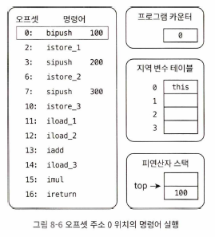

# ch 08 .바이트 코드 엔진

- 바이트 코드 실행 엔진의 개념 모델: 주요 업체의 JVM 실행 엔진들에 통일성 제공
    - 바이너리 바이트 스트림을 입력하면, 이 바이트 코드를 해석해 실행하고 그 결과를 출력
- 실행 엔진이 바이트 코드를 실행하는 방법은 해석 실행(인터프리터를 통한 실행)과 컴파일 실행(JIT 컴파일러로 네이티브 코드 생성 후 실행) 중 하나

## 런타임 스택 프레임 구조

- 메서드가 가장 기본적 실행 단위
- 메서드 호출과 실행을 뒷받침하는 내부 데이터 구조로 스택 프레임 이용
- 스택 프레임에는 메서드의 지역 변수 테이블, 피연산자 스택, 동적 링크, 반환 주소와 같은 정보가 담김
- 스택 프레임에 할당 해야하는 메모리 크기는 프로그램 실행 중에 영향 안 받고,
- 오로지 `프로그램 소스 코드`와 특정 가상 머신 구현의 `스택 메모리 레이아웃`에 달림
- 스레드의 호출 스택에 쌓여 있는 메서드는 모두 실행 중(실행 엔진 관점에서는 맨 위에 메서드만)
- 실행 엔진이 실행하는 모든 바이트 코드 명령어는 현재 스택 프레임에서만 작동
  

### 지역 변수 테이블

- 메서드 매개 변수와 메서드 안에서 정의된 `지역 변수`를 저장하는 공간
- 지역 변수 테이블의 최대 용량은 메서드의 Code 속성 중 max_locals 항목에 기록
-

### 피연산자 스택

- 후입 선출(LIFO) 스택

### 동적 링크

- 메서드에서 이용하는 외부 객체를 가리키는 참조는 런타임 상수 풀에 담겨 있음
- 각 메서드의 스택 프레임에서 런타임 상수 풀 내의 원소를 참조

### 반환 주소

- 메서드 종료 방법
    - 실행 엔진이 반환 바이트코드 명령어를 만나면 메서드 종료
    - 메서드 실행 도중 예외가 발생하고 메서드 본문에서 예외 처리가 제대로 이뤄지지 않으면 종료

### 기타 정보

- 스택 프레임에 디버깅이나 프로파일링 관련 정보를 담기 가능

## 메서드 호출

- 메서드 호출 단계에서는 호출 대상 메서드 버전 선택할 뿐 메서드 본문은 관심 없음

### 해석

- 메서드 호출 대상은 모두 클래스 파일의 상수 풀에 심벌 참조로 기록됨

### 디스패치

- 호출 디스패치 과정은 다형성이라는 특성의 가장 기본에 해당하는 내용

### 정적 디스패치

- 위 코드에서 Human을 변수의 정적타입 또는 겉보기타입
- 위 코드에서 Man을 변수의 실제 타입 또는 런타임 타입

### 동적 디스패치

- 호출할 메서드의 버전을 정적 타입만으로 결정하는 건 불가능

### 단일 디스패치와 다중 디스패치

- 메서드 볼륨(수신 객체 + 매개 변수) 수에 따라 디스패치는 단일 디스패치와 다중 디스패치로 나뉨

### 가상 머신의 동적 디스패치 구현

## 동적 타입 언어 지원

### 동적 타입 언어

- 핵심 특징: 타입 검사 과정 중 주요 단계들이 런타임에 수행

### 자바와 동적 타이핑

- JVM의 동적 타입 언어 지원 수준은 오랜기간 동안 미흡했음(JDK 7 이전 바이트 코드 명령어중 메서드 호출 명렁어는 4개)

### java.lang.invoke 패키지

- JSR 292의 핵심
- 심벌 목적만으로 호출 대상 메서드를 결정하는 것

### invokedynamic 명령어

- 메서드 핸들 메커니즘과 동일한 기능

### 실전: 제어 메서드 할당 규칙

- invokedynamic이 기존 네 가지 invoke* 명령어와 가장 크게 다른점은 디스패치 로직을 개발자가 결정

## 스택 기반 바이트 코드 해석 실행 엔진

- 많은 JVM 실행 엔진에서 자바 코드 실행 시 해석 실행 or 컴파일 실행 선택 가능
- 핫스팟 템플릿 인터프리터 처럼 실제 인터프리터에는 최적화 다수 적용됨
- 실제로는 바이트코드에 해당하는 어셈블리 코드가 동적으로 생성되어 실행됨

### 해석 실행

- JDK 1.0 이후 JVM이 JIT 컴파일러 포함하면서 해석 실행할지, 컴파일 실행할지 스스로 판단

### 스택 기반 명령어 집합과 레지스터 기반 명령어 집합

- 바이트 코드 명령어 스트림의 명령어 대부분은 메모리 주소 대신 피연산자 스택을 이용해 동작(반면, x86은 레지스터 기반 명령어 집합 아키텍처)
    - 스택 기반 명령어 집합은 명령어 모두에 매개 변수가 없고, 입력 데이터를 피연산자 스택에서 가져오고 결과도 피연산자 스택에 저장
    - 레지스터 기반 명령어는 매개변수를 받고, 레지스터로부터 데이터를 읽고 레지스터에 저장
- 스택 기반 명령어의 장점
    - 이식성(레지스터는 하드웨어에 종속)
    - 코드 각각이 상대적으로 더 간결(바이트코드에서 바이트 각각이 온전한 명령어)
    - 컴파일러 구현 더 쉬움(공간 할당 문제 고민 불필요)
- 단점
    - 해석 실행 모드 동작 시, 실행 속도 상대적으로 느림(주류 물리 머신이 레지스터 기반 아키텍처라서)
        - 필요한 명령어 총개수가 레지스터 기반 아키텍처보다 많음
        - 스택이 메모리에 구현돼 메모리 접근이 빈번(레지스터보다 느림) -> 레지스터에 매핑(최상위캐시최적화)하여 메모리 RW 줄임

### 스택 기반 해석 실행 과정

- 스택 기반 명령어 집합의 일반적인 연산 과정(개념적 모델일 뿐)
- 코드, 피연산자 스택, 지역 변수 테이블이 어떻게 변하는지 보여줌

