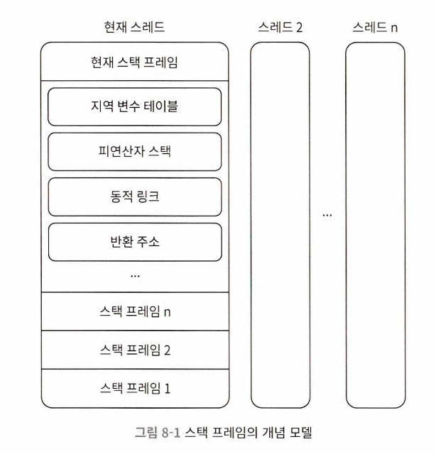
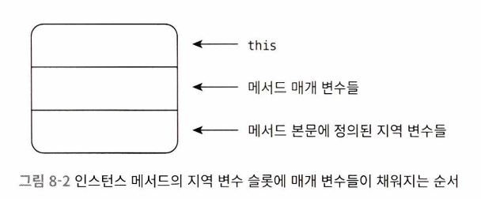
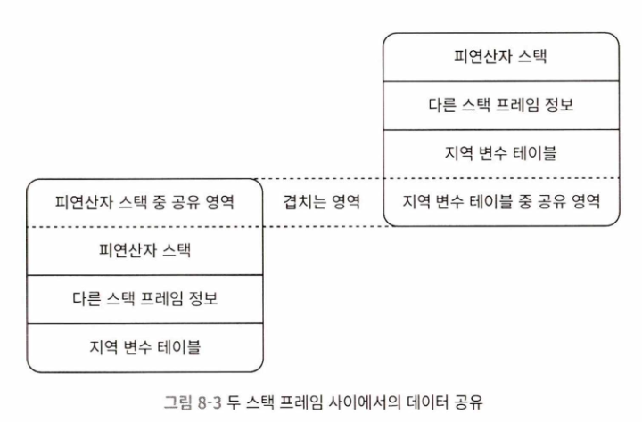

# 바이트코드 실행 엔진

## 들어가며

실행 엔진은 자바 가상 머신의 핵심 구성 요소이다. 가상 머신은 물리 머신과 대비되는 개념으로, 모든 코드를 실행하는 기능을 수행한다. 물리 머신의 실행 엔진은 프로세서, 캐시, 명령어 집합, 운영 체제 수준에서 직접 구현되는 반면, 가상 머신의 실행 엔진은 순수하게 소프트웨어로만 구현된다. 따라서 명령어 집합의 구조와 실행 엔진을 물리적 제약 없이 원하는 대로 만들 수 있으며, 하드웨어에서 직접 지원하지 않는 명령어 집합도 실행할 수 있다.

《자바 가상 머신 명세》에서는 바이트코드 실행 엔진의 개념 모델을 정의하고 있으며, 이 모델은 주요 업체들이 자바 가상 머신 실행 엔진을 개발할 때 통일성을 유지하는 기준이 된다. 가상 머신의 실행 엔진이 바이트코드를 실행하는 방식에는 해석 실행과 컴파일 실행이 있다. 해석 실행은 인터프리터를 통해 바이트코드를 한 줄씩 해석하여 실행하는 방식이며, 컴파일 실행은 JIT(Just-In-Time) 컴파일러를 사용하여 네이티브 코드로 변환한 후 실행하는 방식이다. 실행 엔진 하나에서 두 가지 방식을 혼용할 수도 있으며, 일부 구현에서는 여러 JIT 컴파일러를 단계별로 활용하기도 한다.

## 런타임 스택 프레임 구조

자바 가상 머신은 메서드를 실행 단위로 사용하며, 이를 실행하고 수행 상태를 관리하기 위해 스택 프레임이라는 내부 데이터 구조를 활용한다. 스택 프레임은 가상 머신의 스택 요소이자 실행 데이터 영역에 존재하는 구조로, 메서드 실행과 관련된 여러 정보를 저장한다. 여기에는 지역 변수 테이블, 피연산자 스택, 동적 링크, 반환 주소 등이 포함된다.

메서드가 호출되면 새로운 스택 프레임이 생성되어 가상 머신 스택에 추가되며, 실행이 완료되면 해당 프레임이 제거된다. 이 과정에서 스택 프레임의 크기는 메서드 테이블의 Code 속성에 기록된 내용을 기반으로 결정된다. 컴파일 시 소스 코드의 구조에 따라 필요한 지역 변수 테이블 크기와 피연산자 스택 깊이가 정해지므로, 실행 중에는 메모리 크기가 변경되지 않는다. 다만, 가상 머신의 구현 방식에 따라 전체적인 메모리 레이아웃이 결정된다.

하나의 스레드가 여러 개의 메서드를 호출하면, 각 메서드마다 별도의 스택 프레임이 생성된다. 특정 시점에서 활성화된 메서드 중 가장 최근에 호출된 메서드의 스택 프레임이 실행 엔진에서 동작하며, 이를 현재 스택 프레임이라고 한다. 이 스택 프레임이 가리키는 메서드를 현재 메서드라고 하며, 실행 엔진은 현재 스택 프레임에서만 바이트코드 명령을 실행한다.

자바 프로그램에서 특정 스레드의 호출 스택에 존재하는 모든 메서드는 실행 중인 상태로 간주되지만, 실제 실행 엔진에서 동작하는 것은 현재 스택 프레임만이다. 현재 스택 프레임은 실행 엔진이 접근하는 유일한 프레임이며, 실행이 끝나면 해당 프레임은 제거되고 이전 프레임이 다시 활성화된다.

일반적인 스택 프레임의 구조는 지역 변수 테이블, 피연산자 스택, 동적 링크, 반환 주소 등의 요소로 구성된다. 지역 변수 테이블에는 메서드의 지역 변수와 매개변수가 저장되며, 피연산자 스택은 연산에 필요한 값을 저장하고 전달하는 역할을 한다. 동적 링크는 메서드 실행 중 상위 클래스나 인터페이스의 메서드를 참조하는 정보를 포함하며, 반환 주소는 메서드가 종료된 후 다시 돌아갈 위치를 가리킨다.

가상 머신은 각 스택 프레임을 활용하여 실행 흐름을 관리하며, 실행 엔진은 현재 스택 프레임에서 수행되는 명령어를 처리한다. 프로그램 실행 중에는 스택 프레임이 계속 생성되고 제거되면서 메서드 호출과 반환이 이루어진다. 이러한 구조를 통해 자바 가상 머신은 안정적인 실행 환경을 유지하면서도 메서드 실행을 효율적으로 관리할 수 있다.

### 지역 변수 테이블

지역 변수 테이블은 메서드의 매개변수와 지역 변수를 저장하는 공간이다. 자바 프로그램이 컴파일될 때, 메서드의 Code 속성에 max_locals 항목이 기록되며, 이는 해당 메서드에서 사용 가능한 지역 변수 슬롯의 개수를 나타낸다. 지역 변수 테이블의 최소 단위는 변수 슬롯이며, 이는 boolean, byte, char, short, int, float, 참조 타입, returnAddress 등의 데이터를 저장할 수 있도록 규정되어 있다. 이 데이터 타입들은 모두 32비트 이하이므로, 하나의 변수 슬롯은 적어도 32비트 크기의 공간을 차지한다. 하지만 “변수 슬롯 하나의 크기는 32비트”라고 명시하는 것은 아니다. 일부 64비트 가상 머신에서는 변수 슬롯을 64비트 단위로 구현하기도 한다.

참조 타입은 객체 인스턴스를 가리키는 역할을 한다. 자바 가상 머신 명세는 참조 타입의 길이를 명확히 정의하지 않았지만, 일반적으로 객체의 힙 영역 내 시작 주소 또는 인덱스를 저장하는 방식으로 처리된다. 또한, 참조 타입 자체로는 객체의 타입 정보를 직접적으로 알 수 없으며, 이러한 특성 덕분에 자바의 다형성이 가능해진다.

returnAddress 타입은 jsr, jsr_w, ret 같은 바이트코드 명령어가 실행될 때 사용되며, 예전에는 예외 처리 중 특정 코드로 점프하는 용도로 쓰였다. 하지만 현재는 예외 테이블을 활용하는 방식으로 변경되었기 때문에, 최신 JVM에서는 거의 사용되지 않는다.

64비트 데이터 타입인 long과 double은 연속된 두 개의 변수 슬롯을 사용하여 저장된다. 이는 64비트 데이터를 두 개의 32비트 슬롯에 나누어 저장하는 방식이기 때문이다. 즉, long이나 double 변수는 독립적인 변수 슬롯 하나만으로 저장될 수 없으며, 반드시 두 개의 슬롯을 연속해서 차지해야 한다. 다만, 지역 변수 테이블 자체는 스레드별로 독립적으로 관리되므로, 데이터 경합이나 스레드 안전성 문제는 발생하지 않는다.

자바 가상 머신은 지역 변수 테이블을 0부터 시작하는 인덱스 방식으로 관리하며, 접근 방식도 인덱스를 통해 이루어진다. 32비트 데이터 타입의 경우 변수 슬롯 인덱스 N을 사용하여 접근하지만, 64비트 데이터 타입은 N과 N+1 두 개의 연속된 변수 슬롯을 동시에 활용해야 한다. 또한, 동일한 변수 슬롯을 공유하는 방식으로 64비트 데이터를 저장하는 것은 허용되지 않으며, 이를 위반할 경우 바이트코드 검증 단계에서 예외가 발생할 수 있다.

메서드가 호출될 때, 지역 변수 테이블에는 메서드의 매개변수들도 저장된다. 인스턴스 메서드(정적 메서드가 아닌 경우)에서는 0번째 인덱스에 this 참조가 자동으로 저장되며, 나머지 매개변수들은 순서대로 저장된다. 이후 메서드 본문에서 정의된 지역 변수들이 추가되면서 테이블이 확장된다.

JVM은 메모리 사용을 최적화하기 위해 변수 슬롯을 재사용할 수도 있다. 즉, 특정 지역 변수가 유효 범위를 벗어나면, 해당 변수 슬롯을 새로운 변수에 할당하여 메모리를 절약할 수 있다. 하지만 이 과정이 가비지 컬렉션에 영향을 줄 수도 있다. 예를 들어, 특정 객체를 가리키던 지역 변수가 유효 범위를 벗어나더라도, 해당 변수 슬롯이 새로운 값으로 덮어씌워지지 않으면 JVM이 여전히 참조가 존재한다고 판단하여 가비지 컬렉션을 수행하지 않을 수 있다. 이를 해결하기 위해 불필요한 객체를 가비지 컬렉션 대상에 포함시키려면, 변수 슬롯을 새로운 값으로 덮어쓰거나 null을 명시적으로 할당하는 방법이 있다.

코드 예제에서는 이러한 개념을 실험적으로 검증한다. 만약 지역 변수 슬롯이 재사용되지 않으면 System.gc()를 호출해도 할당된 메모리가 회수되지 않는다. 하지만 변수를 덮어쓰거나 null을 할당하면 가비지 컬렉션이 정상적으로 동작하여 메모리를 해제할 수 있다. 하지만 null을 무조건 할당하는 것이 최선의 방법은 아니며, 코드의 가독성과 유지보수를 고려할 때, 지역 변수의 유효 범위를 명확하게 지정하는 것이 더 바람직한 해결책이다.

자바에서 지역 변수는 클래스 변수와 달리 별도의 ‘준비’ 단계가 존재하지 않는다. 클래스 변수는 시스템이 자동으로 초기화하지만, 지역 변수는 명확한 초기값을 지정하지 않으면 사용할 수 없다. 따라서 초기화되지 않은 지역 변수는 컴파일 타임에서 오류가 발생한다.

지역 변수 테이블은 JVM의 메모리 관리와 성능 최적화에 중요한 역할을 한다. 변수 슬롯을 재사용하는 방식, 64비트 데이터 타입의 처리 방식, 그리고 가비지 컬렉션과의 관계는 JVM의 내부 동작을 이해하는 데 필수적인 요소이다. 이러한 구조를 이해하면 보다 효율적인 자바 프로그램을 설계하고 성능을 최적화할 수 있다.

### 피연산자 스택

피연산자 스택은 후입선출(Last In First Out, LIFO) 방식으로 동작하는 스택이다. 지역 변수 테이블과 마찬가지로, 피연산자 스택의 최대 깊이는 컴파일될 때 Code 속성의 max_stacks 항목에 기록된다. 피연산자 스택의 각 원소에는 long과 double을 포함한 모든 자바 데이터 타입을 저장할 수 있다. 32비트 데이터 타입이 차지하는 용량은 1이고, 64비트 데이터 타입이 차지하는 용량은 2이다. javac 컴파일러는 데이터의 흐름을 분석하여, 메서드 실행 중 피연산자 스택의 깊이가 max_stacks에 설정된 값을 절대 초과하지 않도록 보장한다.

메서드가 실행되기 시작할 때, 해당 메서드의 피연산자 스택은 비어 있다. 실행되는 동안 다양한 바이트코드 명령어가 스택에 값을 푸시하거나 팝하면서 연산이 이루어진다. 예를 들어, 산술 연산을 수행할 때는 연산에 필요한 피연산자 값을 스택 맨 위에 푸시한 후 연산을 수행한다. 또한, 다른 메서드를 호출할 때 매개변수를 전달하는 역할도 한다. 예를 들어, 정수 덧셈용 바이트코드 명령어인 iadd는 더해야 할 값 두 개가 스택의 가장 위 두 원소로 존재해야 한다. iadd는 스택에서 int 값 두 개를 꺼내 더한 후, 결과 값을 다시 스택에 추가한다.

피연산자 스택에 있는 원소의 데이터 타입은 바이트코드 명령어의 실행 순서와 정확히 일치해야 한다. 컴파일러는 프로그램 코드를 컴파일할 때 이러한 일관성을 엄격하게 보장해야 하며, 클래스 검증 단계에서 데이터 흐름을 분석하여 이를 다시 한 번 검증한다. 예를 들어, iadd 명령어는 정수 덧셈에만 사용할 수 있으므로, 실행될 때 스택의 가장 위에 있는 두 개의 원소가 반드시 int 타입이어야 한다. long이나 float 데이터는 iadd 명령어를 통해 연산할 수 없다.

일반적으로 서로 다른 메서드의 가상 머신 스택에 있는 스택 프레임들은 완전히 독립적이다. 그러나 최적화 과정에서 스택 프레임 일부가 겹쳐 사용될 수도 있다. 즉, 하부 스택 프레임의 피연산자 스택 일부가 상부 스택 프레임의 지역 변수 테이블과 겹쳐지는 방식으로 구현될 수 있다. 이렇게 하면 메모리 공간을 절약할 수 있으며, 메서드 호출 시 매개변수로 전달할 데이터를 복사할 필요 없이 공유할 수도 있다.

자바 가상 머신의 실행 방식 중 하나인 해석 방식의 실행 엔진을 “스택 기반 실행 엔진”이라고 부른다. 여기에서 말하는 “스택”이 바로 피연산자 스택이다. 피연산자 스택을 활용한 실행 방식은 일반적인 레지스터 기반 실행 엔진과 다른 특징을 가진다. 

### 동적 링크

메서드에서 사용하는 외부 객체를 가리키는 참조는 런타임 상수 풀에 저장되며, 각 메서드의 스택 프레임에서 런타임 상수 풀 내의 원소를 참조하는 방식으로 구성된다. 이러한 참조는 동적 링크를 가능하게 하는 중요한 요소이다. 클래스 파일의 상수 풀에는 여러 개의 심벌 참조가 포함되어 있으며, 바이트코드의 메서드 호출 명령어는 피호출 메서드가 사용하는 심벌 참조를 상수 풀에서 가져와 매개변수로 전달한다.

심벌 참조 중 일부는 클래스 로딩 단계에서 변환되거나, 참조가 처음 사용될 때 직접 참조로 변환된다. 이러한 변환 방식을 정적 해석이라고 한다. 반면, 실행 중에 참조가 직접 변환되는 경우 이를 동적 링크라고 한다. 동적 링크는 런타임에서 참조를 해석하여 실행 도중 변경이 가능한 구조를 제공한다. 이 과정은 자바의 유연한 실행 환경을 가능하게 하며, 실행 시점에 필요한 객체나 메서드를 적절히 연결하는 역할을 수행한다.

### 반환 주소

메서드를 종료하는 방법은 두 가지뿐이다. 첫 번째는 실행 엔진이 반환 바이트코드 명령어를 만나면 메서드를 종료하는 방식이다. 이 경우, 호출자에게 반환값이 전달될 수 있으며, 현재 메서드를 호출한 메서드 또는 호출자는 반환값의 유무와 타입을 반환 명령어를 통해 결정한다. 이 방식으로 종료되는 메서드는 정상적인 메서드 호출 완료라고 하며, 이를 정상적 메서드 호출 완료(normal method invocation completion)라고 한다.

두 번째 방식은 메서드 실행 도중 예외가 발생하여 본문에서 예외 처리가 제대로 이루어지지 않아 종료되는 경우이다. 예외가 발생하는 원인은 자바 가상 머신 내부에서 발생할 수도 있고, 코드에서 athrow 바이트코드 명령어를 실행하여 직접 예외를 발생시킬 수도 있다. 예외 발생 시, 메서드의 예외 테이블에서 적절한 예외 핸들러를 찾지 못하면 해당 메서드는 종료된다. 이처럼 예외로 인해 종료되는 메서드를 갑작스러운 메서드 호출 완료(abrupt method invocation completion)라고 한다. 이 방식으로 종료되는 메서드는 호출자에게 반환값을 전달하지 않는다.

어떤 방식으로든 메서드가 종료되면, 호출자의 실행 상태를 복원해야 한다. 이를 위해 스택 프레임에 정보가 저장될 수 있다. 일반적으로 메서드가 정상 종료되면, 호출자의 프로그램 카운터 값이 반환 주소로 사용된다. 프로그램 카운터는 스택 프레임에 저장될 가능성이 높다. 반면, 메서드가 비정상 종료될 경우, 예외 핸들러 테이블을 통해 반환 주소가 결정된다.

이 정보는 일반적으로 스택 프레임에 저장되지 않는다. 메서드 종료 과정은 사실상 현재의 스택 프레임을 제거하는 것과 동일하다. 따라서 메서드가 종료될 때 수행할 수 있는 작업은 몇 가지로 요약된다. 첫째, 호출자의 지역 변수 테이블과 피연산자 스택을 복원한다. 둘째, 반환값이 존재하는 경우, 반환값을 호출자의 스택 프레임의 피연산자 스택에 푸시한다. 셋째, 프로그램 카운터 값을 조정하여 메서드 호출 명령어의 바로 다음 명령어를 실행하도록 만든다.

이러한 설명은 개념 모델에 따른 것이므로, 실제로는 자바 가상 머신이 어떻게 구현되었느냐에 따라 세부적인 동작 방식이 다를 수 있다.

### 기타 정보

자바 가상 머신 명세에서는 가상 머신의 스택 프레임에 추가 정보를 포함할 수 있도록 허용하고 있다. 이는 주로 디버깅이나 프로파일링과 같은 작업에서 필요한 정보를 저장하는 데 활용된다. 어떤 정보를 포함할지는 전적으로 가상 머신의 구현에 달려 있으며, 특정한 정보를 반드시 포함해야 한다는 규정은 존재하지 않는다. 따라서, 이 책에서는 이에 대한 구체적인 설명을 다루지 않는다.

개념적으로 설명할 때는 동적 링크, 반환 주소, 추가 정보 등을 모두 스택 프레임 정보라는 하나의 범주로 묶어 이해할 수 있다. 이러한 정보들은 실행 중에 필요할 경우 사용되며, 가상 머신의 동작 방식이나 최적화 전략에 따라 어떤 정보가 저장되는지는 달라질 수 있다.

## 메서드 호출

자바 프로그램을 실행하다 보면 메서드 호출이 매우 빈번하게 일어난다. 하지만 자바는 C나 C++과 달리 클래스 파일을 컴파일할 때 링킹 단계를 수행하지 않는다. 따라서 클래스 파일 내에 저장된 메서드 호출은 단순한 심벌 참조일 뿐이며, 실제 실행 시점에서 해당 메서드가 위치한 메모리 주소를 직접 참조하는 것이 아니다. 다시 말해, 메서드 호출이 발생하면 실행 중에 심벌 참조를 바탕으로 메서드의 실제 위치를 찾아야 한다.

자바는 동적 확장 측면에서 매우 강력한 언어지만, 이러한 특성 때문에 메서드 호출 과정이 상대적으로 복잡해졌다. 메서드의 정확한 실행 위치를 결정하는 과정은 클래스가 로드될 때 해결될 수도 있고, 경우에 따라서는 실제 실행 시점인 런타임에서 결정될 수도 있다. 

### 해석

메서드 호출 대상은 클래스 파일의 상수 풀에 심벌 참조로 저장된다. 클래스 로딩 시점에서 일부 심벌 참조는 직접 참조로 변환되는데, 이를 통해 실행할 메서드를 찾을 수 있다. 어떤 메서드는 프로그램이 실행되기 전에 호출할 버전이 결정될 수도 있지만, 런타임에 변경될 가능성이 있는 경우도 있다. 즉, 컴파일 타임에 호출 대상이 확정되는 경우를 정적 해석이라 한다.

자바에서 “컴파일 타임에 알 수 있으며, 런타임에는 변경될 수 없다”는 조건을 만족하는 메서드는 주로 정적 메서드와 private 메서드이다. 정적 메서드는 특정 클래스에 고정되며, private 메서드는 인스턴스 바깥에서 접근할 수 없으므로 다형성이 적용되지 않는다. 이러한 메서드들은 클래스 로딩 과정에서 해석되며, 이후에는 변경되지 않는다.

메서드 호출 유형에 따라 사용되는 바이트코드 명령어가 다르다. invokestatic은 정적 메서드를 호출하며, invokespecial은 생성자, private 메서드, 부모 클래스의 메서드를 호출하는 데 사용된다. invokevirtual은 일반적인 가상 메서드를 호출하고, invokeinterface는 인터페이스의 메서드를 호출하는 데 활용된다. 마지막으로 invokedynamic은 호출할 메서드가 실행 전에 정해지지 않고, 런타임에 동적으로 결정될 때 사용된다.

invokestatic과 invokespecial을 이용하는 메서드는 해석 단계에서 호출 대상이 고정되며, 이후 변경될 수 없다. 정적 메서드, private 메서드, 생성자, 부모 클래스의 메서드, 그리고 final 한정자가 붙은 인스턴스 메서드는 클래스 로딩 시 심벌 참조를 직접 참조로 변환할 수 있다. 이러한 메서드는 비가상(non-virtual) 메서드로 분류되며, 나머지 메서드는 가상(virtual) 메서드로 분류된다.

비가상 메서드는 호출 대상이 컴파일 타임에 결정되므로 실행 시점에 추가적인 해석 과정이 필요하지 않다. 하지만 가상 메서드는 실행 중 객체의 타입에 따라 호출할 메서드가 결정되므로, 런타임에 동적 바인딩이 필요하다. 예를 들어 final 한정자가 붙은 메서드는 invokevirtual을 통해 호출되지만, 오버라이딩이 불가능하므로 비가상 메서드처럼 동작한다.

디스패치는 실행 시점에 호출할 메서드를 찾는 과정이며, 정적일 수도 있고 동적일 수도 있다. 또한, 호출할 메서드가 하나인지 여러 개인지에 따라 단일 디스패치와 다중 디스패치로 구분된다. 이를 조합하면 정적 단일 디스패치, 정적 다중 디스패치, 동적 단일 디스패치, 동적 다중 디스패치의 네 가지 방식이 존재한다.

### 디스패치

자바는 객체 지향의 세 가지 기본 특징인 상속, 캡슐화, 다형성을 지원하는 객체 지향 프로그래밍 언어이다. 이 중 다형성의 핵심 개념인 ‘오버로딩’과 ‘오버라이딩’이 자바 가상 머신에서 구현되는 방식이 바로 디스패치 과정이다. 디스패치는 실행 중 어떤 메서드를 호출할 것인지 결정하는 과정이며, 이는 자바의 다형성을 실현하는 데 중요한 역할을 한다.

자바 가상 머신에서 디스패치는 단순히 문법적인 개념이 아니라, 런타임에서 정확한 대상 메서드를 결정하는 방법을 의미한다.

#### 정적 디스패치

정적 디스패치는 자바에서 메서드 호출 시 컴파일 시간에 호출할 메서드 버전을 결정하는 방식이다. 보통 오버로딩된 메서드의 선택 과정에서 사용되며, 메서드의 매개변수 타입과 개수를 기반으로 호출할 버전이 정해진다. 이 과정은 실행 시간(runtime)에는 변경되지 않으며, 컴파일러가 미리 결정하기 때문에 성능 면에서 유리하다.

자바에서는 디스패치라는 단어가 동적인 개념을 포함하고 있기 때문에 ‘정적 디스패치’라는 용어가 문맥상 적절하지 않을 수도 있다. 하지만 많은 자료에서 이 용어를 사용하고 있어 이해를 돕기 위해 따로 설명한다. 정적 디스패치는 일반적으로 메서드 오버로딩을 구현하는 방식으로 동작하며, 컴파일러가 메서드 호출을 분석하여 적절한 메서드 버전을 결정한다. 이때, 변수의 ‘정적 타입(apparent type)’을 기준으로 메서드가 선택되며, 이는 컴파일 타임에만 결정되고 실행 시간에는 변경되지 않는다.

예제 코드를 통해 살펴보면, Human 클래스를 상속한 Man과 Woman 클래스가 존재한다고 가정한다. 그리고 sayHello() 메서드가 Human 타입을 매개변수로 받는 경우, sayHello(Man)과 sayHello(Woman) 메서드가 각각 정의될 수 있다. 컴파일러는 메서드 호출 시점에 Human 타입을 기준으로 판단하여 어느 버전을 사용할지 결정한다. 즉, 실행 시점에 실제 객체가 Man인지 Woman인지에 따라 메서드가 선택되는 것이 아니라, 컴파일 시점에 정해진 정적 타입에 따라 선택된다.

이를 이해하기 위해 sayHello() 메서드가 Human 타입을 매개변수로 받을 때, Man과 Woman 중 어느 객체가 전달되더라도 결국 Human 타입을 따르는 버전이 선택된다. 하지만 강제 형변환을 통해 sayHello((Man) human)와 같은 방식으로 호출하면, 명시적으로 변환된 타입을 기반으로 메서드가 선택된다. 이는 정적 디스패치의 본질을 보여주는 사례로, 컴파일 타임에 결정된 타입이 실행 시간에 영향을 미친다는 점을 보여준다.

정적 디스패치에서 중요한 개념 중 하나는 자동 형 변환과 오토박싱이다. 예를 들어, sayHello(char arg) 메서드가 존재할 때, sayHello(‘a’)를 호출하면 char 타입을 받는 메서드가 선택된다. 하지만 만약 char 타입의 메서드가 없다면, int, long 등의 더 넓은 범위의 타입으로 변환되어 호출될 수도 있다. 이 과정은 컴파일러가 가능한 범위 내에서 최적의 메서드를 선택하는 방식으로 이루어진다. 오토박싱이 적용되면, char 타입이 Character 객체로 변환될 수도 있으며, 결국 sayHello(Character arg) 버전이 선택될 수 있다.

자바의 정적 디스패치는 결국 컴파일 타임에 모든 결정이 내려지고, 실행 시간에는 변경되지 않는다는 점이 핵심이다. 이러한 특성 덕분에 정적 디스패치는 실행 성능이 뛰어나지만, 런타임에 동적으로 메서드를 선택할 수 없는 제한이 존재한다. 이를 해결하기 위해 동적 디스패치가 활용되며, 자바에서는 동적 바인딩을 지원하여 다형성을 구현할 수 있도록 한다.

#### 동적 디스패치

동적 디스패치는 자바의 다형성, 즉 오버라이딩과 밀접하게 관련된 주제로, 런타임 시점에 호출할 메서드의 버전을 결정하는 방식이다. 앞에서 사용한 Man과 Woman 클래스, 그리고 sayHello() 메서드를 활용하여 동적 디스패치의 개념을 설명할 수 있다. 예제 코드에서는 Human이라는 추상 클래스와 이를 상속하는 Man, Woman 클래스가 있으며, 각각 sayHello() 메서드를 오버라이딩한다. main 메서드에서 Human 타입의 변수에 Man과 Woman 객체를 할당한 뒤 각각 sayHello()를 호출하면, 실제 객체의 타입에 따라 오버라이딩된 메서드가 실행된다. 다시 말해, 정적 타입은 같지만 실제 타입이 다르기 때문에 다른 메서드가 호출되는 것이다.

바이트코드를 통해 이 과정을 분석하면, javap 명령어를 통해 확인한 main 메서드의 바이트코드는 객체를 생성하고 참조를 변수에 저장하며, invokevirtual 명령어를 사용해 메서드를 호출하는 과정을 보여준다. 핵심은 invokevirtual 명령어가 메서드 수신 객체의 실제 타입을 기준으로 호출할 메서드를 결정한다는 점이다. 이 명령어는 먼저 피연산자 스택의 첫 번째 요소에서 객체의 실제 타입을 찾아낸 뒤, 그 타입의 상속 구조를 따라가며 접근 권한이 있는지 확인하고, 최종적으로 적절한 메서드를 호출한다. 만약 해당 메서드를 찾지 못하면 IllegalAccessError나 AbstractMethodError가 발생한다.

invokevirtual 명령어가 호출 시점에 수신 객체의 실제 타입을 기준으로 메서드 버전을 선택하는 이 방식이 바로 동적 디스패치이며, 자바에서 메서드 오버라이딩을 실현하는 핵심적인 기법이다. 이와 달리 필드에는 이러한 동적 디스패치가 적용되지 않는다. 자바에서는 가상 메서드는 존재하지만, 가상 필드는 존재하지 않기 때문이다. 따라서 필드는 정적 타입을 기준으로 접근이 이루어지며, 이는 필드의 다형성을 허용하지 않는다는 의미이다.

이를 보여주는 예제로는 Father 클래스를 상속한 Son 클래스가 있다. 두 클래스 모두 이름이 같은 money 필드를 가지며, Son 클래스는 이를 오버라이딩하지 않고 단순히 새로운 필드를 선언한 것이다. Son 생성자에서 showMeTheMoney() 메서드를 호출하면 Son 클래스의 오버라이딩된 메서드가 실행되지만, 이 메서드 내부에서 참조하는 money 필드는 여전히 Father 클래스의 money 필드이다. 이는 메서드는 동적으로 디스패치되지만 필드는 정적으로 결정된다는 자바의 규칙 때문이다. Son 클래스의 생성자에서 money를 4로 초기화했지만, 그 시점에는 아직 초기화되지 않았기 때문에 값은 0으로 출력되고, 이후 main 메서드에서 출력한 money 값은 정적 타입인 Father 기준으로 접근되어 2가 출력된다.

#### 단일 디스패치와 다중 디스패치

디스패치는 메서드의 수신 객체와 매개변수를 합쳐서 어떤 메서드를 호출할지를 결정하는 방식이다. 디스패치는 이 기준이 되는 불륨의 수에 따라 단일 디스패치와 다중 디스패치로 나뉜다. 단일 디스패치는 하나의 불륨 안에서 대상 메서드를 선택하는 것이고, 다중 디스패치는 두 개 이상의 불륨을 조합하여 대상을 찾는 방식이다. 이 정의는 직관적으로 혼란스러울 수 있기 때문에 구체적인 예제를 통해 설명된다.

예제에서는 QQ와 360이라는 두 클래스가 등장하고, 이를 인자로 받는 hardChoice 메서드가 Father와 Son 클래스 각각에 정의된다. main 메서드에서 Father 인스턴스는 360을, Son 인스턴스는 QQ를 인자로 하여 hardChoice를 호출한다. 실행 결과는 각각 “Father chose a 360”과 “Son chose a qq”이다.

이 결과는 컴파일 시점의 정적 디스패치 과정과 런타임 시점의 동적 디스패치 과정을 명확히 구분해 이해해야 한다. 정적 디스패치는 컴파일 시점에 호출할 메서드를 결정하는 과정이며, 이때 고려되는 요소는 수신 객체의 정적 타입과 매개변수의 정적 타입이다. 위 예제에서 각각 Father::hardChoice(_360), Father::hardChoice(QQ)로 컴파일된다.

실행 시점에 해당 메서드가 호출될 때는 동적 디스패치가 적용되며, 수신 객체의 실제 타입이 Son일 경우 Son 클래스의 hardChoice가 호출된다. 이처럼 실행 시점에는 오직 수신 객체의 실제 타입만이 메서드 선택에 영향을 미치므로 자바의 동적 디스패치는 단일 디스패치이다. 즉, 매개변수의 타입은 컴파일 시 결정되며 실행 시에는 영향을 주지 않는다.

이러한 디스패치 방식은 언어에 따라 다르며, 예를 들어 C++은 기본적으로 정적 단일 디스패치 방식이고, JDK 7 이후 자바는 invokedynamic 명령어를 통해 동적 언어의 요구도 수용할 수 있게 되었다. 특히 JDK 9에 도입된 jdk.dynalink 모듈은 C#의 dynamic 타입과 유사한 기능을 제공하며, javac 컴파일러가 해당 표현식을 invokedynamic 명령어 호출로 변환한다. 그러나 자바 언어 자체는 여전히 정적 언어이며, 자바 가상 머신 수준에서만 동적 언어와의 상호 운용을 위한 기능이 추가된 것이다.

#### 가상 머신의 동적 디스패치 구현

지금까지의 디스패치 과정 설명은 자바 가상 머신의 개념 모델에 충실하게 이루어졌다. 즉, 디스패치를 “가상 머신은 어떻게 수행하는가?”라는 질문에 대한 답으로 다룬 것이다. 그러나 실제로는 가상 머신 구현에 따라 방식이 조금씩 다를 수 있다. 동적 디스패치는 매우 빈번하게 일어나며, 특히 메서드 버전을 선택해야 하는 경우 런타임에 수신 객체 타입의 메서드 메타데이터를 참고해 적절한 메서드를 찾는 방식으로 진행된다. 이런 방식은 런타임 성능에 영향을 줄 수 있기 때문에 일반적인 가상 머신 구현에서는 타입 메타데이터를 매번 탐색하지 않고, 해당 타입에 대한 가상 메서드 테이블(vtable)을 미리 만들어 최적화를 수행한다. 인터페이스 메서드 호출을 위한 경우에는 itable이라는 인터페이스 메서드 테이블이 따로 준비되며, 이를 통해 일반적인 메타데이터 조회 대신 인덱스를 사용한 빠른 접근으로 성능을 확보한다.

코드 8-11에 등장하는 Father와 Son 클래스의 예시를 기반으로 그려진 그림 8-4는 이러한 가상 메서드 테이블 구조를 잘 보여준다. 각 테이블에는 해당 클래스에서 오버라이딩하거나 상속받은 메서드들의 실제 주소가 담기며, 하위 클래스가 메서드를 오버라이딩하지 않은 경우 상위 클래스의 메서드 주소가 그대로 유지된다. 반면 하위 클래스에서 오버라이딩하면 테이블의 해당 항목은 하위 클래스의 구현을 가리키도록 덮어써진다. 이는 Son 클래스가 Father의 모든 메서드를 오버라이딩했을 때 Son의 테이블에서는 Father의 항목을 참조하지 않게 되는 이유이다. 그러나 Son과 Father가 모두 상속한 Object 클래스의 메서드는 오버라이딩되지 않았기 때문에, 이 경우 Object의 메서드 테이블 항목을 그대로 참조한다.

가상 메서드 테이블에서는 각 메서드마다 인덱스 번호를 부여하고, 디스패치 시 해당 인덱스를 통해 빠르게 실제 메서드 주소로 접근할 수 있도록 한다. 형 변환이 이루어지더라도 테이블 구조만 바꾸면 되기 때문에, 필요한 경우 다른 테이블의 동일 인덱스 항목을 참조해 메서드 실행이 가능하다. 이러한 가상 메서드 테이블은 클래스 로딩 중 링킹 단계에서 초기화되며, 클래스 변수의 초기값이 준비되면서 함께 구성된다.

자바에서 메서드는 기본적으로 가상 메서드이며, final로 선언된 경우를 제외하고는 항상 가상 메서드 테이블에 등록된다. 따라서 디스패치 최적화를 위해서는 클래스 계층 구조 분석(class hierarchy analysis) 기법도 활용할 수 있다. 이 기법은 클래스 상속 구조를 기반으로 메서드 호출 경로를 미리 예측하여 성능을 높이는 데 활용되며, 더욱 적극적인 최적화 방법으로는 다소 불안정하긴 하지만 인라인 캐시나 인간식 캐시와 같은 접근도 존재한다.

## 동적 타입 언어 지원

### 동적 타입 언어

동적 타입 언어란 타입 검사의 주요 단계가 런타임에 수행되는 언어를 의미한다. 이 특징을 충족하는 언어에는 APL, 리스프, 클로저, 얼랭, 그루비, 자바스크립트, 루아, PHP, 프롤로그, 파이썬, 루비, 스몰토크, Tcl 등이 있으며, 반대로 타입 검사를 컴파일타임에 수행하는 정적 타입 언어로는 C++과 자바가 있다. 동적 타입 언어의 개념은 자바 가상 머신과 어떤 관계가 있으며, 자바 가상 머신이 동적 타입 언어를 지원하게 된 배경을 이해하는 데 도움이 된다.

타입 검사가 언제 이루어지는지를 설명하기 위해 자바와 C 코드를 비교할 수 있다. 예를 들어 자바에서 int[1][0][-1] 같은 코드는 컴파일이 잘 되지만 실행 시 NegativeArraySizeException이라는 런타임 예외가 발생한다. 이는 자바에서 발생하는 전형적인 런타임 예외로, 실행 중에만 알 수 있는 문제라는 뜻이다. 반면 C 언어에서는 같은 코드를 작성하면 컴파일 자체가 거부되며 “size of array is negative”라는 메시지가 출력된다. 즉, 타입 검사를 컴파일 단계에서 수행한다. 이러한 차이는 언어의 명세에서 타입 검사를 언제 하도록 정의하느냐에 달려 있다.

자바 코드에서 obj.println("hello world");라는 문장을 생각해보자. 이 코드가 실행되기 위해서는 컴파일러가 obj의 타입과 println(String)이라는 메서드 시그니처를 명확히 알아야 한다. 자바에서는 컴파일 과정에서 이 메서드 호출을 위한 완전한 심벌 참조(CONSTANT_Methodref_info)를 생성하여 바이트코드의 명령어에 저장한다. 예를 들어 invokevirtual #4 같은 바이트코드 명령이 생성된다. 이 명령은 메서드의 구체적인 타입, 이름, 매개변수 순서, 반환 타입 등을 포함하고 있으며, 실행 시 이 정보를 기반으로 정확한 메서드 버전을 호출할 수 있다.

반면, 자바스크립트와 같은 동적 타입 언어에서는 obj가 어떤 타입인지, 그 타입이 println(String)이라는 메서드를 가지는지 여부가 전혀 중요하지 않다. 중요한 것은 obj의 ‘값’만 있으며, 메서드 호출 시점에 그 값이 해당 메서드를 포함하고 있으면 호출이 가능하다. 이로 인해 동적 타입 언어에서는 메서드의 구체적인 타입을 컴파일 시점에 정의하지 않으며, 메서드 수신 객체가 특정되지 않아도 된다. 이러한 특징은 ‘변수에는 타입이 없고 값에만 타입이 있다’는 말로 요약할 수 있으며, 이것이 바로 동적 타입 언어의 핵심이다.

정적 타입 언어의 장점은 컴파일러가 타입 검사를 철저히 수행하여 데이터 타입과 관련된 문제를 코드 작성 단계에서 조기에 발견할 수 있다는 점이다. 이는 안정성과 신뢰성이 중요한 프로젝트에서 매우 유리하다. 반면 동적 타입 언어는 타입을 런타임에 결정하므로 개발자가 더 많은 자유를 가질 수 있으며, 코드가 명확하고 간결해진다. 이러한 명확성과 간결성은 개발 효율, 즉 생산성의 향상으로 이어진다.

### 자바와 동적 타이핑

정적 타입 언어와 동적 타입 언어가 자바 가상 머신에서 어떤 관련을 갖는지 살펴보면, 자바 가상 머신은 처음부터 자바 언어만을 위한 실행 플랫폼이 아니었고, 이미 1997년부터 자바 이외의 다양한 언어들을 지원하기 위한 방향성을 가지고 설계되었다. 실제로 클로저, 그루비, Jython, JRuby 등 다양한 동적 타입 언어들이 자바 가상 머신 위에서 실행되고 있다. 정적 타입 언어의 안정성과 동적 타입 언어의 유연성을 자바 가상 머신이 동시에 품을 수 있는 것이다.

하지만 오랫동안 자바 가상 머신은 동적 타입 언어 지원에 미흡했고, 특히 메서드 호출 관련 부분에서 부족했다. JDK 7 이전까지 존재하던 네 가지 메서드 호출 명령어는 모두 컴파일타임에 호출 대상이 결정되는 방식이었다. invokevirtual, invokespecial, invokestatic, invokeinterface 네 명령어 모두 첫 번째 피연산자로 메서드 심볼 참조를 받아 컴파일타임에 메서드를 특정하게 되어 있었다. 반면 동적 타입 언어는 메서드 호출을 런타임에 결정해야 하기에, 기존 명령어만으로는 구현이 불가능했다.

기존 방식에서는 컴파일타임에 미정의된 타입에 대한 처리를 위해 placeholder 타입을 심어두고, 런타임에 적절한 타입으로 대체하는 방식이 사용되었으나, 이는 메모리와 성능 모두에 부정적 영향을 끼쳤다. 호출할 메서드의 타입이 런타임까지 알 수 없기 때문에 인라인 캐시와 같은 보조 최적화 기법도 충분히 활용되지 못했으며, 메서드 인라인 자체도 어려웠다. 예를 들어 var arrays = {“abc”, new ObjectX(), 123, Dog, Cat, Car…}와 같은 배열에서 각 원소의 타입이 제각각일 경우, item.sayHello()를 컴파일할 때 각 item이 어떤 타입인지 알 수 없어 컴파일러는 가능한 모든 sayHello() 호출에 대한 캐시를 준비해야 하며, 이로 인해 캐시 효율이 급감하게 된다. 캐시가 무효화되거나 재사용이 어려워져 성능이 저하되는 것이다.

이러한 문제를 해결하고자 자바 가상 머신은 JDK 7에서 invokedynamic 명령어와 함께 java.lang.invoke 패키지를 도입했다. invokedynamic 명령어는 런타임에 메서드 호출 대상과 방법을 유연하게 결정할 수 있도록 설계되었으며, 이를 통해 자바 가상 머신은 동적 타입 언어의 특성에 보다 적합한 실행 구조를 갖추게 되었다. 결국 자바 가상 머신이 동적 타입 언어를 제대로 지원하지 않으면 자바 플랫폼 자체가 확장성과 유연성을 갖추기 어려운 것이 분명해졌으며, invokedynamic의 도입은 이런 요구에 대한 기술적 해답이었다.

### java.lang.invoke 패키지

java.lang.invoke 패키지는 JSR 292의 핵심 기능 중 하나로, 바이트코드 상의 심벌 참조만으로는 불가능한 동적 메서드 결정을 지원하기 위해 만들어졌다. 이 패키지는 메서드 핸들(Method Handle)이라는 새로운 메커니즘을 도입하여 호출 대상 메서드를 동적으로 결정할 수 있게 하며, 이는 C, C++의 함수 포인터나 C#의 델리게이트(delegate)와 유사한 기능을 자바에 제공한다. 예를 들어, C/C++에서는 함수 포인터를 매개변수로 넘겨 정렬 기준 함수를 전달하듯, 자바에서는 Comparator 인터페이스를 구현한 객체를 넘기는 방식으로 정렬 기준을 명시해왔다. 그러나 이 방식은 함수 자체를 직접 전달하는 것이 아니며, 자바는 함수 포인터 개념이 없었기 때문에 제한적이었다.

메서드 핸들은 이러한 제약을 해소하기 위한 방식으로, 자바에서 함수 또는 메서드를 참조하고 호출할 수 있는 직접적인 수단을 제공한다. 메서드 핸들의 기본 사용 방식은 MethodHandle 객체를 생성하고, 그것을 통해 메서드를 직접 호출하는 것이다. 예시 코드에서는 System.out 또는 new ClassA() 중 하나를 Object로 받아와 println(String) 메서드를 메서드 핸들을 통해 호출한다. MethodType을 사용해 반환 타입과 매개변수 타입을 정의하고, MethodHandles.lookup()을 통해 메서드를 찾은 다음, bindTo()로 객체를 바인딩하고, invokeExact()로 호출한다. 이 과정은 전통적인 invokevirtual 명령어의 동작을 자바 코드로 시뮬레이션한 형태이다.

메서드 핸들은 메서드 자체의 반환값이나 파라미터 타입이 모두 명확히 지정된 객체이기 때문에, 최종 호출 메서드를 ‘참조’로 간주할 수 있으며, 이를 통해 C++와 같은 방식으로 정렬 함수를 넘겨주는 형태의 코드 구현이 가능하다. 예를 들어, sort(List list, MethodHandle compare)와 같은 선언은 메서드 핸들을 직접 넘겨 사용하는 것을 의미하며, 기존 자바 방식보다 간결하고 명확하다.

메서드 핸들의 사용법과 구조는 리플렉션과 유사하지만, 근본적으로 다르다. 리플렉션은 메서드 실행과 관련된 정보뿐 아니라 시그니처, 서술자, 메서드 소속 클래스, 접근 제어 정보까지 포함하는 반면, 메서드 핸들은 실제 실행과 관련된 정보만 담는다. 이로 인해 메서드 핸들은 리플렉션보다 훨씬 가볍고 빠르며, 개발자 입장에서 더 효율적이다. 또한 리플렉션은 자바 언어에 한정되어 설계된 반면, 메서드 핸들은 자바 가상 머신 상에서 동작하는 다양한 언어를 고려하여 설계되었다는 점에서 범용성과 유연성이 크다.

이러한 특성으로 인해 메서드 핸들은 기존의 바이트코드 기반 메서드 호출 명령을 시뮬레이션하면서도 다양한 메서드 호출 관련 최적화, 예를 들어 메서드 인라인 등과 같은 성능 개선 기법을 적용할 수 있다. 물론 아직 완벽하지는 않지만, 꾸준히 개선이 이루어지고 있으며, 반면 리플렉션 기반의 방식은 메서드 호출의 다양한 최적화를 직접 구현하기가 거의 불가능하다는 한계를 가진다.

### invokedynamic 명령어

invokedynamic 명령어는 JDK 7에서 다섯 번째 메서드 호출용 바이트코드 명령어로 새롭게 도입되었다. 이는 자바 언어 자체보다는 자바 가상 머신 위에서 실행되는 다른 동적 타입 언어들을 지원하기 위한 목적이 컸으며, 자바 탄생 이후 처음으로 추가된 바이트코드 명령어이기도 하다. invokedynamic 명령어의 핵심 역할은 기존 invoke 명령어들과 달리 메서드 해석 로직을 가상 머신 내부가 아닌 사용자 코드, 즉 개발자에게 넘김으로써 더 큰 유연성을 제공한다는 점에 있다. 기존의 invokevirtual, invokespecial, invokestatic, invokeinterface 명령어는 모두 호출할 메서드를 컴파일 타임에 결정된 심벌 참조를 바탕으로 실행하지만, invokedynamic은 메서드 해석 책임을 실행 시점에 사용자 코드로 이관한다.

이러한 특징으로 인해 invokedynamic은 메서드 핸들 방식과 동일한 기능을 갖는다. 메서드 핸들이 상위 수준의 API에서 구현된 메커니즘이라면, invokedynamic은 이를 바이트코드 수준에서 구현한 방식이다. 결국 메서드 핸들을 이해하면 invokedynamic 역시 쉽게 이해할 수 있게 된다. invokedynamic이 사용되는 모든 위치는 ‘동적으로 계산된 호출 사이트’이며, 이 호출 사이트는 기존 심벌 참조가 아닌 새로운 상수 풀 항목인 CONSTANT_InvokeDynamic_info를 통해 표현된다. 이 항목은 부트스트랩 메서드(bootstrap method), 메서드 이름, 메서드 타입 총 세 가지 정보를 담고 있으며, 부트스트랩 메서드는 java.lang.invoke.CallSite 객체를 반환하여 이후에 호출할 메서드를 지정하는 역할을 한다.

코드 예제에서는 부트스트랩 메서드인 BootstrapMethod()가 호출되어 ConstantCallSite 객체를 생성하고, 이 객체에 포함된 동적 호출자(dynamic invoker)를 반환하여 결국 testMethod() 메서드가 호출되는 과정을 보여준다. 이 메커니즘은 코드가 처음 실행될 때 단 한 번 부트스트랩 과정을 거쳐 CallSite 객체를 생성하고, 이후에는 이 객체를 재사용함으로써 성능을 최적화한다.

실제 바이트코드에서는 main 메서드 내의 메서드 호출 명령어가 invokedynamic으로 대체되어 있고, 관련된 상수 풀 항목들을 통해 메서드 이름과 서술자, 그리고 BootstrapMethod의 메서드 핸들을 확인할 수 있다. invokedynamic 명령어의 첫 번째 피연산자는 CONSTANT_InvokeDynamic_info 항목의 인덱스를 나타내며, 이 항목은 내부적으로 CONSTANT_NameAndType_info를 참조하여 호출할 메서드의 이름과 서술자 정보를 담고 있다. 실행 시 자바 가상 머신은 이 정보를 통해 부트스트랩 메서드를 실행하고, 반환된 CallSite 객체의 dynamicInvoker를 통해 진짜 메서드를 호출하게 된다.

이런 구조 덕분에 invokedynamic은 실행 시점에서 매우 유연하고 동적으로 메서드를 연결할 수 있다. 그러나 단순한 사용만으로는 호출 메서드가 컴파일 타임에 결정된 기존 invoke 명령어보다 복잡한 구조를 가지므로, 런타임 해석 비용이나 메모리 부담이 커질 수 있다. 이를 해결하기 위해 JSR 292 프로젝트의 리더였던 존 로즈는 INDY 도구를 개발하여 invokedynamic의 바이트코드를 간단히 생성하고 분석할 수 있도록 했다. 이 도구는 메서드 이름을 임의로 바꾸는 등의 작업은 허용하지 않으며, 생성된 코드는 javap 도구로 출력 시 필요한 정보만 남기고 나머지는 생략된다.

### 실전: 제어 메서드 할당 규칙

invokedynamic이 기존 네 가지 invoke* 명령어와 가장 크게 다른 점은 디스패치 로직을 가상 머신이 아니라 개발자가 결정한다는 것이다. 디스패치 규칙을 개발자가 정의한다면 우리는 과연 어떤 일을 할 수 있을까? 이 질문에 대한 답을 간단한 예제를 통해 알아보며, 자바 가상 머신의 동적 언어 지원에 대한 소개를 마무리한다. 예제로 사용된 코드는 세 개의 클래스인 GrandFather, Father, Son으로 구성되며, 각각 thinking() 메서드를 오버라이드하고 있다. 여기서 Son 클래스에서 GrandFather 클래스의 thinking() 메서드를 호출하려는 경우를 가정한다. 자바에서는 super 키워드를 통해 바로 위 부모 클래스의 메서드는 호출할 수 있지만, 그보다 상위 조상 클래스의 메서드는 직접 호출할 방법이 없다. 이 문제는 자바 언어만으로는 해결할 수 없고, JDK 7 이전에는 적절한 방법이 없었다.

Son 클래스의 thinking() 메서드에서 GrandFather의 메서드에 접근하기 위해서는 GrandFather 타입의 참조를 얻어야 하지만, invokevirtual 명령어는 수신 객체의 실제 타입에 따라 디스패치되므로 Son 객체를 통해 GrandFather의 메서드를 직접 호출할 수 없다. 이 디스패치 로직은 가상 머신에 고정되어 있어 개발자가 변경할 수 없다. JDK 7에서는 이를 해결하기 위해 java.lang.invoke 패키지의 MethodHandle을 사용한 방법이 도입되었다.

이 방식에서는 MethodType을 정의하고, MethodHandles.lookup()을 통해 GrandFather 클래스의 thinking() 메서드를 찾은 다음, invoke로 호출한다. 이 방식은 JDK 7부터 JDK 9까지의 가상 머신에서 동작하며, 실제 실행 결과는 “I am a grandfather”를 출력한다. 하지만 이 방식은 보안적으로 문제가 될 수 있다. findSpecial()은 부모 클래스에 있는 메서드라도 버전과 호출 조건이 정확히 맞아야 하며, 그렇지 않으면 접근이 거부된다. 따라서 JDK 10 이후부터는 이 방식으로는 GrandFather의 메서드에 접근할 수 없게 되었으며, 그 결과는 “I am a father”로 바뀐다.

이 책의 2판은 JDK 7 기준으로 쓰여 이러한 변경 사항을 제대로 반영하지 못했으며, 많은 독자들이 결과가 다르다는 문의를 해왔다. 이후 버전의 JDK에서는 MethodHandles.Lookup 클래스의 allowedModes 필드를 통해 보호 수준을 확인하고, 이를 우회하는 방법이 존재한다. 이 필드는 TRUSTED로 설정되면 모든 보호 장치를 우회할 수 있으며, 리플렉션을 이용해 이 값을 설정하면 JDK 15까지는 문제없이 “I am a grandfather”를 출력할 수 있다.

하지만 JDK 16부터는 InaccessibleObjectException이 발생한다. 이는 비공개 기능을 이용한 해법이었기 때문에 릴리스 이후 동작을 보장하지 않으며, JDK 9부터 이미 “불법적인 리플렉션 접근은 미래 릴리스에서 거부된다”는 경고가 있었다. JDK 16부터는 그 경고가 실제로 현실이 되었고, 이제는 이러한 방식의 접근이 완전히 차단되었다.

## 스택 기반 바이트코드 해석 및 실행 엔진

### 해석 실행

자바 언어를 ‘해석 실행’ 언어, 즉 인터프리터 언어로 간주하는 시각은 JDK 1.0 시대에는 비교적 타당한 정의였다. 당시 자바 가상 머신은 주로 해석 실행 방식에 의존했고, 클래스 파일의 코드를 해석하여 바로 실행하는 구조였기 때문이다. 하지만 이후 JIT 컴파일러가 도입되면서 상황은 달라졌다. 이제는 가상 머신이 클래스 파일을 해석 실행할지 컴파일 실행할지를 스스로 판단하고 선택할 수 있게 되었다. 나아가 자바에도 네이티브 코드를 직접 생성할 수 있는 컴파일러(Jaotc, GCJ, 예측 실행용 JET 등)가 생겨났고, C나 C++ 언어처럼 해석 실행하는 제품들도 등장했다(CINT 등). 따라서 자바 전체를 ‘해석 실행’ 언어로 설명하는 것은 무의미하며, 특정 자바 버전이나 실행 엔진의 동작 모드를 명확히 구분하여 이야기해야 한다.

해석을 수행하는 컴파일러는 물리적인 기계가 프로그램을 직접 이해하고 실행할 수 없기 때문에 존재한다. 대부분의 프로그램 코드는 물리 머신의 명령어로 바로 변환되기 어려우며, 이를 위해 컴파일러는 여러 단계를 거쳐야 한다. 이 과정은 프로그램의 소스 코드를 기계어로 번역하는 일련의 전통적 컴파일 원칙에 따라 이루어지며, 대표적으로 어휘 분석 → 구문 분석 → 추상 구문 트리 생성 → 중간 코드 생성 → 최적화 → 목적 코드 생성의 순서를 따른다. 그림 8-5는 이 전형적인 컴파일 과정을 요약한 것으로, 이 중 일부 단계는 자연스럽게 해석 실행 과정으로 이어진다. 예를 들어, 추상 구문 트리에서 바로 인터프리터가 명령어를 해석해 실행하는 경우가 이에 해당한다.

오늘날의 자바 가상 머신은 이처럼 전통적인 컴파일 원칙을 따르면서도, 해석 실행과 컴파일 실행을 모두 아우르는 하이브리드 방식으로 동작한다. 즉, 자바 소스 코드를 어휘 분석하고 구문 분석한 뒤, 추상 구문 트리를 생성하고 이를 기반으로 중간 코드나 최적화된 목적 코드를 만들며, 필요에 따라 해석하거나 컴파일하여 실행하는 것이다. 이 방식은 자바만의 독립된 실행 구조를 가능하게 한다.

한편 자바와 달리, C나 C++ 같은 언어에서는 전통적인 방식으로 해석 실행이 이루어지는 경우가 드물고, 대부분의 경우 완전한 컴파일 과정을 거쳐 실행된다. 물론 일부 단계는 언어나 구현에 따라 독립적으로 구성될 수 있으나, 자바는 전체 단계를 통합해 블랙박스로 캡슐화된 실행 엔진을 제공하는 대표적 사례이다. 이는 많은 자바스크립트 엔진에서도 채택한 방식이다.

자바 언어에서 javac 컴파일러는 소스 코드를 어휘 분석하고, 구문 분석을 통해 추상 구문 트리를 생성한 뒤, 이 트리를 탐색하며 바이트코드 명령어를 만들어낸다. 이 과정은 대부분 가상 머신 외부에서 수행되며, 실행은 가상 머신 내부 인터프리터가 담당한다. 따라서 자바의 프로그램 컴파일은 독립적인 컴파일러 구성에 속하며, 자바 프로그램의 해석 실행은 독립된 실행 엔진이 담당한다고 할 수 있다.

### 스택 기반 명령어 집합과 레지스터 기반 명령어 집합

스택 기반 명령어 집합은 javac 컴파일러가 출력하는 바이트코드 명령어 스트림의 기본 구조로, 피연산자나 결과값을 스택에 저장하고 사용하는 방식이다. 대부분의 바이트코드 명령은 피연산자들을 메모리 주소가 아닌 스택에서 가져와 연산하며, 명령어 자체에는 매개변수가 포함되지 않는 것이 특징이다. 예를 들어 iconst_1, iconst_1, iadd, istore_0 명령어 시퀀스를 보면, 두 개의 상수 1을 스택에 푸시하고 iadd가 이를 더해 다시 스택에 푸시한 후 istore_0이 이 결과를 지역 변수 슬롯 0번에 저장하는 식으로 동작한다. 이처럼 스택 기반 명령어는 피연산자를 명령어 자체에 지정하지 않고 모두 스택에서 가져오기 때문에 메모리 주소 지정 없이 간단한 구조로 작성할 수 있다.

반면, 레지스터 기반 명령어 집합은 대표적으로 x86 아키텍처가 사용하며, 명령어가 피연산자를 레지스터로 직접 지정하는 방식이다. 예를 들어 mov eax, 1, add eax, 1은 eax 레지스터에 1을 대입하고, 거기에 다시 1을 더해 저장하는 방식이다. 이때 각 명령은 독립된 매개변수를 가지며, 데이터를 직접 레지스터에서 읽고 다시 저장한다. 이는 명령어마다 피연산자 정보가 포함된다는 점에서 스택 기반 명령어 집합과 구분된다.

스택 기반 명령어 집합은 명령어 크기가 작고 간결하여 공간 효율이 높으며, 하드웨어에 독립적으로 구현이 쉬운 장점이 있다. 반면 레지스터 기반 명령어는 하드웨어가 레지스터를 직접 제공하므로 더 빠른 성능을 낼 수 있으며, 고정된 수의 레지스터를 통해 효율적인 코드 작성을 지원한다. 예를 들어 64비트 x86 프로세서는 16개의 범용 레지스터를 제공하고, ARMv6는 30개, AArch64는 31개를 제공한다. 이러한 레지스터는 프로그램 카운터, 스택 포인터, 데이터 캐시 등으로도 사용되며 성능을 최적화할 수 있다.

그러나 가상 머신 환경에서는 사용자 프로그램이 레지스터를 직접 다루지 않고, 가상 머신 내부에서 프로그램의 수행에 필요한 작업을 레지스터에 매핑하여 최적화한다. 따라서 특정 하드웨어에 종속되지 않고 이식성 있는 코드를 작성하기에 스택 기반 명령어 집합이 더 유리하다.

스택 기반 명령어 집합의 단점은 실행 속도가 상대적으로 느릴 수 있다는 점이다. 대부분의 실제 하드웨어는 레지스터 기반 아키텍처를 사용하므로, 스택 기반 코드를 해석 실행하는 경우 명령어 수가 많고 메모리를 반복 접근해야 하는 문제가 발생한다. 메모리는 프로세서 내부의 레지스터보다 접근 속도가 느리기 때문에, 자바 가상 머신에서는 자주 사용하는 데이터를 레지스터에 매핑하거나 캐시에 보관하여 성능을 최적화한다. 또한 스택 기반 구조는 명령어 수가 많고 메모리 접근이 빈번하기 때문에 실행 속도가 느려질 수 있으며, JIT 컴파일러는 이런 구조를 인식하고 명령어들을 재배열하거나 캐시를 이용하는 등 다양한 방식으로 성능 향상을 시도한다.

### 스택 기반의 해석 실행 과정

이 절에서는 스택 기반 아키텍처 실행 엔진을 이해하기 위한 필수 지식을 설명한 후, 자바 코드 예제를 들어 가상 머신에서 해당 코드가 바이트코드로 어떻게 실행되는지를 보여준다. 예제로 사용된 자바 메서드는 (a + b) * c 연산을 수행하는 간단한 코드이며, a = 100, b = 200, c = 300으로 초기화되어 있다.

이 자바 코드가 컴파일된 바이트코드는 총 17줄 정도이며, 이 중 각 명령어는 스택과 지역 변수 테이블, 프로그램 카운터를 중심으로 수행된다. bipush, sipush는 각각 상수를 피연산자 스택에 푸시하고, istore_n은 스택의 값을 지역 변수 슬롯에 저장하며, iload_n은 지역 변수의 값을 다시 스택에 푸시한다. iadd, imul 명령은 스택에서 값을 꺼내 덧셈이나 곱셈 연산을 수행한 후 다시 결과를 스택에 저장하며, ireturn은 메서드 실행을 종료하고 스택 위의 값을 반환한다.

실행 흐름을 살펴보면 먼저 bipush 100 명령어가 실행되어 스택에 100이 올라가고, 그 값은 istore_1로 지역 변수 1번 슬롯에 저장된다. 이후 sipush 200, istore_2, sipush 300, istore_3의 과정을 통해 200과 300이 각각 2번과 3번 슬롯에 저장된다. 그 후 iload_1, iload_2로 두 값을 스택에 다시 올리고 iadd 명령어로 더한 결과 300을 스택에 저장한다. 여기에 iload_3 명령어로 300을 추가로 올린 후 imul 명령어로 곱셈 연산을 하여 최종 결과 90000을 스택에 저장한다. 마지막으로 ireturn 명령어가 실행되어 이 결과값을 반환하게 된다.

이 실행 과정은 스택 기반 명령어 집합의 일반적인 연산 모델을 보여주며, 피연산자 스택을 통해 정보가 교환되는 방식으로 이루어진다. 명령어가 많고 메모리를 자주 읽고 쓴다는 설명이 이 모델과 일치함을 확인할 수 있다. 그러나 이러한 흐름은 개념적인 모델일 뿐이며 실제 가상 머신은 다양한 성능 최적화를 수행하므로 현실과는 차이가 있다는 점을 강조한다.

