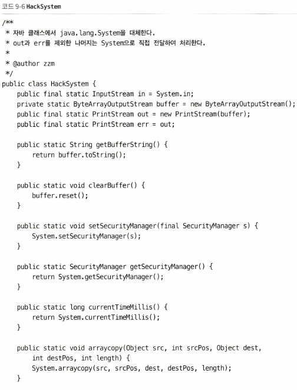

# ch 09. 클래스 로딩과 실행 서브시스템, 사례와 실전

- 클래스 파일 구조와 실행 엔진은 JVM이 직접 통제하기에 사용자 프로그램에서 바꿀 수는 없지만 나중에 구현 시 참고할 만한 아이디어 제공
- 이 장에서는 지금까지 배운 내용을 실제 적용해봄

## 사례 연구

### 톰캣: 정통 클래스 로더 아키텍처

- 톰캣, 제티, 웹로직, 웹스피어 등 주류 자바 웹 서버가 둘 이상의 "별도의" 클래스 로더 혼용하는 이유
    - 똑같은 서버에 배포하더라도 자바 클래스 라이브러리를 웹 애플리케이션별로 격리하는 게 좋음 -> WebAppClassLoaderA, WebAppClassLoaderB에 각각 필요한 라이브러리
    - 똑같은 서버에 배포된 둘 이상의 웹 애플리케이션이 사용하는 자바 클래스 라이브러리는 서로 공유 가능 -> 톰캣의 CommonClassLoader에 공통라이브러리(log4j 등)
    - 서버는 보안을 최대한 유지해서 배포된 웹 애플리케이션들의 영향을 받지 않아야
    - JSP 애플리케이션을 지원하는 웹 서버는 대부분 핫 스와프를 지원
        - 가상 머신에서 실행되기 전 자바 클래스 파일로 컴파일되긴 하지만, 서드 파티 클래스 라이브러리나 자바로 작성된 코드보다 런타임에 수정될 가능성이 큼
    - 톰캣5 이하의 경우, `/common/*`(톰캣 자신과 모든 웹앱), `/server/*`(톰캣 자신), `/shared/*`(톰캣 제외 모든 웹앱), `/WEB-INF/*`(해당 웹앱)가 핵심
        - 톰캣 6부터는 lib 디렉터리가 서버 클래스로더와 공유 클래스로더의 역할을 흡수(기존 로더 아키텍처로 사용 가능)
    - 톰캣은 클래스 라이브러리들을 디렉터리 구조와 용도에 맞게 처리하기 위해 다수의 클래스 로더 이용
    - 

### OSGi: 유연한 클래스 로더 아키텍처

- OSGi는 IBM 등이 이끄는 OSGi 연합에서 제창한 자바 기반 동적 모듈 명세

### 바이트코드 생성 기술과 동적 프락시 구현

- 동적 프락시에서 동적은 자바 코드 사용해 프락시 클래스의 정적 프락시를 작성하는 일
- 스프링에서 등 많은 자바 개발자들이 동적 프락시 사용

### 백포트 도구: 자바의 타임머신

- 상위 버전 JDK로 작성된 코드를 하위 버전 JDK 환경에 배포 가능 -> 백포트 도구
    - 레트로트랜슬레이터, 레트로람다, 제이블 등
- 레트로트랜스레이터는 JDK 5에서 컴파일된 클래스 파일을 JDK 1.4 또는 1.3에서 배포할 수 있는 버전으로 변환해줌

## 실전: 원격 실행 기능 직접 구현하기

- 프로그램 유지 보수 시 생기는 문제
    - 문제 원인을 찾기 위해 매개변수 값 확인하고 싶지만 그 값을 화면이나 로그에 출력 불가
    - 캐시나 특정 데이터를 찾지 못하고 있을 때 캐시를 통합 관리해주는 인터페이스 없음

### 목표

- JVMTI와 같이 JDK 버전에 구애받지 않는 기능은 JDK 1.4 이상의 주류 JDK에서 구동할 수 있다.
- 원래 서버 프로그램 배포에 영향을 주지 않으며 서드 파티 클래스 라이브러리를 사용하지 않는다.
- 원래 프로그램을 침해하지 않는다. 즉, 원래 프로그램의 코드를 변경하지 않고 프로그램 동작에도 영향을 주지 않는다.
- 빈셸 스크립트나 자바스크립트 등에서는 자바 객체를 사용하기 불편하므로 '임시 코드는 자바 언어를 직접 지원해야 한다.
- 임시 코드는 자유롭게 구현할 수 있어야 한다. 특정 클래스에 의존하거나 특정 인터페이스를 구현하지 않아도 된다(물론 원한다면 특정 대상에 의존하도록 해도 좋다).
    - 임시 코드는 제한 없이 다른 클래스 라이브러리를 참조할 수 있다. 서버 프로그램이 사용할 수 있는 클래스와 인터페이스라면 임시 코드에서도 직접 참조할 수 있다.
- 클라이언트는 '임시 코드'의 실행 결과를 받아 볼 수 있다. 실행 결과에는 프로그램에서 출력한 정보와 발생한 예외가 포함될 수 있다.

### 아이디어 구상

#### 서버에 제출된 자바 코드 컴파일하기

- 해법
    - 서버에서 컴파일
    - 자바 코드를 클라이언트에서 컴파일한 다음 바이트 코드를 서버에 전달

#### 컴파일된 자바 코드 실행하기

- 클래스 로더가 클래스 로드하여 클래스 객체 생성 후, 리플렉션을 이용해 메서드를 호출하도록 하면 됨

#### 실행 결과 수집하기

- 표준 출력은 JVM 전체에서 공유하는 자원
    - System.setOut(), System.setErr() 메서드를 이용하면 출력 스트림을 자신이정 의한 PrintStream 객체로 전달할 수 있음
    - but, 원래 프로그램에 영향

### 구현

#### HotSwapClassLoader 클래스

#### ClassModifier와 ByteUtils 클래스

#### HackSystem 클래스

#### JavaClassExecuter 클래스

### 검증

