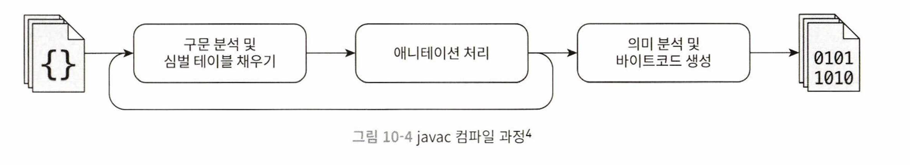

# 프런트엔드 컴파일과 최적화

## javac 컴파일러

javac 컴파일러는 순수하게 자바로 작성됐다. <br>
그 덕분에 자바 개발자가 컴파일 과정을 이해하는 데 매우 유용하다.

### javac 소스코드와 디버깅

JDK 6부터 javac 컴파일러 구현 코드가 표준 자바 클래스 라비르러리로 옮겨졌다. <br>
소스 코드 위치는 JDK 버전에 따라 조금씩 다르다.

- JDK 6~8: JDK_SRC_HOME/langtools/src/share/classes/com/sun/tools/java
- JDK 9: JDK_SRC_HOME/langtools/src/jdk.compiler/share/classes/com/sun/tools/javac
- JDK 10~: JDK_SRC_HOME/src/jdk.compiler/share/classes/com/sun/tools/java

<br>

javac 코드의 전체 구조를 보면 컴파일은 다음과 같이 크게 1개의 준비 단계와 3개의 처리 단계를 거친다.

- 단계 0(준비): 플러그인 애너테이션 처리기들 초기화
- 단계 1: 구문분석 및 심벌 테이블 채우기
  - 1.1 어휘 및 구분 분석: 소스코드를 토큰화하여 추상 구문 트리 구성
  - 1.2 심벌 테이블 채우기: 심벌 주소와 심벌 정보 생성
- 단계 2: 플러그인 애너테이션 처리기들로 애너테이션 처
- 단계 3: 의미 분석 및 바이트코드 생성
  - 3.1 특성 검사: 문법의 정적 정보 확인
  - 3.2 데이터 흐름 및 제어 흐름 분석: 프로그램의 동적 실행 과정 확인
  - 3.3 편의 문법 제거: 코드를 단순화하는 편의 문법을 원래 형식으로 복원
  - 3.4 바이트코드 생성: 지금까지 생성된 정보를 바이트코드로 변환

컴파일하는 중간에 플러그인 애너테이션이 실행되면 새로운 심벌이 생성될 수 있다. <br>
그러면 새로운 심벌을 다시 처리하기 위해 구문을 분석하고 심벌 테이블을 채우는 앞 단계로 돌아가야 한다. <br>
javac의 컴파일 과정은 com.sun.tools.javac.main.JavaCompiler 클래스가 맡고 있으며, 앞의 세 가지 처리는 compile() 메서드에 집중되어 있다.

 

### 구문 분석과 심벌 테이블 채우기

#### 1. 어휘 및 구분 분석

**어휘 분석은 소스 코드의 문자 스트림을 토큰 집합으로 변환하는 일을 말한다.** <br>
프로그램을 작성할 때는 가장 작은 단위가 문자이지만 컴파일 시에는 키워드, 변수 이름, 리터럴, 연산자 같은 토큰이 가장 작은 단위다. <br>
예들 들어 코드 `int a = b + 2`는 총 6개의 토큰으로 구성된다. <br>
**구문 분석은 일련의 토큰들로부터 추상 구문 트리를 구성하는 과정이다.** <br>
추상 구문 트리는 프로그램 코드의 문법 구조를 트리 형태로 기술하는 기법이다. <br>
예를 들어 패키지, 타입 한정자 연산자, 인터페이스, 반환값은 물론 코드 주석도 모두 하나의 구문 구조가 될 수 있다. <br>
추상 구문 트리가 만들어진 후에는 원래의 소스 코드 문자 스트림은 더 이상 쓰이지 않는다. 이후 작업은 모두 추상 구문 트리를 써서 수행하기 때문이다.

#### 2. 심벌 테이블 채우기

**어휘와 구문 분석 다음은 심벌 테이블 채우기로, 심벌 테이블은 심벌 주소와 심벌 정보의 집합으로 구성된 데이터 구조다.** <br>
정렬된 심벌 테이블, 트리 형태의 심벌 테이블, 스택 형태의 심벌 테이블등 구현 방식은 다양하다. <br>
심벌 테이블에 등록된 정보는 컴파일 과정 곳곳에 사용된다. 예를 들어 의미 분석 과정에서는 의미를 확인하거나 중간 코드를 생성할때 참고한다. <br>

### 애너테이션 처리

특정 애너테이션은 컴파일타임에 미리 처리될 수 있기 때문에 프런트엔드 컴파일러의 동작에 영향을 준다. <br>
**플러그인 애너테이션 처리기는 이 과정에서 추상 구문 트리의 임의 요소를 읽고 수정하고 추가할 수 있는 컴파일러용 플러그인이라고 생각하자.** <br>
이러한 플러그인이 애너테이션 처리 중에 구문 트리를 수정하면 컴파일러는 구문 분석 및 심벌 테이블 채우기 단계로 돌아가야 한다. <br>
이 일을 모든 플러그인 애너테이션 처리기가 구문 트리를 더는 수정하지 않을 때까지 반복한다.

> 예를 들어 롬복은 이 컴파일러의 애너테이션 처리 API를 이용하여 getter/setter 생성, null 확인 <br>
> 검사 예외 테이블 생성, equals()와 hashCode() 메서드 생성 등 スト바 코드의 장황한 부분을 자동으로 작성하여 개발자의 수고를 덜어준다.

### 의미 분석과 바이트코드 생성

앞서 구문 분석 결과로 컴파일러는 프로그램 코드의 추상 구문 트리를 얻었다. 추상 구문 트리는 프로그램 코드를 잘 구조화해 표현하지만 의미 체계가 논리적 인지까지는 보장하지 못한다. <br>
**의미 분석의 주된 목적은 구조적으로 올바른 소스가 맥락상으로도 올바른지 확인하는 것이다. 예를 들어 타입 검사, 제어 흐름 검사, 데이터 흐름 검사 같은 작업을 수행한다.** <br>

#### 1. 특성 검사

**javac가 수행하는 컴파일 과정에서 의미 분석은 특성 검사와 데이터 및 제어 흐름 분석의 두 단계로 나눌 수 있다.** <br>
특성 검사 단계에서는 예컨대 변수를 사용하기 앞서 선언이 되어 있는지, 변수와 할당될 데이터의 타입이 일치하는지 등을 확인한다. <br>
특성 검사 과정에서 상수 접기라는 최적화도 수행한다. javac 컴파일러가 소스 코드에 대해 수행하는 몇 안 되는 최적화다. (거의 모든 최적화는 JIT 컴파일러가 수행한다) <br>

```java
int a = 1 + 2;
```

이 코드로 생성한 추상 구문 트리에는 리터럴 1, 2와 연산자 +가 존재한다. <br>
하지만 상수 접기 최적화가 적용된 후에는 리터럴 3 하나만 남는다. <br>
그 결과, 런타임에 a = 1 + 2를 처리하는 속도는 a = 3으로 선언했을때와 완전히 같아진다.

#### 2. 데이터 흐름 분석과 제어 흐름 분석

데이터와 제어 흐름 분석은 프로그램이 맥락상 논리적으로 올바른지 확인하는 추가 검사다. <br>
예를 들어 지역 변수가 사용되기 전에 값이 할당되었는지, 메서드의 모든 실행 경로에서 값을 반환하는지, 검사 예외는 모두 올바르게 처리되는지 등을 확인한다. <br>
컴파일 시 수행하는 데이터 및 제어 흐름 분석의 목적은 기본적으로 클래스 로딩 시 수행하는 데이터 및 제어 흐름 분석의 목적과 같다.

#### 3. 편의 문법 제거

편의 문법은 컴파일 결과와 언어 기능에 실질적인 영향은 없지만 개발자가 언어를 더 쉽게 사용할 수 있게끔 프로그래밍 언어에 추가된 구문을 뜻한다. <br>
자바의 대표적인 편의 문법은 앞서 몇 차례 언급한 제네릭, 가변 길이 매개 변수, 오토박싱/언박싱 등이다. <br>
이러한 구문은 자바 가상 머신의 런타임에서 직접 지원하지 않는다. 그래서 컴파일 과정 중 편의 문법 제거 단계에서 원래의 기본 구문 구조로 복원한다.

#### 4. 바이트코드 생성

바이트코드 생성은 javac 컴파일 과정의 마지막 단계이다. <br>
바이트코드 생성 단계는 이전 단계에서 생성한 정보(구문 트리, 심벌 테이블)를 바이트코드 명령어로 변환하여 저장소에 기록한다. <br>
예를 들어 인스턴스 생성자와 클래스 생성자가 이 단계에서 구문 트리에 추가된다. <br>
여기서 말하는 인스턴스 생성자는 기본 생성자와는 다르다. 사용자 코드에서 생성자를 제공하지 않으면 컴파일러는 매개 변수와 접근 제한자가 없는 기본 생성자를 추가하는데, 이 작업은 심벌 테이블 채우기 단계에서 진행된다. <br>
생성자 생성 외에도 프로그램 로직 일부를 최적화된 코드로 대체하기도 한다. <br>
예를 들어 + 연산자를 사용한 문자열 합치기를 StringBuffer나 StringBuilder의 append()를 이용하는 코드로 대체될 수 있다.

## 자바 편의 문법의 재미난 점

전반적으로 편의 문법은 프런트엔드 컴파일러가 부리는 작은 속임수로 볼 수 있다. <br>
작은 속임수 덕에 커다란 효율 개선을 맛볼 수도 있지만, 개발자라면 뒤에 숨겨진 실제 모습도 이해해야 한다.

### 제네릭

**제네릭의 본질은 매개 변수화된 타입 또는 매개 변수화된 다형성이라 할 수 있다.** <br>
달리 표현하면 특수한 매개 변수를 사용하여 작업 대상의 데이터 타입을 지정할 수 있게 하는 것이다. <br>
클래스, 인터페이스, 메서드를 생성할 때 매개변수 타입을 이용해 제네릭 클래스, 제네릭 인터페이스, 제네릭 메서드로 만들 수 있다. 

자바가 선택한 제네릭 구현 방식을 타입 소거 제네릭이라고 하며, 컴파일 과정에서 타입 정보가 사라진다. <br>
자바의 제네릭 정보는 소스 코드에만 존재하고, 컴파일된 바이트코드에서는 타입 정보가 원래의 타입(원시 타입)으로 대체되고 적절한 형 변환 코드가 해당 위치에 삽입된다. <br>
따라서 런타임에는 ArrayList<Integer>와 ArrayList<String>의 타입이 동일하다.


### 오토박싱, 오토언박싱, 개선된 for문

```java
public static void main(String[] args) {
    List<Integer> list = Arrays.asList(1, 2, 3, 4);
    int sum = 0;
    for (int i : list) {
        sum += i;
    }
    System.out.printIn(sum);
}
```

```java
public static void main(String[] args) {
    List list = Arrays.asList(new Integer[] {
        Integer.valueOf(1),
        Integer.valueOf(2),
        Integer.valueOf(3),
        Integer.valueOf(4) });
    int sum = 0;
    for (Iterator localIterator = list.iterator(); localIterator.hasNext(); ) {
        int i = ((Integer)localIterator.next()).intValue();
        sum += i;
    }
    System.out.printIn(sum);
}
```

제네릭은 원시 타입으로 바뀌고 오토박싱과 언박싱은 래퍼 타입과 복원 메서드로 바뀐다. <br>
개선된 for문은 Iterator를 사용하는 코드로 바뀌었다. 개선된 for 문에 사용할 클래스가 Iterable 인터페이스를 구현해야 하는 이유가 여기 있다. <br>


