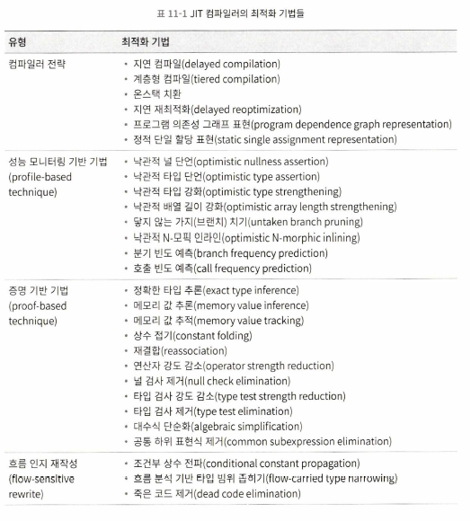
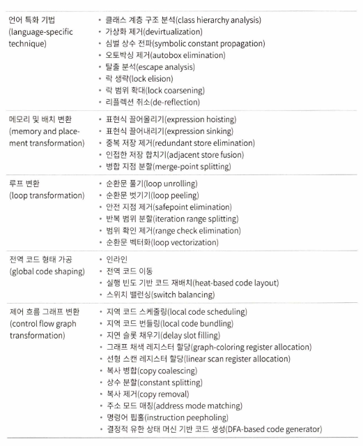

## 컴파일러 최적화 기법

- 컴파일러의 목표: 기계어로 번역하는 것 뿐만 아니라 출력 코드를 최적화하는 것

### 최적화 기법 개요

- 전통적인 컴파일러에서 쓰이는 최적화 기법
  
  
- 메서드 인라인
    - 목적
        - 메서드 버전 찾기나 스텍 프레임 구축 등 비용 제거
        - 후속 최적화 쉽게 해주어 더 나은 최종 결과 도출
- 중복 저장 제거
    - 변수 변경 없으면 같은 참조는 대체 가능
- 복사 전파
    - 완전히 같은 변수는 한번 더 대체
- 죽은 코드 제거
    - 실행되지 않을 코드, 실행해도 의미가 전혀 없는 코드
- 위 최적화 수행 시 최적화 전과 완전히 같은 효과지만 실행 효율 측면에서도 차이가 큼

### 메서드 인라인

- 메서드 호출 비용 절감 위해 대상 메서드의 코드를 호출 메서드로 단순히 복사하는 일
- 인라인 수행 안 하면 죽은 코드 눈치채지 못할 수도 있음
- 고전적인 컴파일 원칙의 최적화 이론에 따르면 대부분의 자바 메서드는 인라인 할 수 없음
    - 자바의 기본 인스턴스 메서드는 `가상 메서드` -> 컴파일타임에 어떤 메서드 버전 사용할지 결정 어려움
        - 자식 클래스의 실제 타입은 해당 코드 라인이 실제 실행될 때 결정되므로 컴파일 타임에 결론 도출 어려움
    - 해결책
        - 클래스 계층 구조 분석 기술(앱 전반의 타입 분석 - 인터페이스 구현 여부, 하위 클래스 유무, 오버라이드 여부) 도입
        - 비 가상 메서드는 직접 인라인 가능
        - 가상 메서드면 현재 상태에서 후보 버전이 여러 개 존재하는지 확인
            - 후보가 하나면 애플리케이션이 변하지 않을 것이라고 가정하고 인라인(가이디드 인라인)
            - 이는 급진적 예측 최적화(자바는 동적으로 링크되므로 언제 새로운 타입이 로드되어 변경될지 불확실하기 때문)
        - 후보가 여러 개면 메서드 호출 부담을 줄이기 위해 `인라인 캐시`(대상 메서드에 정상 진입 전 확인 캐시) 찾음
            - 첫 번째 호출 이후 버전 정보를 캐시에 기록
            - 후속 호출에서도 버전 같으면 모노모픽 인라인 캐시, 달라지면 가상 메서드에서 다형성 이용(부하 일으킴)

### 탈출 분석

- 새로 만들 객체가 사용되는 범위를 분석하여 자바 힙에 할당할지 여부 결정하는 기술
    - 탈출 수준
        - 전역 탈출: 객체가 메서드 밖으로 빠져나와 다른 스레드가 접근 가능
        - 인수 탈출: 객체가 인수로 전달되거나 참조되지만 호출 도중 전역 탈출 안 함
        - 탈출하지 않음: 메서드 안에서 생애를 마침
- 탈출 수준에 따라 해당 인스턴스에 적용하는 최적화 수준 달리 적용
    - 스택 할당: 객체가 스레드에서 탈출하지 않는다고 확신한다면, 힙이 아니라 스택에 할당 하는게 훨씬 이득 -> GC 부담 크게 절감
    - 스칼라 치환
        - 더 작은 표현으로 분해할 수 없는 데이터를 스칼라, 분해할 수 있는 데이터를 집합체(aggregate)
        - 객체라는 껍질을 벗겨내어 멤버변수들에 직접 접근할 수 있게 만드는 과정
        - 탈출 분석을 통해 메서드 외부에서 접근할 수 없고 분해할 수 있는 객체임이 증명되면 객체 생성 안 함
        - 객체를 분해해서 맴버 변수들을 스택에 직접 할당하여 읽고 쓰기
    - 동기화(synchronized) 제거: 탈출 분석 결과 다른 스레드에서 접근할 수 없는 변수는 경쟁이 일어나지 않으므로 스레드 동기화(오래 걸림) 조치는 제거 가능
- but, 탈출 분석 계상 비용이 너무 큼 -> JIT, AOT는 부담이 큰 알고리즘인 프로시저 간 분석 적용 어려움

### 공통 하위 표현식 제거

- 표현식 E가 평가되었고 E에 등장하는 모든 변숫값이 평가 이후 변하지 않을 때, 뒤에 등장하는 E
- 공통 하위 표현식은 이전 계선 결과로 치환 -> 계산 반복 감축 가능

### 배열 경계 검사 제거

- 자바는 오버 플로 공격에 상대적으로 안전한 언어
    - 자동으로 경계 확인 -> 방어 코드 따로 필요 없지만, 매번 확인해야 해서 성능 부담
    - 런터임에 한 번 수행하도록 완화활 수도 있음(배열 길이를 이미 알 때)
    - 자바는 이외에도 다양한 안전 검사를 제공 -> 결국 더 많은 부하로 이어짐 -> 배열 경계 검사 최대한 최적화 필요

## 실전: 그랄 컴파일러 깊이 이해하기

### 역사적 배경

- 맥신 가상 머신의 차세대 컴파일러
- 2012년 독립 프로젝트화
- 그랄 컴파일러, jaotc 고급 컴파일 도구 라는 이름으로 JDK 9 최초 공식 탑재
- JDK 10부터 계층형 컴파일의 최상위 JIT 컴파일러로 사용 가능
- JDK9에 포함된 JVMCI 덕분에 핫스팟 코드와 분리 가능해짐
    - 핫스팟 컴파일 요청에 응답 후 JIT 컴파일러에 전달
    - 핫스팟 JIT 컴파일 관련 데이터를 자바 언어 수준의 데이터 구조로 제공
    - 핫스팟 코드 캐시 추상화하여 컴파일 끝난 네이티브 코드 배포 가능
- 현재는 JDK에서 jaotc 제거됐지만, 그랄 컴파일러 다시 통합하도록 제안됨

### 빌드 및 컴파일 환경

책 참조

### JVMCI 컴파일러 인터페이스

책 참조

### 코드 중간 표현

책 참조

### 코드 최적화와 생성

책 참조

