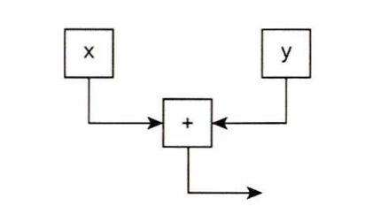
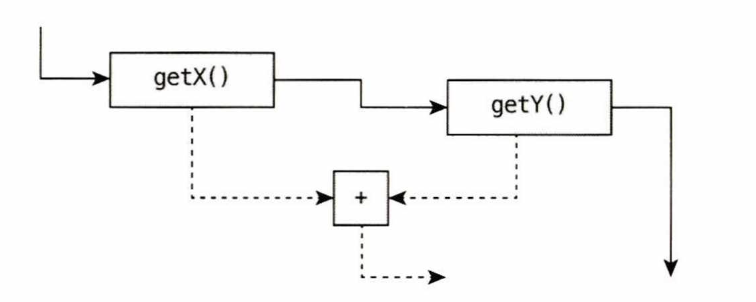

# 백엔드 컴파일과 최적화

바이트코드를 프로그래밍 언어의 중간 표현이라고 생각하면, 컴파일러가 클래스 파일을 로컬 환경에 맞는 네이티브 코드로 변환하는 과정을 전체 컴파일 과정의 백엔드로 간주할 수 있다. <br>
백엔드 컴파일러의 컴파일 성능과 최적화 품질은 상용 가상 머신의 우수성을 측정하는 핵심 지표다. 상용 가상 머신의 중추이자 기술 수준과 가치를 가장 잘 반영하는 기술인 것이다. <br>

## JIT 컴파일러

현재 가상 머신의 쌍두마차인 핫스팟과 OpenJ9은 자바 프로그램을 먼저 인터프리터로 해석해 실행한다. <br>
그런 다음 아주 자주 실행되는 메서드나 코드 블록이 발견되면 해당 코드를 네이티브 코드로 컴파일하고 다양한 최적화를 적용해 실행 효율을 높인다. <br>
이러한 코드 블록을 핫스팟 코드 또는 핫 코드라고 하며, 런타임에 이작업을 수행하는 백 엔드 컴파일러를 JIT 컴파일러라고 한다. <br>

### 인터프리터와 컴파일러

현재 주류 상용 가상머신인 핫스팟과 OpenJ9은 모두 인터프리터와 컴파일러를 함께 사용한다. <br>
프로그램을 빠르게 시작해야 할 때는 인터프리터가 먼저 나서서 컴파일 없이 곧바로 실행할 수 있다. <br>
프로그램이 시작된 후에는 시간이 흐를수록 컴파일러의 역할이 커진다. 점점 더 많은 코드를 네이티브 코드로 컴파일해 실행 효율을 높이는 것이다. <br>
또한 메모리가 부족한 환경에서는 인터프리터 방식으로 메모리를 절약할 수 있다.

프로그램 시작 응답 속도와 운영 효율 사이에서 최상의 균형을 찾기 위해 핫스팟 가상 머신은 컴파일 서브시스템에 계층형 컴파일 기능을 추가했다. <br>
계층형 컴파일은 컴파일과 최적화 규모와 소요 시간에 따라 다음과 같이 여러 단계의 수준으로 수행 된다.

- 계층 0: 인터프리터가 프로그램을 순수하게 해석 실행한다. 
- 계층 1: 클라이언트 컴파일러를 사용하여 바이트코드를 네이티브 코드로 컴파일하고 실행한다. 이때 간단하고 안정적인 최적화만 수행한다.
- 계층 2: 클라이언트 컴파일러를 사용한다. 메서드 및 반환 횟수 통계 등 몇 가지 성능 모니터 링만 수행한다.
- 계층 3: 여전히 클라이언트 컴파일러를 사용한다. 분기 점프와 가상 메서드 호출 버전 등 모든 성능 모니터링 정보를 수집한다.
- 계층 4: 서버 컴파일러를 사용한다. 서버 컴파일러는 성능 모니터 링 정보를 활용하여 더 오래 걸리는 최적화까지 수행한다.

> 계층형 컴파일이 도입된 뒤로는 인터프리터, 클라이언트 컴파일러, 서버 컴파일러가 협력해 동작하면서 핫 코드가 여러 번 컴파일될 수 있다. <br>
> 빠르게 컴파일할 때는 클라이언트 컴파일러를 사용하고, 성능을 더 높여야 할 때는 서버 컴파일러를 사용한다. <br>
> 서버 컴파일러가 매우 복잡한 최적화 알고리즘을 수행해야 할 때는 우선 클라이언트 컴파일러로 간단한 최적화를 해 놓고, 복잡한 최적화는 느긋하게 마무리하는 방식도 가능하다.

### 컴파일 대상과 촉발 조건

런타임에 JIT 컴파일러가 컴파일하는 대상을 핫 코드라고 한다. 다음은 핫 코드의 가장 대표적인 유형 이다.

1. 여러번 호출되는 메서드
2. 여러번 실행되는 순환문의 본문

두 유형 모두에서 컴파일 대상은 개별 순환문의 본문이 아니라 메서드 전체다. <br>
첫 번째 유형의 컴파일은 메서드 호출에 의해 촉발되므로 컴파일러는 메서드 전체를 컴파일 대상으로 삼는다. 이는 가상 머신의 표준 JIT 컴파일 방법 이기도 하다. <br>
두 번째 유형의 컴파일은 순환문 본문에 의해 촉발되지만 컴파일 대상은 여전히 메서드 전체다.

특정 코드 블록이 핫 코드인지 그래서 JIT 컴파일을 촉발시켜야 하는지 판단하는 동작을 **핫스팟 코드 탐지 또는 핫스팟 탐지**라고 한다. <br>
다음은 현재 핫스팟 탐지에 주로 쓰이는 방식들이다.

- 샘플 기반 핫스팟 코드 탐지: 각 스레드의 호출 스택 상단을 샘플링하여 특정 메서드 또는 메서드의 일부가 자주 발견되면 해당 메서드를 핫 메서드로 간주한다.
- 카운터 기반 핫스팟 코드 탐지: 각 메서드와 코드 블록에 대한 카운터를 설정하고 나서 개별 실행 횟수를 기록한다. 그러다가 실행 횟수가 문턱값을 초과하면 핫 메서드로 간주한다.

**J9은 샘플 방식을 사용하고 핫스팟 가상 머신은 카운터 방식을 사용한다.**

### 컴파일 과정

기본적으로 JIT 컴파일은 백그라운드에서 별도 스레드가 진행하며 , 컴파일이 완료될 때까지는 인터프리터가 프로그램 실행을 이어 간다. <br>
그렇다면 백그라운드 컴파일 과정에서 컴파일러가 하는 일은 정확히 무엇일까? <br>
서버 컴파일러와 클라이언트 컴파일러의 컴파일 절차는 다르다.

#### 클라이언트 컴파일러의 컴파일 과정

클라이언트 컴파일러는 비교적 간단하고 빠른 3단계 컴파일러다. 오래 걸리는 전역 최적화는 포기하고 지역 최적화에 집중한다.

- 단계 1: 플랫폼 독립적 프런트엔드가 바이트코드로부터 타깃 독립적 중간 표현인 HIR을 생성한다. HIR은 코드 값을 정적 단일 할당(SSA)으로 표현해 주어 몇 가지 최적화를 더 쉽게 구현할 수 있게 도와준다. 물론 바이트코드를 HIR로 구성하기 앞서 메서드 인라인이나 상수 전파 등 몇 가지 기본적인 최적화는 수행한다.
- 단계 2: 플랫폼 의존적 백엔드가 HIR로부터 LIR을 생성한다. LIR 생성 전에 HIR을 대상으로 null 검사 제거와 범위 검사 제거 등의 최적화를 수행하여 HIR이 코드를 더 효율적으로 표현하도록 최 적화한다.
- 단계 3: 플랫폼 의존적 백엔드가 선형 스캔 레지스터 할당을 사용하여 UR에 레지스터를 할당하고 핍홀 최적화를 수행한 다음, 네이티브 코드를 생성한다.

#### 서버 컴파일러의 컴파일 과정

서버 컴파일러는 서버용 애플리케이션들의 일반적인 시나리오를 감안하여 서버 측 성능을 극대화하도록 설정된 컴파일러다. <br>
죽은 코드 제거, 순환문 언롤링, 순환문 표현식 호이스팅, 공통 하위 표현 제거, 상수 전파, 기본 블록 재정렬 등 전통적인 최적화를 대부분 수행하며 <br>
범위 검사 제거, null 검사 제거 등 자바 언어에 특화된 최적화도 수행한다. <br>
나아가 인터프리터나 클라이언트 컴파일러가 제공하는 성능 모니터 링 정보를 토대로 가이디드 인라인과 분기 예측처럼 안정성이 다소 떨어지는 예측 최적화도 수행할 수 있다.

## AOT 컴파일러

### AOT 컴파일의 장점과 단점

#### AOT의 매력

AOT 컴파일러 관련 연구는 크게 두 가지 형태로 나뉜다. <br>
하나는 프로그램이 실행되기 전에 프로그램 코드를 네이티브 코드로 컴파일하는 형태로, 기존 C/C++ 컴파일러와 비슷하다. <br>
또 다른 하나는 원래 JIT 컴파일러가 런타임에 수행해야 하는 작업을 미리 수행해 캐시에 저장해 두고 다음번 실행 시 사용하는 형태다.

프로그램 실행에 앞서 네이티브 코드로 컴파일하는 것은 AOT의 전통적인 형태이자 JIT 방식의 가장 큰 약점에 해당한다. <br>
JIT 컴파일은 애플리케이션이 실행되는 동안 컴파일러도 뒤에서 컴퓨팅 자원을 소비한다. <br>
최신 JIT 컴파일러들은 계층형 컴파일을 지원하여 품질은 낮지만 빠른 JIT 컴파일러를 먼저 수행하고, 고품질 JIT 컴파일러가 더 나은 결과를 준비할 시간을 벌어 준다. <br>
**하지만 어떤 경우든 JIT 컴파일에 소요되는 시간은 애플리케이션 실행에 사용할 수 있었던 시간이다.** <br>
**JIT 컴파일에 소비된 컴퓨팅 자원 역시 애플리케이션 실행에 사용할 수 있었던 자원임은 변함이 없다.**

JIT 컴파일러가 런타임에 수행해야 하는 작업을 미리 수행하여 캐시해 두는 것은 캐시 역할을 극대화하여 자바 프로그램 구동 시간을 단축하고, 구동 후 빠르게 최상의 성능을 내는 것이다. <br>
현재 주류 상용 JDK들은 이 방식의 고급 컴파일을 모두 지원한다. <br>
**그런데 이런 AOT 컴파일은 대상 물리 머신뿐 아니라 핫스팟 가상 머신의 런타임 매개 변수도 고려해야 해서 실제로 적용하기는 쉽지 않다.** <br>
예를 들어 가상 머신은 런타임에 여러 종류의 가비지 컬렉터를 이용할 수 있는데, 어떤 가비지 컬렉터는 JIT 컴파일 서브시스템을 이용한다. <br>
AOT 컴파일을 원한다면 이러한 협업 과정을 적절히 변환해 처리해야 한다. 플랫폼 중립성을 해친다는 점과 바이트 팽창 같은 단점도 여전하다.

#### JIT의 반격

JIT가 AOT보다 본질적으로 나은 점 세 가지를 살펴보자.

**첫 번째는 성능 모니터링 기반 최적화다.** <br>
핫스팟의 JIT 컴파일러는 인터프리터나 클라이언트 컴파일러가 실행되는 동안 다양한 성능 모니터링 정보를 수집한다. <br>
예를 들어 프로그램이 참조하는 추상 클래스의 실제 타입, 주로 선택되는 조건 분기, 메서드 호출 시 주로 선택되는 버전, 순환문의 일반적인 반복 횟수 같은 정보를 취합한다. <br>
해당 경로들을 핫 코드로 지정하여 더 많은 자원(분기 예측, 레지스터, 캐시 등)을 배분해 최적화할 수 있다.

**두 번째는 많은 JIT 컴파일 최적화 측정의 기초가 되는 급진적 예측 최적화다.** <br>
JIT 컴파일은 AOT 컴파일처럼 보수적일 필요가 없다. 100% 정확하지는 않더라도 성능 모니터링 정보를 토대로 높은 확률로 정확한 판단을 내릴 수 있다. <br>
가능성 높은 가정을 믿고 과감하게 최적화하는 것이다. 그리고 혹시라도 낮은 확률의 동작이 실행된다면 하위 계층 컴파일러나 인터프리터로 실행하는 식이다.

**세 번째는 링크타임 최적화다.** <br>
자바 언어는 본질적으로 동적으로 링크된다. 클래스가 런타임에 가상 머신 메모리에 로드된 다음 JIT 컴파일러에 의해 최적화된 네이티브 코드로 만들어진다. <br>
AOT 컴파일을 사용하는 언어와 프로그램에서 이와 같은 시나리오가 발생했다고 해 보자. <br>
예를 들어 C/C++ 프로그램이 특정 동적 링크 라이브러리의 특정 메서드를 호출하려는 경우는 확실한 경계가 있어서 최적화하기 어렵다. <br>
메인 프로그램의 코드와 동적 링크 라이브러리는 완전히 독립적으로 컴파일되고 자신만을 고려해 최적화되기 때문이다.

## 컴파일러 최적화 기법

컴파일러의 목표는 프로그램 코드를 기계어로 번역하는 것이다. <br>
하지만 기계어로 번역하는 일 자체는 어려운 주제가 아니다. 출력 코드가 얼마나 잘 최적화되었느냐가 컴파일러의 우수성을 결정하는 핵심이다. <br>
아래에는 컴파일러의 코드 최적화를 전반적으로 이해할 수 있도록 핫스팟 가상 머신의 JIT 컴파일러가 사용하는 최적화 기술 몇 가지가 나온다.

## 표 11-1 JIT 컴파일러의 최적화 기법들

## 표 11-1 JIT 컴파일러의 최적화 기법들

| 유형 | 최적화 기법 |
| --- | --- |
| **컴파일러 전략** | 지연 컴파일(delayed compilation)<br>계층형 컴파일(tiered compilation)<br>온스택 치환(on-stack replacement)<br>지연 재최적화(delayed reoptimization)<br>프로그램 의존성 그래프 표현(program dependence graph representation)<br>정적 단일 할당 표현(static single assignment representation) |
| **성능 모니터링 기반 기법**<br/>(profile-based technique) | 낙관적 널 단언(optimistic nullness assertion)<br>낙관적 타입 단언(optimistic type assertion)<br>낙관적 타입 강화(optimistic type strengthening)<br>낙관적 배열 길이 강화(optimistic array length strengthening)<br>닿지 않는 가지(브랜치) 치기(untaken branch pruning)<br>낙관적 N-모픽 인라인(optimistic N-morphic inlining)<br>분기 빈도 예측(branch frequency prediction)<br>호출 빈도 예측(call frequency prediction) |
| **증명 기반 기법**<br/>(proof-based technique) | 정확한 타입 추론(exact type inference)<br>메모리 값 추론(memory value inference)<br>메모리 값 추적(memory value tracking)<br>상수 접기(constant folding)<br>재결합(reassociation)<br>연산자 강도 감소(operator strength reduction)<br>널 검사 제거(null check elimination)<br>타입 검사 강도 감소(type test strength reduction)<br>타입 검사 제거(type test elimination)<br>대수식 단순화(algebraic simplification)<br>공통 하위 표현식 제거(common subexpression elimination) |
| **흐름 인지 재작성**<br/>(flow-sensitive rewrite) | 조건부 상수 전파(conditional constant propagation)<br>흐름 분석 기반 타입 범위 좁히기(flow-carried type narrowing)<br>죽은 코드 제거(dead code elimination) |
| **언어 특화 기법**<br/>(language-specific technique) | 클래스 계층 구조 분석(class hierarchy analysis)<br>가상화 제거(devirtualization)<br>심벌 상수 전파(symbolic constant propagation)<br>오토박싱 제거(autobox elimination)<br>탈출 분석(escape analysis)<br>락 생략(lock elision)<br>락 범위 확대(lock coarsening)<br>리플렉션 취소(de-reflection) |
| **메모리 및 배치 변환**<br/>(memory and placement transformation) | 표현식 끌어올리기(expression hoisting)<br>표현식 끌어내리기(expression sinking)<br>중복 저장 제거(redundant store elimination)<br>인접한 저장 합치기(adjacent store fusion)<br>병합 지점 분할(merge-point splitting) |
| **루프 변환**<br/>(loop transformation) | 순환문 풀기(loop unrolling)<br>순환문 벗기기(loop peeling)<br>안전 지점 제거(safepoint elimination)<br>반복 범위 분할(iteration range splitting)<br>범위 확인 제거(range check elimination)<br>순환문 벡터화(loop vectorization) |
| **전역 코드 형태 가공**<br/>(global code shaping) | 인라인<br>전역 코드 이동<br>실행 빈도 기반 코드 재배치(heat-based code layout)<br>스위치 밸런싱(switch balancing) |
| **제어 흐름 그래프 변환**<br/>(control flow graph transformation) | 지역 코드 스케줄링(local code scheduling)<br>지역 코드 번들링(local code bundling)<br>지연 슬롯 채우기(delay slot filling)<br>그래프 채색 레지스터 할당(graph-coloring register allocation)<br>선형 스캔 레지스터 할당(linear scan register allocation)<br>복사 병합(copy coalescing)<br>상수 분할(constant splitting)<br>복사 제거(copy removal)<br>주소 모드 매칭(address mode matching)<br>명령어 핍홀(instruction peepholing)<br>결정적 유한 상태 머신 기반 코드 생성(DFA-based code generator) |


### 메서드 인라인

가장 먼저 진행할 최적화는 메서드 인라인이다. 메서드를 인라인하는 목적은 두 가지다. <br>
첫 번째는 메서드 버전 찾기나 스택 프레임 구축 등의 메서드 호줄 비용을 없애는 것이고, <br>
두 번째는 다른 최적화를 적용하기 쉽도록 길을 미리 평탄하게 닦는 것이다. <br>
메서드 인라인은 가장 중요한 컴파일러 최적화 기법이다. <br>

```java
// AS IS
public void foo() {
        y = b-get();
        // ...무언가 수행...
        z = b.get();
        sum = y + z;
}

// TO BE
public void foo() {
        y = b.value;
        // ...무언가 수행...
        z = b.value;
        sum = y + z;
}
```

### 중복 저장 제거

코드 중간의 주석 '// …무언가 수행…' 부분에서 b.value의 값을 변경하지 않는다고 가정하자. <br>
그러면 다음 줄의 z = b.value를 z = y로 대체할 수 있다. <br>
이런 식으로 중간에 b 객체를 거쳐 변수에 접근하는 수고를 없앨 수 있다.

```java
public void foo() {
        y = b.value;
        // ...무언가 수행...
        z = y;
        sum = y + z;
}
```

### 복사 전파

이 프로그램에서는 논리적으로 변수 y와 완전히 같은 또 다른 변수 z를 사용할 필요가 없다. z 대신 y를 써도 똑같다는 뜻이다.

```java
public void foo() {
        y = b.value;
        // ...무언가 수행...
        y = y;
        sum = y + y;
}
```

### 죽은 코드 제거

죽은 코드란 실행되지 않을 코드일 수도 있고, 실행해도 의미가 전혀 없는 코드일 수도 있다. <br>
앞의 코드에서 y = y 문장은 아무 의미가 없다. 다음은 죽은 코드를 제거한 후의 모습이다.

```java
public void foo() {
        y = b.value;
        // ...무언가 수행...
        sum = y + y;
}
```

### 탈출 분석

탈출 분석은 새로 만들 객체가 사용되는 범위를 분석하여 자바 힙에 할당할지 여부를 결정하는 기술이다. <br>
코드를 직접 최적화하기보다는, 클래스 상속 관계 분석과 마찬가지로 다른 최적화를 위해 기초를 닦는 분석 기법이다. <br>
탈출 분석은 먼저 객체의 동적 범위를 분석하여 탈출 수준을 다음 세 가지로 구분한다.

- 전역 탈출: 객체가 메서드 밖으로 빠져나와 다른 스레드가 접근할 수 있게 된다. 예를 들어 객체를 정적 필드에 저장하면 다른 스레드가 참조할 수 있다.
- 인수 탈출: 객체가 인수로 전달되거나 인수에 의해 참조되지만, 호출 도중 전역 탈출하지는 않는다.
- 탈출하지 않음: 어디로도 탈출하지 않고 메서드 안에서 생애를 마친다. 

<br>

객체의 탈출 수준에 따라 해당 객체 인스턴스에 적용하는 최적화 수준을 달리할 수 있다. 예를 들면 다음과 같다.

#### 스택 할당

자바 힙에 존재하는 객 체는 참조만 가지고 있다면 다른 스레드에서 접근할 수 있다. <br>
그리고 가비지 컬렉터는 힙에서 더 이상 사용되지 않는 객체를 회수한다. 그런데 생존 여부를 확인해 회수하는 작업에는 상당한 자원이 소모된다. <br>
따라서 객체가 스레드에서 탈출하지 않는다고 확신한다면, 즉 다른 스레드가 사용하지 않는다고 확신한다면 힙이 아니라 스택에 할당하는 게 훨씬 이득이다.
**스택 프레임이 사라질 때 객체가 점유하던 메모리도 자동으로 파괴되기 때문이다.**

#### 스칼라 치환

더 작은 표현으로 분해할 수 없는 데이터를 스칼라라고 한다. <br>
자바 가상 머신에서는 기본 데이터 타입(int, long 등)은 더 작게 분해할 수 없다. <br>
반대로 더 작게 분해할 수 있는 데이터를 집합(aggregate)라 한다. 자바에서는 객체가 대표적이다. <br>
자바 객체를 분해하는 작업, 즉 객체라는 껍질을 벗겨 내어 멤버 변수들에 직접 접근할 수 있게 만드는 과정을 스칼라 치환이라고 한다. <br>
**탈출 분석을 통해 메서드 외부에서 접근할 수 없고 분해할 수 있는 객체라고 증명된다면 애초부터 이 객체를 생성하지 않을 수 있다.**
그 대신 객체의 멤버 변수들을 메서드에서 직접 사용하게 하는 것이다. 객체를 분해하면 멤버 변수들을 스택에 직접 할당하여 읽고 쓸 수 있다.

#### 동기화 제거

스레드 동기화는 그 자체로 시간이 오래 걸리는 작업이다. <br>
탈출 분석 결과 다른 스레드에서 접근할 수 없다고 판단되는 변수는 읽고 쓰는 데 경쟁이 일어나지 않는다. 따라서 관련 동기화 조치는 제거해도 안전하다.


### 공통 하위 표현식 제거

> 표현식 E가 이미 평가되었고 E에 등장하는 모든 변숫값이 평가 이후 변하지 않는다면, 뒤에 등장하는 E를 공통 하위 표현식이라고 한다.

공통 하위 표현식은 다시 계산할 필요 없이 이전 계산 결과로 치환하면 된다. <br>
이 최적화는 적용 범위에 따라 다음과 같이 구분할 수 있다.

- 지역 공통 하위 표현식 제거: 적용 범위가 기본블록으로 제한
- 전역 공통 하위 표현식 제거: 둘 이상의 기본 블록에 걸쳐 있음

### 배열 경계 검사 제거

자바는 C, C++보다 상대적으로 안전한 언어다. <br>
예를 들어 foo[] 배열의 원소를 얻기 위해 foo[i]를 실행하면 시스템이 자동으로 경계(배열 볌위의 상한과 하한)을 확인한다. <br>
즉 i >= 0 && i < foo.length 조건을 만족하지 못하면 런타임 예외인 ArrayIndexOutOfBoundsExcepion을 던진다. <br>
그 덕분에 방어 코드를 따로 작성하지 않더라도 오버플로 공격을 대부분 피할 수 있다. <br>
**하지만 배열 원소를 읽고 쓸 때마다 경계를 확인하므로 배열을 많이 이용하는 프로그램에서는 성능 부담으로 다가올 수 있다.**

배열 경계 검사는 안전을 위해 반드시 필요하지만 잘 협상하면 런타임에 정확히 한 번만 수행되도록 할 수 있다. <br>
간단한 예로, foo[3]처럼 배열의 인덱스를 상수로 지정했다고 해 보자. 그리고 컴파일타임에 데이터 흐름을 분석하여 foo.length가 3보다 크다는 사실을 알아냈다면 실행 중 경계 검사를 할 필요가 없다. <br>
자바는 이 외에도 다양한 안전 검사를 제공하여 C, C++보다 프로그램을 훨씬 쉽게 작성할 수 있다. <br>
예를 들어 널 포인터 에 접근하려 들면 NullPointerException을 던지고, 0으로 나누면 ArithmeticException을 던지는 식이다. <br>

자바는 이러한 문제 상황을 인지하고 조치하는 안전 검사 로직을 자동으로 수행한다. <br>
같은 작업이라도 C, C++보다 더 많은 일을 수행하며 결국 눈에 보이지 않는 부하로 이어진다. <br>
이러한 보이지 않는 부하를 없애려면 배열 경계 검사를 최대한 최적화하여 런타임에 수행할 검사를 컴파일타임에 끝마쳐야 한다.

<br>

## 실전: 그랄 컴파일러 깊이 이해하기

JDK 9부터 15까지 핫스팟 가상 머신에는 총 세 가지 JIT 컴파일러가 포함되어 있다. <br>
지금까지는 그중 전통적인 클라이언트 컴파일러와 서버 컴파일러를 중심으로 이야기했다. <br>
세 번째는 바로 그랄 컴파일러를 활용한 jaotc 컴파일러다. <br>
비록 JDK 16부터는 jaotc가 사라졌지만 그랄 컴파일러는 그랄VM이라는 독립 프로젝트에서 발전을 이어 가고 있다.

그랄VM은 오라클이 자바 기술을 확장하여 만든 새로운 가상 머신이다. <br>
**핫스팟 가상 머신을 토대로 고성능, 메모리 사용량 감소, 폴리글랏 프로그래밍, AOT 네이티브 컴파일 등의 프리미엄 특징을 추가했다.**
그랄 컴파일러는 JIT 컴파일과 AOT 컴파일을 모두 지원한다.

### 역사적 배경

그랄 컴파일러는 자바로 작성되었기 때문에 코드가 명확하고 핫스팟 서버 컴파일러의 다양한 고급 최적화 기술을 가져와 쓸 수 있었다. <br>
그래서 수많은 회사와 연구소에서 이 컴파일러를 기반으로 새로운 컴파일 기술을 개발하고 연구하고 있다. <br>
그랄도 초기에는 C1이나 C2와 마찬가지로 핫스팟과 긴밀하게 연결되어 있어서 그랄을 컴파일할 때마다 핫스팟 전체를 다시 컴파일해야 했다. <br>
하지만 JDK 9에 포함된 컴파일러 인터페이스(JVMCI) 덕분에 핫스팟 코드로부터 분리할 수 있었다. <br>
JVMCI는 크게 아래 세 가지 기능을 제공한다.

- 핫스팟 가상 머신의 컴파일 요청 에 응답하고, 요청을 자바로 구현된 JIT 컴파일러에 전달한다.
- 클래스, 메서드, 필드, 성능 모니터링 정보 등 핫스팟 JIT 컴파일 관련 데이터를 자바 언어 수준의 데이터 구조로 제공한다.
- 핫스팟 코드 캐시를 추상화하여 컴파일러가 컴파일이 끝난 네이티브 코드를 배포할 수 있게 한다.

### JVMCI 컴파일러 인터페이스

먼저 JIT 컴파일러가 받아야 할 입력이 무엇인지 생각해 보자. 답은 물론 컴파일할 메서드의 바이트코드다. <br>
다음으로 출력은 무엇일까? JIT 컴파일러는 입력받은 메서드에 해당하는 네이티브 코드를 출력해야 하며, 이 역시 바이트 배열로 표현되는 코드여야 한다. <br>
그래서 JVMCI 인터페이스의 모습은 다음처럼 생겨야 할 것이다.

```java
interface JVMCICompiler {
    byte[] compileMethod(byte[] bytecode);
}
```

> 사실 핫스팟은 바이트코드 외에도 메서드에 대한 다양한 정보를 컴파일러에 제공하기 때문에 실제 JVMCI 인터페이스는 이보다는 복잡하다. <br>
> 예를 들어 지 역 변수 테이블의 변수 슬롯 수, 피연산자 스택의 최대 깊이, 계층형 컴파일의 최하단 계층에서 수집한 통계 등을 추가로 알려 준다.

아래는 JVMCI 인터페이스의 실제 모습이다.

```java
interface JVMCICompiler {
    void compileMethod(CompilationRequest request);
}

interface CompilationRequest {
    JavaMethod getMethod();
}

interface JavaMethod {
    byte[] getCodeO;
    int getMaxLocals();
    int getMaxStackSize();
    Profilinginfo getProfilingInfo();
    ... // 다른 메서드 생략
}
```

### 코드 중간 표현

그랄 컴파일러는 핫스팟 서버 컴파일러와 매우 비슷한 중간 표현을 사용하도록 설계되었다. <br>
바로 아이디얼 그래프라는 프로그램 의존성 그래프 형태다. 코드에서는 StructuredGraph라고 표현한다. <br>
컴파일러 내부에서는 다음과 같은 순서로 처리된다.

1. 바이트코드
2. 아이디얼 그래프
3. 최적화
4. 네이티브 코드

**아이디얼 그래프는 노드를 사용하여 변수, 연산자, 메서드, 필드 등의 프로그램 요소를 표현하고 에지를 사용하여 데이터나 제어 흐름을 표현하는 방향 그래프다.** <br>
아래는 표현식 x + y의 아이디얼 그래프다. <br>
두 노드 x와 y의 데이터가 더하기 연산자로 흘러가며, 더하기 연산자는 x와 y의 값을 읽어 하나의 값을 출력한다. 화살표는 데이터가 흐르는 방향을 나타낸다.



<br>

이를 getX() + getY()의 계산 과정으로 나타내면 다음과 같다. <br>
이번에는 데이터 흐름뿐 아니라 메서드 호출 순서도 고려해야 한다. <br>
점선은 데이터 흐름을 뜻하고 실선은 코드 실행 순서를 뜻한다.




